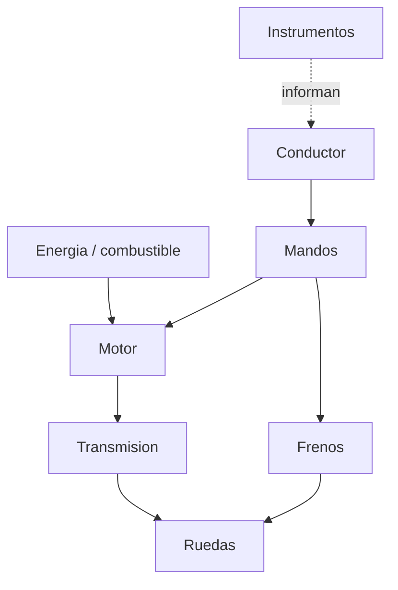

# 🎓 Guia de estilo y estructura de curso

[⬅️ Volver al indice](00-indice-maestro.md) · [🏠 README](../README.md)

Cada vehiculo del repositorio se documenta como un **curso completo**: no es una
ficha suelta, sino un itinerario de aprendizaje conectado que va de la historia a
la simulacion, pasando por la mecanica profunda, los mandos, los entornos de
trabajo y los reglamentos. Esta guia define como se ve y como se conecta ese
curso para que todos sean coherentes.

---

## 🧭 Filosofia: un curso por vehiculo

Igual que un piloto estudia un programa completo antes de volar, cada vehiculo
tiene su **programa de curso**. El objetivo es que quien lea una carpeta de
vehiculo pueda aprenderlo de principio a fin, con material interconectado.


---

## 🎨 Iconografia

Iconos fijos para mantener una identidad visual consistente.

### Vehiculos

| Vehiculo | Icono | Vehiculo | Icono |
| --- | :---: | --- | :---: |
| Motos | 🏍️ | Submarinos | 🌊 |
| Automoviles | 🚗 | Aviones pequenos | 🛩️ |
| Buses | 🚌 | Aviones de combate | ✈️ |
| Gruas | 🏗️ | Naves espaciales | 🚀 |
| Barcos mercantes | 🚢 | Acorazados | 🛡️ |
| Portaviones | 🛳️ | | |

### Secciones y modulos

| Modulo | Icono | Modulo | Icono |
| --- | :---: | --- | :---: |
| Historia | 📜 | Entornos de trabajo | 🌍 |
| Caracteristicas funcionales | 📋 | Reglamentos | ⚖️ |
| Sistemas mecanicos | 🔧 | Diseno de simulacion | 🎮 |
| Mandos e instrumentos | 🎛️ | Recursos | 🧰 |
| Principios y operacion | 🧪 | Objetivos de aprendizaje | 🎯 |
| Manuales y fuentes | 📚 | Seguridad | 🦺 |

---

## 🗂️ Estructura de archivos de un curso

Dentro de `vehiculos/<vehiculo>/` cada curso usa estos archivos:

```text
<vehiculo>/
  README.md                              # 🎓 Portada del curso (indice + diagrama)
  historia/historia-<v>.md               # 📜 Modulo 1
  operacion/caracteristicas-<v>.md       # 📋 Modulo 2
  operacion/sistemas-mecanicos-<v>.md    # 🔧 Modulo 3
  mandos/manual-mandos-<v>.md            # 🎛️ Modulo 4
  operacion/principios-<v>.md            # 🧪 Modulo 5
  operacion/entornos-<v>.md              # 🌍 Modulo 6
  reglamentos/reglamentos-<v>.md         # ⚖️ Modulo 7
  simulacion/diseno-simulador-<v>.md     # 🎮 Modulo 8
  recursos/recursos-<v>.md               # 🧰 Modulo 9 (glosario + enlaces)
```

---

## 🔗 Navegacion e interconexion

La documentacion **profesional se conecta**. Reglas:

1. **Breadcrumb superior** en cada archivo, en la primera linea util:

   ```markdown
   [🏠 Inicio](../../../README.md) · [🏍️ Curso: Motos](../README.md) · 🔧 Sistemas mecanicos
   ```

2. **Portada del curso** (`README.md` del vehiculo): tabla de modulos con icono,
   enlace y una linea de descripcion, mas un diagrama Mermaid del vehiculo o su
   itinerario.

3. **Pie "Continuar"** al final de cada modulo, enlazando al anterior y al
   siguiente:

   ```markdown
   ---
   [⬅️ Anterior: Caracteristicas](caracteristicas-motos.md) ·
   [➡️ Siguiente: Mandos](../mandos/manual-mandos-motos.md)
   ```

4. **Enlaces cruzados** hacia el marco legal comun
   ([`docs/07-marco-legal-chile.md`](07-marco-legal-chile.md)) y hacia
   [`manuales/fuentes.md`](../manuales/fuentes.md) cuando se cite una norma o
   fuente.

---

## 📊 Diagramas con Mermaid

GitHub renderiza Mermaid de forma nativa. Usalo para explicar sistemas y flujos.

- **Sistemas**: `flowchart` para mostrar como se relacionan componentes.
- **Estados**: `stateDiagram-v2` para modos de operacion (apagado, en marcha...).
- **Itinerario**: `flowchart LR` para la ruta del curso.
- **Tiempo**: `timeline` para hitos historicos.

Ejemplo de diagrama de sistemas:



---

## ✅ Checklist de curso profesional

Un curso de vehiculo esta "completo" cuando:

- [ ] 🎓 Portada con diagrama y tabla de modulos enlazada.
- [ ] 📜 Historia con linea de tiempo.
- [ ] 📋 Caracteristicas funcionales y tipos.
- [ ] 🔧 Sistemas mecanicos con al menos un diagrama.
- [ ] 🎛️ Mandos e instrumentos en tablas.
- [ ] 🧪 Principios fisicos y operacion.
- [ ] 🌍 Entornos de trabajo.
- [ ] ⚖️ Reglamentos enlazados al marco legal.
- [ ] 🎮 Diseno de simulacion con variables.
- [ ] 🧰 Recursos, glosario y fuentes registradas.
- [ ] 🔗 Breadcrumb y navegacion anterior/siguiente en cada modulo.

---

[⬅️ Volver al indice](00-indice-maestro.md) · [🏍️ Ver el curso de referencia: Motos](../vehiculos/motos/README.md)
