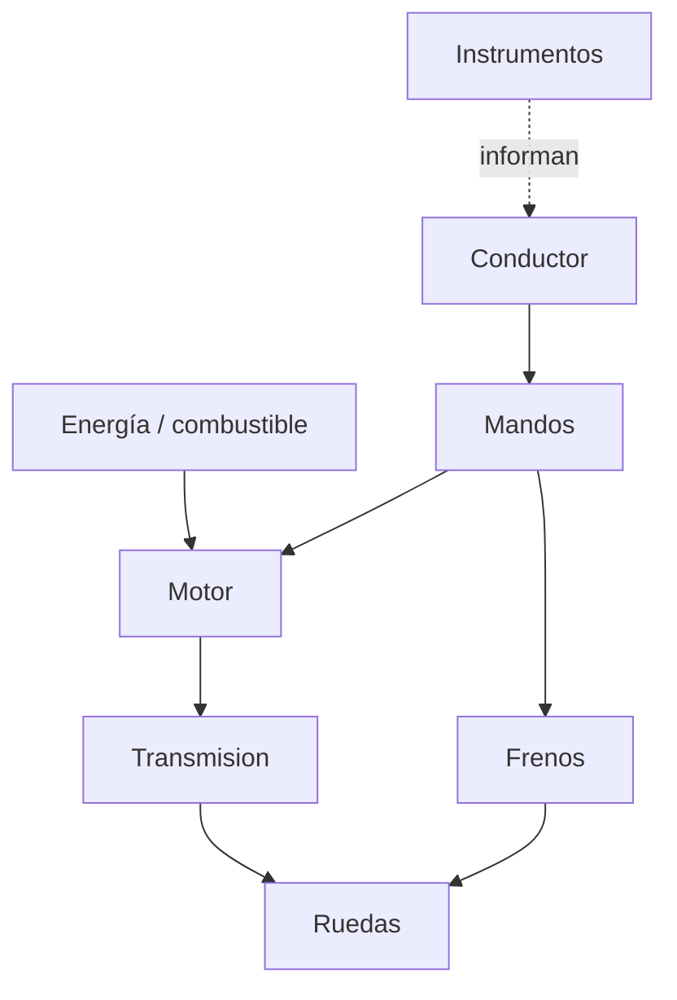

# 🎓 Guía de estilo y estructura de curso

[⬅️ Volver al índice](00-indice-maestro.md) · [🏠 README](../README.md)

Cada vehículo del repositorio se documenta como un **curso estructurado**: no es una
ficha suelta, sino un itinerario de aprendizaje conectado que va de la historia a
la simulación, pasando por la mecánica profunda, los mandos, los entornos de
trabajo y los reglamentos. Esta guía define cómo se ve y cómo se conecta ese
curso para que todos sean coherentes.

---

## 🧭 Filosofía: un curso por vehículo

Igual que un piloto estudia un programa completo antes de volar, cada vehículo
tiene su **programa de curso**. El objetivo es que quien lea una carpeta de
vehículo pueda aprenderlo de principio a fin, con material interconectado.


```mermaid
flowchart LR
    H[📜 Historia] --> C[📋 Características]
    C --> V[🧩 Modelos y variantes]
    V --> S[🔧 Sistemas mecánicos]
    S --> M[🎛️ Mandos e instrumentos]
    M --> P[🧪 Principios y operación]
    P --> E[🌍 Entornos de trabajo]
    E --> R[⚖️ Reglamentos]
    R --> D[🎮 Diseño de simulación]
    D --> X[🧰 Taller de recursos]
    X --> A[🎯 Evaluación integradora]
```

---

## 🎨 Iconografía

Iconos fijos para mantener una identidad visual consistente.

### Vehículos

| Vehículo | Icono | Vehículo | Icono |
| --- | :---: | --- | :---: |
| Motos | 🏍️ | Submarinos | 🌊 |
| Automóviles | 🚗 | Aviones pequeños | 🛩️ |
| Buses | 🚌 | Aviones de combate | ✈️ |
| Grúas | 🏗️ | Naves espaciales | 🚀 |
| Barcos mercantes | 🚢 | Acorazados | 🛡️ |
| Portaviones | 🛳️ | | |

### Secciones y clases

| Clase | Icono | Clase | Icono |
| --- | :---: | --- | :---: |
| Historia | 📜 | Entornos de trabajo | 🌍 |
| Características funcionales | 📋 | Reglamentos | ⚖️ |
| Sistemas mecánicos | 🔧 | Diseño de simulación | 🎮 |
| Mandos e instrumentos | 🎛️ | Recursos | 🧰 |
| Principios y operación | 🧪 | Objetivos de aprendizaje | 🎯 |
| Manuales y fuentes | 📚 | Seguridad | 🦺 |

---

## 🗂️ Estructura de archivos de un curso

Dentro de `vehiculos/<vehiculo>/` cada curso usa estos archivos:

```text
<vehiculo>/
  README.md                              # 🎓 Portada del curso (indice + diagrama)
  historia/historia-<v>.md               # 📜 Clase 1
  operacion/caracteristicas-<v>.md       # 📋 Clase 2
  modelos/modelos-<v>.md                 # 🧩 Clase 3
  operacion/sistemas-mecanicos-<v>.md    # 🔧 Clase 4
  mandos/manual-mandos-<v>.md            # 🎛️ Clase 5
  operacion/principios-<v>.md            # 🧪 Clase 6
  operacion/entornos-<v>.md              # 🌍 Clase 7
  reglamentos/reglamentos-<v>.md         # ⚖️ Clase 8
  simulacion/diseno-simulador-<v>.md     # 🎮 Clase 9
  recursos/recursos-<v>.md               # 🧰 Clase 10 (taller)
  ejercicios/ejercicios-<v>.md           # 🎯 Clase 11 (evaluación)
  manuales/fuentes.md                    # 📚 Fuentes propias del curso
```

---

## 🔗 Navegación e interconexion

La documentación **profesional se conecta**. Reglas:

1. **Breadcrumb superior** en cada archivo, en la primera línea útil:

   ```markdown
   [🏠 Inicio](../../../README.md) · [🏍️ Curso: Motos](../README.md) · 🔧 Sistemas mecanicos
   ```

2. **Portada del curso** (`README.md` del vehículo): tabla de clases con icono,
   enlace y una línea de descripción, más un diagrama Mermaid del vehículo o su
   itinerario.

3. **Pie "Continuar"** al final de cada clase, enlazando al anterior y al
   siguiente:

   ```markdown
   ---
   [⬅️ Anterior: Caracteristicas](caracteristicas-motos.md) ·
   [➡️ Siguiente: Mandos](../mandos/manual-mandos-motos.md)
   ```

4. **Enlaces cruzados** hacia el marco legal común
   ([`docs/07-marco-legal-chile.md`](07-marco-legal-chile.md)) y hacia
   [`manuales/fuentes.md`](../manuales/fuentes.md) cuando se cite una norma o
   fuente.

---

## 📊 Diagramas con Mermaid

GitHub renderiza Mermaid de forma nativa. Usalo para explicar sistemas y flujos.

- **Sistemas**: `flowchart` para mostrar cómo se relacionan componentes.
- **Estados**: `stateDiagram-v2` para modos de operación (apagado, en marcha...).
- **Itinerario**: `flowchart LR` para la ruta del curso.
- **Tiempo**: `timeline` para hitos históricos.

Ejemplo de diagrama de sistemas:


```mermaid
flowchart TD
    Energia[Energía / combustible] --> Motor
    Motor --> Transmision
    Transmision --> Ruedas
    Mandos --> Motor
    Mandos --> Frenos
    Frenos --> Ruedas
    Instrumentos -. informan .-> Conductor
    Conductor --> Mandos
```

---

## 🧑‍🏫 Contrato de una clase

Cada documento lectivo empieza con metadatos que permiten comprobar su identidad,
duración, nivel, prerrequisito, competencia, resultados, evidencia, criterio de
aprobación, fuentes y fecha de revisión. El cuerpo termina con una actividad
específica de la máquina y fuentes visibles. La forma es común; los contenidos,
decisiones y esquemas no deben intercambiarse entre máquinas.

Una clase autónoma debe:

- declarar qué aprenderá y cómo se demostrará;
- explicar con claridad y profundidad proporcional al nivel;
- emplear tablas o Mermaid cuando una relación sea más clara visualmente;
- proponer una tarea que obligue a razonar, no a copiar frases;
- citar fuentes pertinentes al contenido y distinguir jurisdicciones;
- conservar los límites de seguridad y no fingir una habilitación real.

## 📈 Niveles de madurez

| Nivel | Significado |
| --- | --- |
| Estructurado | Tiene las once clases, metadatos, actividades, evaluación y fuentes. |
| Revisado | Una persona con competencia temática verificó exactitud y alcance. |
| Impartible | Fue probado con estudiantes y ajustado con evidencia de aprendizaje. |
| Acreditado | Una institución competente lo reconoce; el repositorio no afirma este nivel. |

## ✅ Checklist de curso estructurado

Un curso alcanza el nivel **estructurado** cuando:

- [ ] 🎓 Portada con diagrama y tabla de once clases enlazada.
- [ ] 📜 Historia con línea de tiempo.
- [ ] 📋 Características funcionales y tipos.
- [ ] 🧩 Modelos y variantes: qué cambia en el manejo, en el mando y en el
      simulador al pasar de un modelo a otro.
- [ ] 🔧 Sistemas mecánicos con al menos un diagrama.
- [ ] 🎛️ Mandos e instrumentos en tablas.
- [ ] 🧪 Principios físicos y operación.
- [ ] 🌍 Entornos de trabajo.
- [ ] ⚖️ Reglamentos enlazados al marco legal.
- [ ] 🎮 Diseño de simulación con variables.
- [ ] 🧰 Recursos, glosario y fuentes registradas.
- [ ] 🎯 Ejercicios y autoevaluación con las respuestas plegadas.
- [ ] 🧑‍🏫 Cada clase declara duración, prerrequisito, resultados y evidencia.
- [ ] 📏 Cada clase tiene criterio de aprobación verificable.
- [ ] 📚 Cada clase cita fuentes y el curso mantiene `manuales/fuentes.md`.
- [ ] 🔗 Breadcrumb y navegación anterior/siguiente en cada clase.

---

[⬅️ Volver al índice](00-indice-maestro.md) · [🏍️ Ver el curso de referencia: Motos](../vehiculos/motos/README.md)
