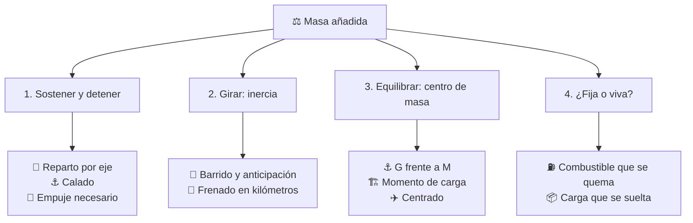

# ⚖️ Carga, pasajeros y manejo

[⬅️ Volver al índice](00-indice-maestro.md) · [🏠 README](../README.md)

Casi toda máquina del catálogo lleva algo: carga, pasajeros o ambos. Este
documento explica **hasta qué punto eso cambia el manejo**, porque la respuesta
no es proporcional al peso y ahí está lo que conviene enseñar.

El principio es uno solo, pero muerde distinto en cada dominio: lo que en un
camión es reparto por eje, en un buque es altura metacéntrica, en una grúa es
momento de carga y en un cohete es fracción de masa. Conviene verlo junto una
vez para reconocerlo después en cada curso.

> 📐 **Aquí no hay cifras.** Los cursos trabajan con relaciones, no con fichas
> técnicas: una masa concreta depende del modelo real y este repositorio no la
> inventa. Lo que un simulador necesita son precisamente las relaciones.

---

## 🧭 La masa hace cuatro preguntas, no una

Cargar una máquina no es "ponerle un número más". Añadir masa plantea cuatro
problemas distintos, y un simulador que solo resuelva el primero se queda corto.

| # | La pregunta | Qué la gobierna |
| --- | --- | --- |
| 1 | ¿Cuánto hay que sostener y detener? | El peso: exige empuje, sustentación, flotación o freno proporcionales. |
| 2 | ¿Cuánto cuesta girarlo? | La inercia: crece con la masa **por la distancia al cuadrado**. |
| 3 | ¿Dónde queda el equilibrio? | El centro de masa y su envolvente segura. |
| 4 | ¿La masa es fija o está viva? | El combustible que se gasta, la carga que se suelta, los pasajeros que se mueven. |

### 1. Sostener y detener

Es la parte intuitiva: más peso exige más empuje para levantarlo, más
sustentación para volarlo, más calado para flotarlo y más distancia para
detenerlo. Tiene un efecto de segundo orden que se olvida: la estructura que
aguanta más carga pesa a su vez, así que **cada kilo útil cuesta más de un kilo**.

### 2. Girarlo: la pregunta que la intuición se salta

Sostener el peso es la mitad del problema. La otra mitad es **rotarlo**, y la
resistencia a rotar crece con la masa multiplicada por la **distancia al
cuadrado** respecto del eje de giro.

De ahí sale la consecuencia que sorprende: **importa más dónde va la carga que
cuánto pesa**. La misma masa colocada al doble de distancia del eje cuadruplica
su aporte a la inercia. Y como el par que el operador puede aplicar no crece
porque la carga sea mayor, el giro se frena en la misma proporción en que sube
la inercia. Cuando un curso dice que el mando "responde más lento con carga",
esa división es el motivo, no una sensación.

### 3. Equilibrarlo

Toda máquina tiene un punto donde la carga puede estar sin desequilibrarla, y
una envolvente alrededor. Fuera de esa envolvente no es que operar sea difícil:
es que el operador gasta toda su autoridad en compensar y no le queda margen
para maniobrar. Los mandos que ajustan el reparto de peso no son comodidades:
son lo que devuelve ese margen.

### 4. ¿Fija o viva?

Una masa que cambia durante la operación es un problema distinto de una que se
fija al salir. El combustible se quema, la carga se descarga, los pasajeros
suben y bajan. Un simulador que calcule el peso al empezar y lo dé por bueno no
puede enseñar lo que ocurre a mitad de trayecto.

---

## 🗺️ La misma física, un nombre por dominio

---

## 🛞 Terrestres

La carga se reparte entre ejes y sube el centro de gravedad. El curso de
[🚛 camiones](../vehiculos/camiones/README.md) lo formaliza con **tara**, **carga
útil** y **peso bruto vehicular**, más el **reparto por eje**: no basta con no
pasarse del total, hay que repartirlo. En [🚌 buses](../vehiculos/buses/README.md)
la carga son personas, y además **se mueven**: el aforo de pie desplaza el centro
de gravedad en cada frenada.

Consecuencias típicas: distancia de frenado más larga, mayor riesgo de vuelco al
subir el centro de gravedad, y barrido trasero más amplio.

## 🚆 Ferroviarios

Aquí manda la primera pregunta llevada al extremo: la masa es tan grande que la
distancia de frenado se cuenta en kilómetros y hay que anticipar mucho antes de
ver el motivo. El curso de [🚂 tren de carga](../vehiculos/tren-carga/README.md)
añade las **fuerzas longitudinales**: el tren no es un cuerpo rígido, y la carga
repartida a lo largo de la composición genera tirones y compresiones entre
vagones que el maquinista gestiona.

## ⚓ Marítimos

La flotación resuelve el peso, así que la pregunta dominante es la tercera. Los
cursos de [🚢 barcos mercantes](../vehiculos/barcos-mercantes/README.md) y
[⛴️ cruceros](../vehiculos/cruceros/README.md) trabajan la posición del centro de
gravedad **G** frente al **metacentro M**: si G queda sobre M hay riesgo de
vuelco, y dónde se estiba la carga decide esa posición. Es el caso más claro de
que colocar importa más que pesar.

## 🏗️ Izaje

La carga va colgada y fuera de la máquina, así que aparece el **momento de
carga**: el peso multiplicado por el radio al que se iza. Por eso las tablas de
carga de [🏗️ grúas](../vehiculos/gruas/README.md),
[⚓ grúa portuaria](../vehiculos/grua-portuaria/README.md) y
[🗼 grúa torre](../vehiculos/grua-torre/README.md) dan menos capacidad cuanto más
lejos: la misma carga, más lejos, vuelca. Además una carga colgada oscila, y ese
**péndulo** es una masa que sigue moviéndose después de que el operador suelte el
mando.

En [🚧 maquinaria de construcción](../vehiculos/maquinaria-construccion/README.md)
ocurre lo mismo con el cucharón: llenarlo y alejarlo son la misma amenaza de
vuelco por dos caminos.

## ✈️ Aéreos

El peso lo sostiene la sustentación, que depende de la velocidad: por eso cargado
se despega más largo y se aterriza más rápido. Y el centrado importa tanto como
el peso, porque un avión descentrado gasta mando en mantenerse nivelado.

El caso duro es el **vuelo vertical**: sin alas trabajando, el empuje sostiene
todo el peso y la carga se paga entera. Es lo que estudian
[🚁 helicópteros](../vehiculos/helicopteros/README.md) y, llevado al extremo de
la ficción, [📦 Thunderbird 2](../vehiculos-fantasticos/thunderbird-2/README.md).
En [🕹️ drones](../vehiculos/drones/README.md) la carga útil se paga sobre todo en
autonomía.

## 🚀 Espaciales

Aquí la masa es el problema central, no un factor. La **ecuación del cohete
(Tsiolkovski)** que trabaja el curso de
[🚀 cohetes](../vehiculos/cohetes/README.md) dice que el delta-v depende de la
proporción entre la masa inicial y la final: cada kilo de carga útil obliga a
llevar mucho más propelente, y ese propelente también pesa. Es la cuarta pregunta
en estado puro: la masa cambia durante todo el ascenso, y por eso existen las
etapas.

## 🛗 Transporte vertical

En [🛗 ascensores](../vehiculos/ascensores/README.md) la carga aparece con una
solución elegante: el **contrapeso** equilibra la cabina más una fracción de la
carga nominal, de modo que el motor solo mueve la diferencia. Es un buen
recordatorio de que la masa no siempre se combate con más potencia — a veces se
compensa.

---

## 🎮 Qué implica para el simulador

| Pregunta | Qué debe exponer el simulador |
| --- | --- |
| Sostener y detener | Una variable de masa o carga que empuje contra el límite de la máquina, no un adorno. |
| Girar | La respuesta angular no puede depender solo de la masa: también de **dónde** va. |
| Equilibrar | Una envolvente con un fuera de rango que sea pérdida de control, no una penalización. |
| ¿Fija o viva? | Si la masa cambia en misión, el peso no se calcula al salir: se recalcula. |

Y una guía de progresión, alineada con los
[🎚️ niveles de realismo](03-niveles-de-realismo.md): en el nivel 1 basta con
notar que cargado cuesta más; la inercia y el centro de masa aparecen en el
nivel 2; la envolvente y la masa viva pertenecen al nivel 3.

---

[⬅️ Volver al índice](00-indice-maestro.md) · [📦 Ver el caso trabajado a fondo: Thunderbird 2](../vehiculos-fantasticos/thunderbird-2/modelos/modelos-thunderbird-2.md)
