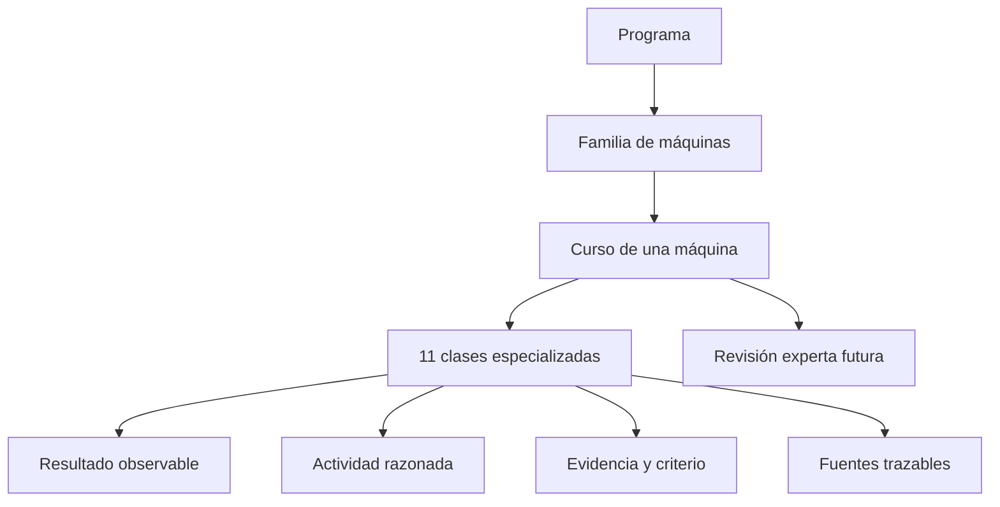

# Modelo pedagógico de clases por máquina

[⬅️ Volver al índice](00-indice-maestro.md) · [🏠 README](../README.md)

Este documento define cómo convertir conocimiento técnico en aprendizaje sin
volver uniformes máquinas que no lo son. El catálogo comparte un contrato de
calidad, no un texto genérico: una motocicleta se enseña desde el equilibrio y
la adherencia; una grúa, desde el momento de carga y la estabilidad; un tren,
desde la señalización y la inercia; una aeronave, desde la energía y el control.

## Arquitectura

Cada curso contiene once clases y suma 735 minutos, equivalentes a 12 horas y
15 minutos. Las 41 máquinas reúnen 451 clases y 30.135 minutos: **502 horas y
15 minutos nominales**. La duración orienta planificación; no acredita horas de
formación reglada.

## Secuencia de once clases

| # | Clase | Minutos | Función pedagógica |
| :-: | --- | ---: | --- |
| 1 | Historia y evolución | 45 | Comprender por qué la máquina llegó a su forma actual. |
| 2 | Características y usos | 45 | Reconocer función, límites y familias. |
| 3 | Modelos y variantes | 60 | Comparar configuraciones que cambian mando o comportamiento. |
| 4 | Sistemas principales | 90 | Relacionar componentes, flujos y fallas simuladas. |
| 5 | Mandos e instrumentos | 60 | Leer estados y decidir desde el puesto de mando. |
| 6 | Principios y operación | 90 | Explicar la física y resolver decisiones de operación simulada. |
| 7 | Entornos de trabajo | 60 | Adaptar decisiones a condiciones distintas. |
| 8 | Reglamentos y seguridad | 60 | Fundamentar límites y distinguir jurisdicciones. |
| 9 | Diseño de simulación | 90 | Traducir conocimiento a estados, variables y retroalimentación. |
| 10 | Taller de recursos | 45 | Usar vocabulario y evaluar fuentes. |
| 11 | Evaluación integradora | 90 | Integrar comprensión, aplicación y transferencia. |
| **Total** | | **735** | **12 h 15 min por máquina** |

## Diseño no robótico

El título de una clase no determina por sí solo su contenido. Para que una clase
sea realmente específica debe conservar, como mínimo:

- los sistemas y vocabulario propios de la máquina;
- decisiones que su operador simulado deba tomar;
- variables físicas que expliquen su comportamiento;
- riesgos y límites que no puedan copiarse desde otro vehículo;
- una actividad construida con los apartados reales de la clase;
- fuentes pertinentes al dominio y, cuando corresponda, a la jurisdicción.

Compartir formato permite revisar calidad. Compartir párrafos o sustituir el
nombre de una máquina en una plantilla no constituye especialización.

## Evaluación

Cada clase produce una evidencia concreta y declara un criterio de aprobación.
La clase 11 usa un umbral orientativo del 80 %, pero ningún curso se considera
profesionalmente validado hasta pasar una revisión experta y una prueba con
estudiantes. Un error crítico de seguridad impide aprobar aunque el porcentaje
global sea suficiente.

## Fuentes

Cada curso mantiene `manuales/fuentes.md` y cada clase muestra las fuentes que
la respaldan. Las referencias extranjeras pueden sostener principios técnicos,
pero nunca reemplazan la normativa chilena. En ficción se separa la fuente de
canon de la referencia usada para contrastar física real.

## Estado y mantenimiento

El campo `ultima_revision` indica revisión editorial del artefacto, no aval de
un especialista. Cuando un experto revise una clase deberá registrarse alcance,
fecha y evidencia sin borrar el historial previo.

---

[⬅️ Anterior: Carga y manejo](09-carga-y-manejo.md) · [🏍️ Curso de referencia](../vehiculos/motos/README.md)
