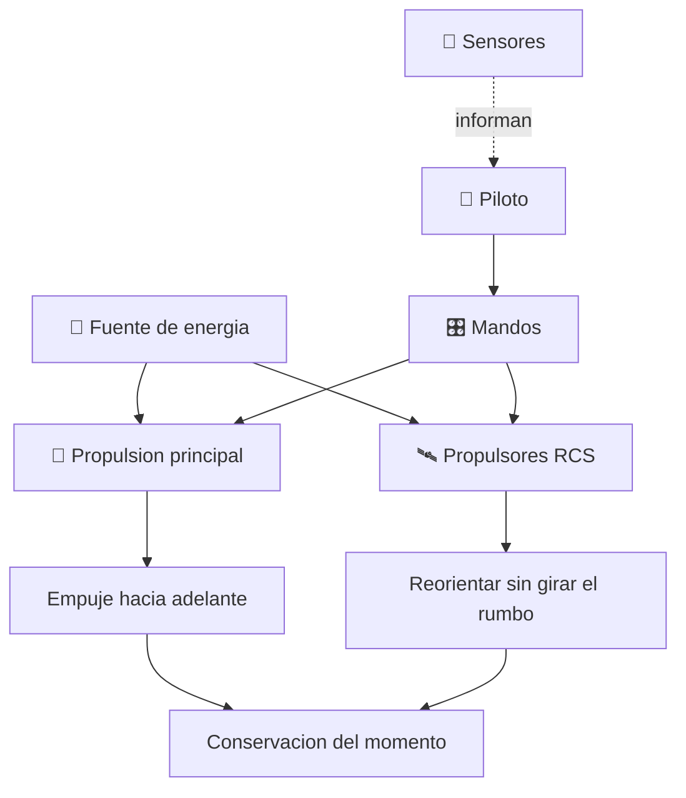

# 🛸 Curso: Caza estelar

[🏠 Inicio](../../README.md) · [🌌 Naves de ficcion](../README.md) · [🎓 Guia de curso](../../docs/08-guia-de-estilo-y-curso.md)

> ⚖️ Material educativo original; los derechos de las obras pertenecen a sus titulares.

---

> Curso de analisis educativo de ciencia ficcion inspirado en el estilo
> "Star Wars". Estudiamos un caza estelar generico para entender la fisica
> real del movimiento en el vacio: por que el combate espacial de las
> peliculas es dramatico pero no fisico, y como seria de verdad.

---

## 🎯 Objetivos de aprendizaje

Al terminar este curso deberias poder:

- Explicar las leyes de Newton aplicadas al vacio, sin aire ni rozamiento.
- Entender por que no hay alas utiles ni virajes bancados fuera de una atmosfera.
- Describir los propulsores de control de reaccion (RCS) y la reorientacion.
- Razonar sobre conservacion del momento, delta-v y presupuesto de maniobra.
- Distinguir que evoca la ficcion que seria real y que rompe la fisica.
- Traducir todo lo anterior a variables de un simulador educativo.

---

## 🗺️ Mapa del vehiculo

---

## 📚 Modulos del curso

| # | Modulo | Contenido | Enlace |
| :-: | --- | --- | --- |
| 1 | 📜 Historia | Contexto de la nave de ficcion y su idea de vuelo. | [Abrir](historia/historia-caza-estelar.md) |
| 2 | 📋 Caracteristicas | Que es un caza estelar generico y para que sirve. | [Abrir](operacion/caracteristicas-caza-estelar.md) |
| 3 | 🔧 Sistemas mecanicos | Tecnologia imaginaria frente a la fisica real. | [Abrir](operacion/sistemas-mecanicos-caza-estelar.md) |
| 4 | 🎛️ Mandos e instrumentos | Puesto de mando conceptual y controles. | [Abrir](mandos/manual-mandos-caza-estelar.md) |
| 5 | 🧪 Principios y operacion | Newton en el vacio: que si, que no y por que. | [Abrir](operacion/principios-caza-estelar.md) |
| 6 | 🌍 Entornos | El vacio, orbitas y campos de escombros. | [Abrir](operacion/entornos-caza-estelar.md) |
| 7 | ⚖️ Reglas del universo | Las leyes internas de la ficcion frente a la fisica. | [Abrir](reglamentos/reglas-universo-caza-estelar.md) |
| 8 | 🎮 Diseno de simulacion | Variables, ciclo y modo ciencia o ficcion. | [Abrir](simulacion/diseno-simulador-caza-estelar.md) |
| 9 | 🧰 Recursos | Glosario, enlaces y diagramas. | [Abrir](recursos/recursos-caza-estelar.md) |

---

## 🧩 Requisitos previos

Ninguno formal. Ayuda tener nociones basicas de las leyes de Newton, pero el
curso las explica desde cero. La idea central es simple y potente: en el vacio
no hay aire ni rozamiento, asi que casi todo lo que muestran las peliculas de
cazas espaciales se comportaria de otra forma.

---

[➡️ Empezar por el Modulo 1: Historia](historia/historia-caza-estelar.md)
