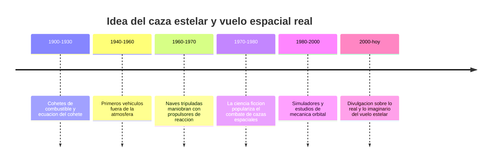

# 📜 Historia del caza estelar

[🏠 Inicio](../../../README.md) · [🛸 Curso: Caza estelar](../README.md) · 📜 Historia

> ⚖️ Material educativo original; los derechos de las obras pertenecen a sus titulares.

Este modulo situa la idea del caza estelar dentro de la ciencia ficcion y la
compara con la historia real del vuelo espacial. No describe una nave oficial:
analiza el concepto generico de "caza estelar" que popularizo el estilo
"Star Wars" y lo contrasta con lo que la ingenieria sabe hacer de verdad.

## De donde viene la idea

El caza estelar de la ficcion toma prestada la estetica del combate aereo de
las guerras del siglo XX: naves agiles que giran, persiguen y disparan en
duelos cerrados. Es una imagen emocionante porque nuestro cerebro entiende
muy bien como se mueve un avion en el aire. El problema es que el espacio no
es aire, y ahi empieza lo interesante de este curso.

## Lo real frente a lo imaginado

La historia real del vuelo espacial siguio otro camino. Las naves que salieron
de la atmosfera no volaron como aviones: se movieron encendiendo motores en
direcciones concretas y dejando que la inercia hiciera el resto. No hay alas
que sirvan donde no hay aire, y no hay freno automatico al soltar el acelerador.

| Periodo | Hito de referencia | Importancia para el curso |
| --- | --- | --- |
| 1900-1930 | Formulacion de la ecuacion del cohete | Explica el limite de maniobra (delta-v). |
| 1940-1960 | Vehiculos que superan la atmosfera | Confirma que sin aire cambian las reglas. |
| 1960-1970 | Naves que se reorientan con propulsores | Base real de los propulsores de control. |
| 1970-1980 | Auge del caza estelar en el cine | Fija la imagen popular del combate espacial. |
| 1980-2000 | Estudio de mecanica orbital aplicada | Muestra como se maniobra de verdad. |
| 2000-hoy | Divulgacion de fisica del espacio | Separa el espectaculo de la realidad. |

## Por que la ficcion eligio el dogfight

Contar una historia con duelos cerrados es facil de seguir: hay persecucion,
tension y giros dramaticos. Un combate espacial realista ocurriria a enormes
distancias, con maniobras lentas y sin ruido, lo que resulta menos vistoso en
pantalla. La ficcion prioriza la emocion sobre la fisica, y eso es una
decision artistica legitima que este curso respeta y analiza.

## Que aprenderemos de todo esto

- Que conceptos de fisica real evoca la nave aunque los exagere.
- Que licencias creativas rompen las leyes de Newton y por que.
- Como seria un caza estelar si tuviera que obedecer la fisica de verdad.

## Fuentes

- Registrar aqui las fuentes publicas de divulgacion consultadas.
- Enlazar cada fuente tambien en [`manuales/fuentes.md`](../../../manuales/fuentes.md).

---

[🎓 Portada del curso](../README.md) · [➡️ Siguiente: Caracteristicas](../operacion/caracteristicas-caza-estelar.md)
