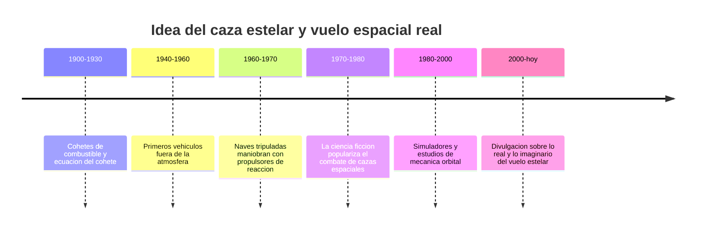

<!-- clase-meta
tipo_documento: clase
clase: 1
codigo: CAZAESTELAR-01
curso: caza-estelar
titulo: "Historia del caza estelar"
modalidad: "teórica dialogada"
duracion_minutos: 45
nivel: introductorio
prerrequisito: ninguno
competencia: "contexto_historico"
resultados_aprendizaje:
  - "Explicar origen, evolución tecnológica, variantes representativas e impacto con vocabulario propio de Caza estelar."
  - "Aplicar esos conceptos a una decisión segura o a un escenario de simulación de Caza estelar."
evidencia: "Línea de tiempo comentada con cuatro hitos o más."
criterio_aprobacion: "Los hitos están ordenados, son pertinentes y dos relaciones de causa y efecto quedan justificadas."
fuentes: manuales/fuentes.md
ultima_revision: 2026-09-10
-->

# 📜 Historia del caza estelar

[🏠 Inicio](../../../README.md) · [🛸 Curso: Caza estelar](../README.md) · 📜 Historia

> ⚖️ Material educativo original; los derechos de las obras pertenecen a sus titulares.

Esta clase situa la idea del caza estelar dentro de la ciencia ficción y la
compara con la historia real del vuelo espacial. No describe una nave oficial:
analiza el concepto genérico de "caza estelar" que popularizo el estilo
"Star Wars" y lo contrasta con lo que la ingeniería sabe hacer de verdad.

```mermaid
timeline
    title Idea del caza estelar y vuelo espacial real
    1900-1930 : Cohetes de combustible y ecuacion del cohete
    1940-1960 : Primeros vehiculos fuera de la atmosfera
    1960-1970 : Naves tripuladas maniobran con propulsores de reaccion
    1970-1980 : La ciencia ficcion populariza el combate de cazas espaciales
    1980-2000 : Simuladores y estudios de mecanica orbital
    2000-hoy : Divulgacion sobre lo real y lo imaginario del vuelo estelar
```

## De donde viene la idea

El caza estelar de la ficción toma prestada la estética del combate aéreo de
las guerras del siglo XX: naves ágiles que giran, persiguen y disparan en
duelos cerrados. Es una imagen emocionante porque nuestro cerebro entiende
muy bien como se mueve un avión en el aire. El problema es que el espacio no
es aire, y ahí empieza lo interesante de este curso.

## Lo real frente a lo imaginado

La historia real del vuelo espacial siguió otro camino. Las naves que salieron
de la atmósfera no volaron como aviones: se movieron encendiendo motores en
direcciones concretas y dejando que la inercia hiciera el resto. No hay alas
que sirvan donde no hay aire, y no hay freno automático al soltar el acelerador.

| Periodo | Hito de referencia | Importancia para el curso |
| --- | --- | --- |
| 1900-1930 | Formulación de la ecuación del cohete | Explica el límite de maniobra (delta-v). |
| 1940-1960 | Vehículos que superan la atmósfera | Confirma que sin aire cambian las reglas. |
| 1960-1970 | Naves que se reorientan con propulsores | Base real de los propulsores de control. |
| 1970-1980 | Auge del caza estelar en el cine | Fija la imagen popular del combate espacial. |
| 1980-2000 | Estudio de mecánica orbital aplicada | Muestra cómo se maniobra de verdad. |
| 2000-hoy | Divulgación de física del espacio | Separa el espectáculo de la realidad. |

## Por qué la ficción eligió el dogfight

Contar una historia con duelos cerrados es fácil de seguir: hay persecución,
tensión y giros dramáticos. Un combate espacial realista ocurriría a enormes
distancias, con maniobras lentas y sin ruido, lo que resulta menos vistoso en
pantalla. La ficción prioriza la emoción sobre la física, y eso es una
decisión artística legítima que este curso respeta y analiza.

## Que aprenderemos de todo esto

- Que conceptos de física real evoca la nave aunque los exagere.
- Que licencias creativas rompen las leyes de Newton y por qué.
- Cómo sería un caza estelar si tuviera que obedecer la física de verdad.

## Fuentes

- Registrar aquí las fuentes públicas de divulgación consultadas.
- Enlazar cada fuente también en [`manuales/fuentes.md`](../../../manuales/fuentes.md).

## 🧭 Guía de estudio aplicada

### Pregunta guía

¿Cómo ayuda **De donde viene la idea, Lo real frente a lo imaginado, Por qué la ficción eligió el dogfight y Que aprenderemos de todo esto** a **explicar cómo la evolución hizo posibles alternativas como vuelo atmosférico frente a vuelo espacial**?

### Explicación razonada

La evolución de Caza estelar se comprende mejor como una sucesión de respuestas a problemas, no como una lista de fechas. Los cambios en fuente de energía ficticia, propulsión, control de actitud y trayectoria alteraron qué podía hacer la máquina, quién podía usarla y qué riesgos debían controlarse. El contraste «vuelo atmosférico frente a vuelo espacial» permite observar qué decisiones de diseño permanecieron y cuáles cambiaron con la tecnología y el propósito.

Esta clase se conecta con el resto del curso mediante **contraste entre maniobra mostrada en el canon y conservación del momento en el espacio**. El hilo de
seguridad consiste en reconocer a tiempo **trasladar aerodinámica atmosférica al vacío sin justificar la licencia narrativa** y poder justificar la decisión
**separar regla de universo, modelo físico elegido y retroalimentación al jugador**; en clases posteriores cambiará el ángulo de análisis, no esa relación causal.
La lectura funcional común sigue **fuente de energía ficticia → propulsión → control de actitud → trayectoria**, de modo que cada concepto pueda
ubicarse dentro del funcionamiento completo y no quede como un dato aislado.

**Apoyo documental:** [Star Wars Databank](https://www.starwars.com/databank) aporta canon narrativo y diseño visual;
[Beginner's Guide to Aeronautics](https://www1.grc.nasa.gov/beginners-guide-to-aeronautics/) se usa para contraste con física y vuelo reales. Estas fuentes
se contrastan con el alcance de la clase y no sustituyen un manual de equipo concreto.

### Caso resuelto: de la observación a la decisión

1. **Situar:** ordena los hitos que explican cómo se llegó a **vuelo atmosférico frente a vuelo espacial** y describe la necesidad que impulsó cada cambio.
2. **Relacionar:** explica qué se modificó en **fuente de energía ficticia**, **propulsión**, **control de actitud** o **trayectoria**; una fecha sin mecanismo no basta.
3. **Interpretar:** vincula el cambio con una capacidad nueva y también con el riesgo **trasladar aerodinámica atmosférica al vacío sin justificar la licencia narrativa**.
4. **Transferir:** usa la evolución para justificar por qué hoy conviene **separar regla de universo, modelo físico elegido y retroalimentación al jugador**.

### Comprueba tu comprensión

1. ¿Qué necesidad histórica impulsó un cambio en **fuente de energía ficticia** o **propulsión**?
2. ¿Qué hito modificó la relación entre capacidad y **trasladar aerodinámica atmosférica al vacío sin justificar la licencia narrativa**?
3. ¿Por qué **vuelo atmosférico frente a vuelo espacial** no puede explicarse como una simple diferencia estética?

Orientación para revisar tus respuestas

- La primera respuesta debe relacionar el eslabón elegido con un efecto posterior, no solo nombrarlo.
- La segunda debe proponer una señal medible u observable y explicar qué tendencia sería preocupante.
- La tercera debe cambiar al menos una variable de capacidad, mando, entorno o margen de seguridad.

## 🎓 Cierre de clase

- **Actividad:** Construye una línea de tiempo de Caza estelar y explica cómo dos cambios históricos transformaron su función o su puesto de mando.
- **Evidencia:** Línea de tiempo comentada con cuatro hitos o más.
- **Criterio de aprobación:** Los hitos están ordenados, son pertinentes y dos relaciones de causa y efecto quedan justificadas.
- **Transferencia:** explica qué cambiaría al pasar a otra variante de esta máquina.

### Fuentes de esta clase

- [STARWARS-DATABANK](https://www.starwars.com/databank): Star Wars Databank, Lucasfilm. Uso: canon narrativo y diseño visual.
- [NASA-FLIGHT](https://www1.grc.nasa.gov/beginners-guide-to-aeronautics/): Beginner's Guide to Aeronautics, NASA. Uso: contraste con física y vuelo reales.

> Las fuentes sostienen el marco conceptual y normativo; esta clase no reemplaza el manual
> del fabricante, la formación certificada ni la habilitación exigida para operar equipos reales.

---

[🎓 Portada del curso](../README.md) · [➡️ Siguiente: Características](../operacion/caracteristicas-caza-estelar.md)
