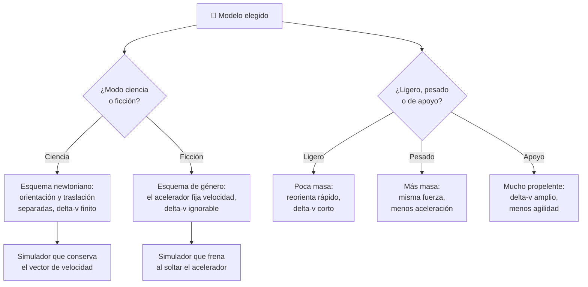

# 🧩 Modelos y variantes del caza estelar

[🏠 Inicio](../../../README.md) · [🛸 Curso: Caza estelar](../README.md) · 🧩 Modelos

El [Módulo 2](../operacion/caracteristicas-caza-estelar.md) ya dijo qué tipos
conceptuales de caza estelar maneja este curso y qué compromiso físico asume
cada uno. Este módulo responde a lo siguiente: **no todos se pilotan igual**, y
esa diferencia no siempre es de matiz. En unos casos cambian solo los rangos; en
otros cambia qué significa un mando, y entonces cambia también qué debe modelar
el simulador.

> 🎯 **La idea que sostiene el módulo.** "Un caza estelar" no es una sola
> máquina desde el punto de vista del mando. Conviene decirlo con honestidad:
> este curso **no documenta variantes con esquemas de control distintos** —
> ligero, pesado y de apoyo comparten el mismo puesto de mando y solo mueven los
> ejes que el propio curso declara (masa, empuje, blindaje, autonomía). Lo que sí
> parte el esquema en dos es el **modo**. Todo esto es análisis original sobre
> naves de ficción: los derechos de las obras pertenecen a sus titulares.

---

## 🧭 Por qué el modelo decide el simulador

El [Módulo 5](../mandos/manual-mandos-caza-estelar.md) describe un puesto de
mando con palanca de orientación a la derecha, palanca de traslación y acelerador
principal a la izquierda, y un instrumento de **presupuesto de maniobra**
(delta-v). El [Módulo 9](../simulacion/diseno-simulador-caza-estelar.md) expone
una variable `Modo` con valores `ciencia / ficción`. Ambos describen una nave
**que no frena sola** y cuyo propelente es finito.

En modo ficción esa palanca izquierda no significa lo mismo: el acelerador deja
de cambiar la velocidad y pasa a fijarla, como en un coche. Y la variable
`Delta-v restante` deja de restringir nada. Si el simulador se construye sobre el
esquema de ciencia y luego se le "añade" el modo ficción, el resultado es una
nave newtoniana con un acelerador que viola a Newton.

Conviene añadir un aviso: el curso **no distingue naves con o sin
hiperimpulsor**, ni les asigna mandos propios. No lo documenta en ningún módulo,
así que este módulo no lo inventa.

---

## 🗂️ Qué cambia en el manejo

Los tres primeros salen del [Módulo 2](../operacion/caracteristicas-caza-estelar.md);
los dos últimos son configuraciones, no naves, y van marcadas como tales.

| Modelo | Qué cambia al pilotarlo |
| --- | --- |
| Interceptor ligero | La referencia del curso: poca masa y muchos RCS, así que reorienta rápido. A cambio lleva poco propelente y el presupuesto de maniobra se agota antes. |
| Caza pesado | Más blindaje y armamento, es decir más masa: por la segunda ley, el mismo empuje da menos aceleración. Cada corrección tarda más y hay que anticiparla. |
| Nave de apoyo | Gran depósito de propelente: mucho delta-v disponible, pero esa misma masa la vuelve menos ágil. Se pilota planificando, no reaccionando. |
| *Configuración*: modo de vuelo asistido | El selector del panel izquierdo delega en la computadora el freno de rotación. El piloto pide orientaciones; la computadora dosifica los RCS y evita gastos inútiles. |
| *Configuración*: modo ficción | La nave frena al soltar el acelerador y vira como avión. Es el manejo familiar, y por eso mismo el que hay que desaprender. |

---

## 🎛️ Qué cambia en el mando

| Modelo | Qué mando aparece o desaparece | Consecuencia |
| --- | --- | --- |
| Interceptor ligero, Caza pesado, Nave de apoyo | Ninguno: el mapa de controles del Módulo 5 aplica tal cual. | Cambian los rangos y los tiempos de respuesta, no los controles. |
| *Configuración*: modo de vuelo asistido | El **freno de rotación** deja de ser una acción del piloto y pasa a ser automático. | La barra espaciadora sigue existiendo, pero deja de ser obligatoria: la nave ya no se queda girando por descuido. |
| *Configuración*: modo ficción | **Cambia de significado** el acelerador principal: pasa de regular empuje a fijar velocidad. El **presupuesto de maniobra** deja de restringir. | Es el corte más profundo del curso: la palanca de traslación pierde casi todo su papel, porque apuntar y moverse vuelven a coincidir. |
| *Configuración*: modo ciencia | **Aparece** de hecho la separación entre orientación y traslación: dos palancas que hay que usar por separado. | El piloto gestiona dos cosas donde la ficción gestiona una. |

---

## 🎮 Qué cambia en el simulador

Contrastado con las variables del
[Módulo 9](../simulacion/diseno-simulador-caza-estelar.md):

| Modelo | Variables que cambian | Esquema de control |
| --- | --- | --- |
| Interceptor ligero | Ninguna: es el caso base. `Masa total` en su valor bajo y `Delta-v restante` con margen corto. | El del Módulo 5. |
| Caza pesado | `Masa total` **sube**, así que el mismo `Empuje principal` produce menos cambio de `Vector de velocidad`. `Calor acumulado` pesa más al no poder maniobrar para aliviarlo. | El mismo, con respuesta más lenta. |
| Nave de apoyo | `Delta-v restante` **amplía** su margen útil; `Masa total` sube por el propelente y baja a medida que se gasta. | El mismo. |
| *Configuración*: modo ficción | `Modo` pasa a `ficción`. `Delta-v restante` **puede ignorarse**. `Vector de velocidad` deja de conservarse sin motor y `Orientación` arrastra el rumbo. | Acelerador que fija velocidad; traslación casi sin uso. |
| *Configuración*: modo ciencia | `Modo` pasa a `ciencia`. `Vector de velocidad` **se conserva** sin motor y `Orientación` queda independiente del rumbo; cada maniobra descuenta `Delta-v restante`. | Orientación y traslación por separado. |
| *Configuración*: entorno con gravedad | `Gravedad del entorno` deja de ser cero y curva la trayectoria sin que el piloto toque nada. | El mismo, con una fuerza que no se manda. |

---

## 🗺️ Del modelo al esquema de control

---

## ⚠️ Qué modelos no comparten simulador

Los tres tipos del Módulo 2 **sí comparten simulador**: ligero, pesado y de apoyo
se resuelven ajustando `Masa total` y `Delta-v restante`, sin tocar el mapa de
controles. Decirlo claro evita prometer una variedad que el curso no documenta.

Lo que no se resuelve con un ajuste de parámetros es el **modo**, porque su
esquema de control es otro:

- **El modo ficción** frente al modo ciencia: un mando cambia de significado (el
  acelerador fija velocidad en lugar de cambiarla) y un límite entero desaparece
  (el delta-v). Es un modo de control distinto, no una dificultad distinta. Por
  eso el Módulo 9 pide avisar en pantalla qué regla se activa al cambiar.
- **El entorno con gravedad** frente al vacío libre: introduce una fuerza que
  actúa sin que el piloto la mande, así que la trayectoria deja de ser una
  consecuencia exclusiva de las entradas.

El resto de diferencias sí caben en un mismo simulador ajustando rangos, tal como
plantean los [niveles de realismo](../../../docs/03-niveles-de-realismo.md): en
el nivel 1 casi todos se comportan igual, y las diferencias emergen a medida que
el nivel sube.

---

[⬅️ Anterior: Características](../operacion/caracteristicas-caza-estelar.md) · [➡️ Siguiente: Sistemas mecánicos](../operacion/sistemas-mecanicos-caza-estelar.md)
