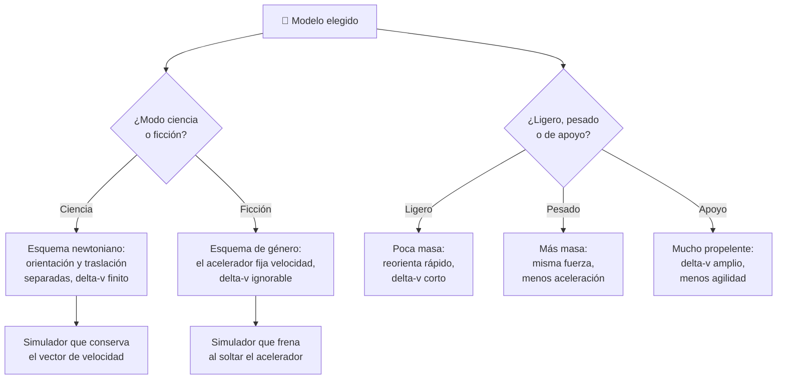

<!-- clase-meta
tipo_documento: clase
clase: 3
codigo: CAZAESTELAR-03
curso: caza-estelar
titulo: "Modelos y variantes del caza estelar"
modalidad: "comparativa guiada"
duracion_minutos: 60
nivel: introductorio
prerrequisito: CAZAESTELAR-02
competencia: "seleccion_de_configuracion"
resultados_aprendizaje:
  - "Explicar manejo, arquitectura de mandos y variables de simulación con vocabulario propio de Caza estelar."
  - "Aplicar esos conceptos a una decisión segura o a un escenario de simulación de Caza estelar."
evidencia: "Matriz comparativa y decisión justificada."
criterio_aprobacion: "La elección considera función, límites, mando y efecto en la simulación; no se apoya solo en preferencias."
fuentes: manuales/fuentes.md
ultima_revision: 2026-09-10
-->

# 🧩 Modelos y variantes del caza estelar

[🏠 Inicio](../../../README.md) · [🛸 Curso: Caza estelar](../README.md) · 🧩 Modelos

El [Clase 2](../operacion/caracteristicas-caza-estelar.md) ya dijo qué tipos
conceptuales de caza estelar maneja este curso y qué compromiso físico asume
cada uno. Esta clase responde a lo siguiente: **no todos se pilotan igual**, y
esa diferencia no siempre es de matiz. En unos casos cambian solo los rangos; en
otros cambia qué significa un mando, y entonces cambia también qué debe modelar
el simulador.

> 🎯 **La idea que sostiene el módulo.** "Un caza estelar" no es una sola
> máquina desde el punto de vista del mando. Conviene decirlo con honestidad:
> este curso **no documenta variantes con esquemas de control distintos** —
> ligero, pesado y de apoyo comparten el mismo puesto de mando y solo mueven los
> ejes que el propio curso declara (masa, empuje, blindaje, autonomía). Lo que sí
> parte el esquema en dos es el **modo**. Todo esto es análisis original sobre
> naves de ficción: los derechos de las obras pertenecen a sus titulares.

---

## 🧭 Por qué el modelo decide el simulador

El [Clase 5](../mandos/manual-mandos-caza-estelar.md) describe un puesto de
mando con palanca de orientación a la derecha, palanca de traslación y acelerador
principal a la izquierda, y un instrumento de **presupuesto de maniobra**
(delta-v). El [Clase 9](../simulacion/diseno-simulador-caza-estelar.md) expone
una variable `Modo` con valores `ciencia / ficción`. Ambos describen una nave
**que no frena sola** y cuyo propelente es finito.

En modo ficción esa palanca izquierda no significa lo mismo: el acelerador deja
de cambiar la velocidad y pasa a fijarla, como en un coche. Y la variable
`Delta-v restante` deja de restringir nada. Si el simulador se construye sobre el
esquema de ciencia y luego se le "añade" el modo ficción, el resultado es una
nave newtoniana con un acelerador que viola a Newton.

Conviene añadir un aviso: el curso **no distingue naves con o sin
hiperimpulsor**, ni les asigna mandos propios. No lo documenta en ningún módulo,
así que este módulo no lo inventa.

---

## 🗂️ Qué cambia en el manejo

Los tres primeros salen del [Clase 2](../operacion/caracteristicas-caza-estelar.md);
los dos últimos son configuraciones, no naves, y van marcadas como tales.

| Modelo | Qué cambia al pilotarlo |
| --- | --- |
| Interceptor ligero | La referencia del curso: poca masa y muchos RCS, así que reorienta rápido. A cambio lleva poco propelente y el presupuesto de maniobra se agota antes. |
| Caza pesado | Más blindaje y armamento, es decir más masa: por la segunda ley, el mismo empuje da menos aceleración. Cada corrección tarda más y hay que anticiparla. |
| Nave de apoyo | Gran depósito de propelente: mucho delta-v disponible, pero esa misma masa la vuelve menos ágil. Se pilota planificando, no reaccionando. |
| *Configuración*: modo de vuelo asistido | El selector del panel izquierdo delega en la computadora el freno de rotación. El piloto pide orientaciones; la computadora dosifica los RCS y evita gastos inútiles. |
| *Configuración*: modo ficción | La nave frena al soltar el acelerador y vira como avión. Es el manejo familiar, y por eso mismo el que hay que desaprender. |

---

## 🎛️ Qué cambia en el mando

| Modelo | Qué mando aparece o desaparece | Consecuencia |
| --- | --- | --- |
| Interceptor ligero, Caza pesado, Nave de apoyo | Ninguno: el mapa de controles del Clase 5 aplica tal cual. | Cambian los rangos y los tiempos de respuesta, no los controles. |
| *Configuración*: modo de vuelo asistido | El **freno de rotación** deja de ser una acción del piloto y pasa a ser automático. | La barra espaciadora sigue existiendo, pero deja de ser obligatoria: la nave ya no se queda girando por descuido. |
| *Configuración*: modo ficción | **Cambia de significado** el acelerador principal: pasa de regular empuje a fijar velocidad. El **presupuesto de maniobra** deja de restringir. | Es el corte más profundo del curso: la palanca de traslación pierde casi todo su papel, porque apuntar y moverse vuelven a coincidir. |
| *Configuración*: modo ciencia | **Aparece** de hecho la separación entre orientación y traslación: dos palancas que hay que usar por separado. | El piloto gestiona dos cosas donde la ficción gestiona una. |

---

## 🎮 Qué cambia en el simulador

Contrastado con las variables del
[Clase 9](../simulacion/diseno-simulador-caza-estelar.md):

| Modelo | Variables que cambian | Esquema de control |
| --- | --- | --- |
| Interceptor ligero | Ninguna: es el caso base. `Masa total` en su valor bajo y `Delta-v restante` con margen corto. | El del Clase 5. |
| Caza pesado | `Masa total` **sube**, así que el mismo `Empuje principal` produce menos cambio de `Vector de velocidad`. `Calor acumulado` pesa más al no poder maniobrar para aliviarlo. | El mismo, con respuesta más lenta. |
| Nave de apoyo | `Delta-v restante` **amplía** su margen útil; `Masa total` sube por el propelente y baja a medida que se gasta. | El mismo. |
| *Configuración*: modo ficción | `Modo` pasa a `ficción`. `Delta-v restante` **puede ignorarse**. `Vector de velocidad` deja de conservarse sin motor y `Orientación` arrastra el rumbo. | Acelerador que fija velocidad; traslación casi sin uso. |
| *Configuración*: modo ciencia | `Modo` pasa a `ciencia`. `Vector de velocidad` **se conserva** sin motor y `Orientación` queda independiente del rumbo; cada maniobra descuenta `Delta-v restante`. | Orientación y traslación por separado. |
| *Configuración*: entorno con gravedad | `Gravedad del entorno` deja de ser cero y curva la trayectoria sin que el piloto toque nada. | El mismo, con una fuerza que no se manda. |

---

## 🗺️ Del modelo al esquema de control

```mermaid
flowchart TD
    Modelo[🧩 Modelo elegido] --> Modo{¿Modo ciencia<br/>o ficción?}
    Modo -- Ciencia --> Newton[Esquema newtoniano:<br/>orientación y traslación<br/>separadas, delta-v finito]
    Modo -- Ficción --> Aereo[Esquema de género:<br/>el acelerador fija velocidad,<br/>delta-v ignorable]
    Newton --> Var1[Simulador que conserva<br/>el vector de velocidad]
    Aereo --> Var2[Simulador que frena<br/>al soltar el acelerador]
    Modelo --> Masa{¿Ligero, pesado<br/>o de apoyo?}
    Masa -- Ligero --> Agil[Poca masa:<br/>reorienta rápido,<br/>delta-v corto]
    Masa -- Pesado --> Lento[Más masa:<br/>misma fuerza,<br/>menos aceleración]
    Masa -- Apoyo --> Largo[Mucho propelente:<br/>delta-v amplio,<br/>menos agilidad]
```

---

## ⚠️ Qué modelos no comparten simulador

Los tres tipos del Clase 2 **sí comparten simulador**: ligero, pesado y de apoyo
se resuelven ajustando `Masa total` y `Delta-v restante`, sin tocar el mapa de
controles. Decirlo claro evita prometer una variedad que el curso no documenta.

Lo que no se resuelve con un ajuste de parámetros es el **modo**, porque su
esquema de control es otro:

- **El modo ficción** frente al modo ciencia: un mando cambia de significado (el
  acelerador fija velocidad en lugar de cambiarla) y un límite entero desaparece
  (el delta-v). Es un modo de control distinto, no una dificultad distinta. Por
  eso el Clase 9 pide avisar en pantalla qué regla se activa al cambiar.
- **El entorno con gravedad** frente al vacío libre: introduce una fuerza que
  actúa sin que el piloto la mande, así que la trayectoria deja de ser una
  consecuencia exclusiva de las entradas.

El resto de diferencias sí caben en un mismo simulador ajustando rangos, tal como
plantean los [niveles de realismo](../../../docs/03-niveles-de-realismo.md): en
el nivel 1 casi todos se comportan igual, y las diferencias emergen a medida que
el nivel sube.

> ⚖️ **El principio detrás de todo esto.** Cuánto pesa la carga y dónde va no cambia
> solo los números: cambia qué puede hacer el operador. La física común a todas las
> máquinas del catálogo —sostener, girar, equilibrar y la masa que cambia en
> marcha— está en [⚖️ carga y manejo](../../../docs/09-carga-y-manejo.md).

## 🧭 Guía de estudio aplicada

### Pregunta guía

¿Cómo ayuda **Por qué el modelo decide el simulador, Qué cambia en el manejo, Qué cambia en el mando y Qué cambia en el simulador** a **comparar vuelo atmosférico frente a vuelo espacial frente al mismo encargo**?

### Explicación razonada

Las variantes «vuelo atmosférico frente a vuelo espacial» resuelven prioridades distintas. Una comparación profesional sigue la cadena fuente de energía ficticia → propulsión → control de actitud → trayectoria: cada cambio de arquitectura modifica mandos, respuesta, mantenimiento y variables que una simulación debe representar. Elegir un modelo significa justificar qué compromiso sirve mejor al caso, no declarar un favorito.

Esta clase se conecta con el resto del curso mediante **contraste entre maniobra mostrada en el canon y conservación del momento en el espacio**. El hilo de
seguridad consiste en reconocer a tiempo **trasladar aerodinámica atmosférica al vacío sin justificar la licencia narrativa** y poder justificar la decisión
**separar regla de universo, modelo físico elegido y retroalimentación al jugador**; en clases posteriores cambiará el ángulo de análisis, no esa relación causal.
La lectura funcional común sigue **fuente de energía ficticia → propulsión → control de actitud → trayectoria**, de modo que cada concepto pueda
ubicarse dentro del funcionamiento completo y no quede como un dato aislado.

**Apoyo documental:** [Star Wars Databank](https://www.starwars.com/databank) aporta canon narrativo y diseño visual;
[Beginner's Guide to Aeronautics](https://www1.grc.nasa.gov/beginners-guide-to-aeronautics/) se usa para contraste con física y vuelo reales. Estas fuentes
se contrastan con el alcance de la clase y no sustituyen un manual de equipo concreto.

### Caso resuelto: de la observación a la decisión

1. **Mantener el encargo constante:** ambas variantes deben evaluarse ante **intercepción ficticia seguida de una maniobra de evasión**.
2. **Trazar consecuencias:** para cada variante sigue el efecto desde **fuente de energía ficticia** hasta **trayectoria**.
3. **Comparar el puesto de mando:** determina qué debe percibir y controlar el operador en cada arquitectura.
4. **Justificar:** elige una variante y explica qué sacrifica; toda selección técnica contiene un compromiso.

### Comprueba tu comprensión

1. ¿Qué cambia en la cadena **fuente de energía ficticia → propulsión → control de actitud → trayectoria** entre las dos variantes?
2. ¿Qué indicación o mando adicional necesitaría una de ellas?
3. ¿Cuál elegirías para «intercepción ficticia seguida de una maniobra de evasión» y qué desventaja aceptarías?

Orientación para revisar tus respuestas

- La primera respuesta debe relacionar el eslabón elegido con un efecto posterior, no solo nombrarlo.
- La segunda debe proponer una señal medible u observable y explicar qué tendencia sería preocupante.
- La tercera debe cambiar al menos una variable de capacidad, mando, entorno o margen de seguridad.

## 🎓 Cierre de clase

- **Actividad:** Compara variantes de Caza estelar mediante los ejes «manejo, arquitectura de mandos y variables de simulación» y elige una para un caso de uso razonado.
- **Evidencia:** Matriz comparativa y decisión justificada.
- **Criterio de aprobación:** La elección considera función, límites, mando y efecto en la simulación; no se apoya solo en preferencias.
- **Transferencia:** explica qué cambiaría al pasar a otra variante de esta máquina.

### Fuentes de esta clase

- [STARWARS-DATABANK](https://www.starwars.com/databank): Star Wars Databank, Lucasfilm. Uso: canon narrativo y diseño visual.
- [NASA-FLIGHT](https://www1.grc.nasa.gov/beginners-guide-to-aeronautics/): Beginner's Guide to Aeronautics, NASA. Uso: contraste con física y vuelo reales.

> Las fuentes sostienen el marco conceptual y normativo; esta clase no reemplaza el manual
> del fabricante, la formación certificada ni la habilitación exigida para operar equipos reales.

---

[⬅️ Anterior: Características](../operacion/caracteristicas-caza-estelar.md) · [➡️ Siguiente: Sistemas mecánicos](../operacion/sistemas-mecanicos-caza-estelar.md)
