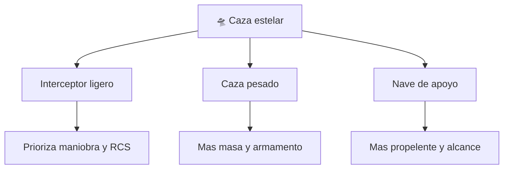

# 📋 Caracteristicas del caza estelar

[🏠 Inicio](../../../README.md) · [🛸 Curso: Caza estelar](../README.md) · 📋 Caracteristicas

> ⚖️ Material educativo original; los derechos de las obras pertenecen a sus titulares.

Que es un caza estelar generico, que rasgos lo definen en la ficcion y cuales
tendrian sentido fisico real. Este modulo da el contexto antes de abrir la
tecnologia por dentro en el Modulo 3.

---

## 🧭 Definicion

Un caza estelar, en la ficcion estilo "Star Wars", es una nave pequena y
maniobrable pensada para el combate en el espacio. La imaginamos veloz, agil y
capaz de girar como un avion de caza. En este curso la usamos como excusa para
estudiar como se moveria de verdad un vehiculo asi en el vacio.

---

## 🧬 Caracteristicas clave

| Caracteristica | Como la muestra la ficcion | Lectura fisica real |
| --- | --- | --- |
| Tamano compacto | Nave para uno o pocos tripulantes | Razonable: menos masa, menos energia para maniobrar. |
| Agilidad | Giros cerrados tipo avion | En el vacio no hay aire que permita virar asi. |
| Velocidad "de crucero" | Se frena al soltar el acelerador | Falso: sin rozamiento la nave sigue igual. |
| Alas o aletas | Grandes superficies visibles | Inutiles sin atmosfera; solo estetica o radiadores. |
| Armamento | Disparos con estela luminosa | La luz viajaria recta y no se veria el haz en el vacio. |
| Propulsion | Un chorro brillante constante | Real solo mientras se gasta propelente. |

---

## 🗂️ Tipos conceptuales de caza estelar

| Tipo | Idea de diseno | Compromiso fisico |
| --- | --- | --- |
| Interceptor ligero | Poca masa, muchos propulsores de control | Reorienta rapido pero lleva poco propelente. |
| Caza pesado | Mas blindaje y armamento | Mas masa exige mas empuje para el mismo cambio. |
| Nave de apoyo | Gran deposito de propelente | Mayor autonomia de maniobra, menos agilidad. |

---

## 🎯 Para que sirve en el relato

- Dar espectaculo con duelos rapidos y visuales.
- Representar al piloto habil como heroe individual.
- Simplificar el combate espacial a algo parecido al aereo.

En cambio, para este curso sirve como laboratorio: cada rasgo llamativo nos
deja preguntar si seria posible y por que.

---

[⬅️ Anterior: Historia](../historia/historia-caza-estelar.md) · [➡️ Siguiente: Sistemas mecanicos](sistemas-mecanicos-caza-estelar.md)
