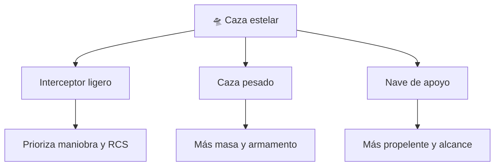

<!-- clase-meta
tipo_documento: clase
clase: 2
codigo: CAZAESTELAR-02
curso: caza-estelar
titulo: "Características del caza estelar"
modalidad: "teórica aplicada"
duracion_minutos: 45
nivel: introductorio
prerrequisito: CAZAESTELAR-01
competencia: "identificacion_funcional"
resultados_aprendizaje:
  - "Explicar definición, rasgos funcionales, tipos y usos con vocabulario propio de Caza estelar."
  - "Aplicar esos conceptos a una decisión segura o a un escenario de simulación de Caza estelar."
evidencia: "Matriz comparativa y decisión justificada."
criterio_aprobacion: "La elección considera función, límites, mando y efecto en la simulación; no se apoya solo en preferencias."
fuentes: manuales/fuentes.md
ultima_revision: 2026-09-10
-->

# 📋 Características del caza estelar

[🏠 Inicio](../../../README.md) · [🛸 Curso: Caza estelar](../README.md) · 📋 Características

> ⚖️ Material educativo original; los derechos de las obras pertenecen a sus titulares.

Que es un caza estelar genérico, que rasgos lo definen en la ficción y cuales
tendrían sentido físico real. Esta clase da el contexto antes de abrir la
tecnología por dentro en el Clase 4.

---

## 🧭 Definición

Un caza estelar, en la ficción estilo "Star Wars", es una nave pequeña y
maniobrable pensada para el combate en el espacio. La imaginamos veloz, ágil y
capaz de girar como un avión de caza. En este curso la usamos como excusa para
estudiar cómo se movería de verdad un vehículo así en el vacío.

---

## 🧬 Características clave

| Característica | Como la muestra la ficción | Lectura física real |
| --- | --- | --- |
| Tamaño compacto | Nave para uno o pocos tripulantes | Razonable: menos masa, menos energía para maniobrar. |
| Agilidad | Giros cerrados tipo avión | En el vacío no hay aire que permita virar así. |
| Velocidad "de crucero" | Se frena al soltar el acelerador | Falso: sin rozamiento la nave sigue igual. |
| Alas o aletas | Grandes superficies visibles | Inutiles sin atmósfera; solo estética o radiadores. |
| Armamento | Disparos con estela luminosa | La luz viajaría recta y no se vería el haz en el vacío. |
| Propulsión | Un chorro brillante constante | Real solo mientras se gasta propelente. |

---

## 🗂️ Tipos conceptuales de caza estelar

```mermaid
flowchart TD
    Caza[🛸 Caza estelar] --> Ligero[Interceptor ligero]
    Caza --> Pesado[Caza pesado]
    Caza --> Apoyo[Nave de apoyo]
    Ligero --> Agil[Prioriza maniobra y RCS]
    Pesado --> Blindaje[Más masa y armamento]
    Apoyo --> Autonomia[Más propelente y alcance]
```

| Tipo | Idea de diseño | Compromiso físico |
| --- | --- | --- |
| Interceptor ligero | Poca masa, muchos propulsores de control | Reorienta rápido pero lleva poco propelente. |
| Caza pesado | Más blindaje y armamento | Más masa exige más empuje para el mismo cambio. |
| Nave de apoyo | Gran depósito de propelente | Mayor autonomía de maniobra, menos agilidad. |

---

## 🎯 Para qué sirve en el relato

- Dar espectáculo con duelos rápidos y visuales.
- Representar al piloto hábil como héroe individual.
- Simplificar el combate espacial a algo parecido al aéreo.

En cambio, para este curso sirve como laboratorio: cada rasgo llamativo nos
deja preguntar si sería posible y por qué.

## 🧭 Guía de estudio aplicada

### Pregunta guía

¿Cómo ayuda **Definición, Características clave, Tipos conceptuales de caza estelar y Para qué sirve en el relato** a **elegir una configuración adecuada para intercepción ficticia seguida de una maniobra de evasión**?

### Explicación razonada

Una característica solo es útil cuando permite anticipar comportamiento. En Caza estelar, la relación entre fuente de energía ficticia, propulsión, control de actitud y trayectoria determina capacidad, respuesta y límites. Por eso «vuelo atmosférico frente a vuelo espacial» no se compara por apariencia: se compara por misión, entorno, carga de trabajo y exposición al riesgo «trasladar aerodinámica atmosférica al vacío sin justificar la licencia narrativa».

Esta clase se conecta con el resto del curso mediante **contraste entre maniobra mostrada en el canon y conservación del momento en el espacio**. El hilo de
seguridad consiste en reconocer a tiempo **trasladar aerodinámica atmosférica al vacío sin justificar la licencia narrativa** y poder justificar la decisión
**separar regla de universo, modelo físico elegido y retroalimentación al jugador**; en clases posteriores cambiará el ángulo de análisis, no esa relación causal.
La lectura funcional común sigue **fuente de energía ficticia → propulsión → control de actitud → trayectoria**, de modo que cada concepto pueda
ubicarse dentro del funcionamiento completo y no quede como un dato aislado.

**Apoyo documental:** [Star Wars Databank](https://www.starwars.com/databank) aporta canon narrativo y diseño visual;
[Beginner's Guide to Aeronautics](https://www1.grc.nasa.gov/beginners-guide-to-aeronautics/) se usa para contraste con física y vuelo reales. Estas fuentes
se contrastan con el alcance de la clase y no sustituyen un manual de equipo concreto.

### Caso resuelto: de la observación a la decisión

1. **Definir la necesidad:** convierte «intercepción ficticia seguida de una maniobra de evasión» en requisitos de capacidad, entorno y respuesta.
2. **Comparar:** contrasta **vuelo atmosférico frente a vuelo espacial** usando esos requisitos y la cadena **fuente de energía ficticia → propulsión → control de actitud → trayectoria**.
3. **Descartar:** elimina la alternativa que deja menos margen frente a **trasladar aerodinámica atmosférica al vacío sin justificar la licencia narrativa**.
4. **Elegir:** declara la variante escogida, la evidencia usada y una limitación que todavía debe respetarse.

### Comprueba tu comprensión

1. ¿Qué característica de **trayectoria** condiciona primero el caso «intercepción ficticia seguida de una maniobra de evasión»?
2. ¿Qué requisito descartaría una de las alternativas **vuelo atmosférico frente a vuelo espacial**?
3. ¿Qué límite debe declararse junto con la variante elegida?

Orientación para revisar tus respuestas

- La primera respuesta debe relacionar el eslabón elegido con un efecto posterior, no solo nombrarlo.
- La segunda debe proponer una señal medible u observable y explicar qué tendencia sería preocupante.
- La tercera debe cambiar al menos una variable de capacidad, mando, entorno o margen de seguridad.

## 🎓 Cierre de clase

- **Actividad:** Compara variantes de Caza estelar mediante los ejes «definición, rasgos funcionales, tipos y usos» y elige una para un caso de uso razonado.
- **Evidencia:** Matriz comparativa y decisión justificada.
- **Criterio de aprobación:** La elección considera función, límites, mando y efecto en la simulación; no se apoya solo en preferencias.
- **Transferencia:** explica qué cambiaría al pasar a otra variante de esta máquina.

### Fuentes de esta clase

- [STARWARS-DATABANK](https://www.starwars.com/databank): Star Wars Databank, Lucasfilm. Uso: canon narrativo y diseño visual.
- [NASA-FLIGHT](https://www1.grc.nasa.gov/beginners-guide-to-aeronautics/): Beginner's Guide to Aeronautics, NASA. Uso: contraste con física y vuelo reales.

> Las fuentes sostienen el marco conceptual y normativo; esta clase no reemplaza el manual
> del fabricante, la formación certificada ni la habilitación exigida para operar equipos reales.

---

[⬅️ Anterior: Historia](../historia/historia-caza-estelar.md) · [➡️ Siguiente: Modelos y variantes](../modelos/modelos-caza-estelar.md)
