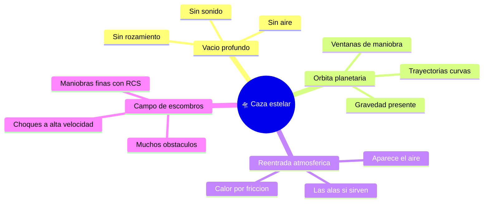

# 🌍 Entornos del caza estelar

[🏠 Inicio](../../../README.md) · [🛸 Curso: Caza estelar](../README.md) · 🌍 Entornos

> ⚖️ Material educativo original; los derechos de las obras pertenecen a sus titulares.

Donde opera un caza estelar y como cambia su comportamiento segun el entorno.
Cada escenario implica reglas fisicas distintas, y en simulacion se traduce en
condiciones diferentes de gravedad, atmosfera y obstaculos.

---

## 🗺️ Entornos principales

| Entorno | Caracteristicas | Riesgos tipicos | Ajuste de maniobra |
| --- | --- | --- | --- |
| Vacio profundo | Sin aire ni rozamiento. | Perder orientacion, gastar delta-v. | Maniobras planificadas, ahorrar propelente. |
| Orbita planetaria | Gravedad que curva la trayectoria. | Caer o escapar sin control. | Respetar mecanica orbital, encender en el momento justo. |
| Reentrada atmosferica | Aparece aire y calor. | Recalentamiento, esfuerzo estructural. | Usar superficies aerodinamicas y frenar con el aire. |
| Campo de escombros | Muchos objetos a gran velocidad. | Colisiones. | RCS finos, trayectoria despejada. |

---

## 🌡️ Factores del entorno

- **Gravedad**: cerca de un planeta la trayectoria se curva; hay que tenerla en
  cuenta para no caer ni salir disparado.
- **Atmosfera**: solo al entrar en una hay aire; ahi si aparecen sustentacion,
  rozamiento y calor por friccion.
- **Calor**: en el vacio el calor no se va por el aire; se acumula y se disipa
  lentamente por radiadores.
- **Obstaculos**: en el vacio los objetos no frenan, asi que un pequeno choque
  puede ser grave por la alta velocidad relativa.

---

## 🎮 Traduccion a simulacion

Cada entorno es un escenario con su gravedad, presencia o ausencia de aire y
densidad de obstaculos. El paso del vacio a una atmosfera cambia por completo
las reglas y es una gran leccion de fisica. Ver como se modela en el
[Modulo 8: Diseno de simulacion](../simulacion/diseno-simulador-caza-estelar.md).

---

[⬅️ Anterior: Principios y operacion](principios-caza-estelar.md) · [➡️ Siguiente: Reglas del universo](../reglamentos/reglas-universo-caza-estelar.md)
