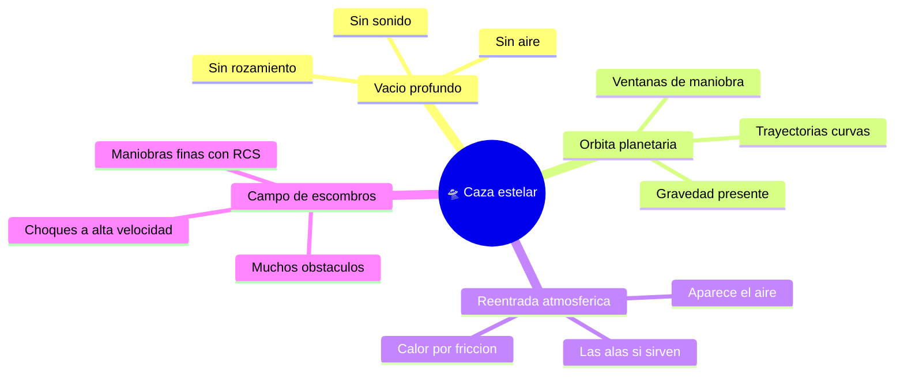

# 🌍 Entornos del caza estelar

[🏠 Inicio](../../../README.md) · [🛸 Curso: Caza estelar](../README.md) · 🌍 Entornos

> ⚖️ Material educativo original; los derechos de las obras pertenecen a sus titulares.

Dónde opera un caza estelar y cómo cambia su comportamiento según el entorno.
Cada escenario implica reglas físicas distintas, y en simulación se traduce en
condiciones diferentes de gravedad, atmósfera y obstáculos.

---

## 🗺️ Entornos principales

| Entorno | Características | Riesgos típicos | Ajuste de maniobra |
| --- | --- | --- | --- |
| Vacío profundo | Sin aire ni rozamiento. | Perder orientación, gastar delta-v. | Maniobras planificadas, ahorrar propelente. |
| Órbita planetaria | Gravedad que curva la trayectoria. | Caer o escapar sin control. | Respetar mecánica orbital, encender en el momento justo. |
| Reentrada atmosférica | Aparece aire y calor. | Recalentamiento, esfuerzo estructural. | Usar superficies aerodinámicas y frenar con el aire. |
| Campo de escombros | Muchos objetos a gran velocidad. | Colisiones. | RCS finos, trayectoria despejada. |

---

## 🌡️ Factores del entorno

- **Gravedad**: cerca de un planeta la trayectoria se curva; hay que tenerla en
  cuenta para no caer ni salir disparado.
- **Atmósfera**: solo al entrar en una hay aire; ahí si aparecen sustentación,
  rozamiento y calor por fricción.
- **Calor**: en el vacío el calor no se va por el aire; se acumula y se disipa
  lentamente por radiadores.
- **Obstáculos**: en el vacío los objetos no frenan, así que un pequeño choque
  puede ser grave por la alta velocidad relativa.

---

## 🎮 Traducción a simulación

Cada entorno es un escenario con su gravedad, presencia o ausencia de aire y
densidad de obstáculos. El paso del vacío a una atmósfera cambia por completo
las reglas y es una gran lección de física. Ver cómo se modela en el
[Módulo 9: Diseño de simulación](../simulacion/diseno-simulador-caza-estelar.md).

---

[⬅️ Anterior: Principios y operación](principios-caza-estelar.md) · [➡️ Siguiente: Reglas del universo](../reglamentos/reglas-universo-caza-estelar.md)
