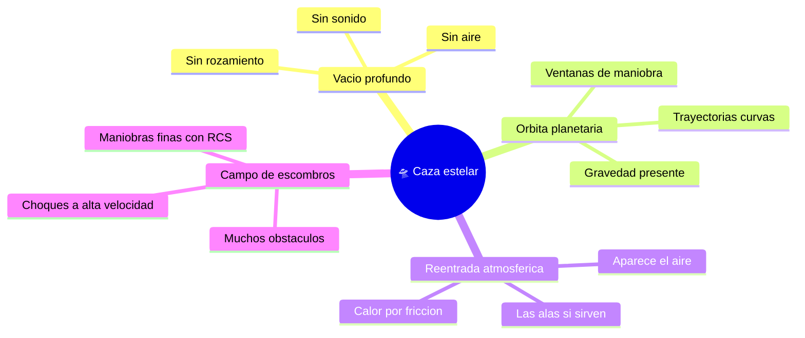

<!-- clase-meta
tipo_documento: clase
clase: 7
codigo: CAZAESTELAR-07
curso: caza-estelar
titulo: "Entornos del caza estelar"
modalidad: "análisis de escenarios"
duracion_minutos: 60
nivel: introductorio
prerrequisito: CAZAESTELAR-06
competencia: "adaptacion_al_entorno"
resultados_aprendizaje:
  - "Explicar entornos, factores ambientales, riesgos y respuesta de simulación con vocabulario propio de Caza estelar."
  - "Aplicar esos conceptos a una decisión segura o a un escenario de simulación de Caza estelar."
evidencia: "Matriz entorno–cambio–riesgo–respuesta."
criterio_aprobacion: "Cada respuesta se adapta al entorno y distingue riesgos que no son intercambiables entre escenarios."
fuentes: manuales/fuentes.md
ultima_revision: 2026-09-10
-->

# 🌍 Entornos del caza estelar

[🏠 Inicio](../../../README.md) · [🛸 Curso: Caza estelar](../README.md) · 🌍 Entornos

> ⚖️ Material educativo original; los derechos de las obras pertenecen a sus titulares.

Dónde opera un caza estelar y cómo cambia su comportamiento según el entorno.
Cada escenario implica reglas físicas distintas, y en simulación se traduce en
condiciones diferentes de gravedad, atmósfera y obstáculos.

---

## 🗺️ Entornos principales

```mermaid
mindmap
  root((🛸 Caza estelar))
    Vacio profundo
      Sin aire
      Sin rozamiento
      Sin sonido
    Orbita planetaria
      Gravedad presente
      Trayectorias curvas
      Ventanas de maniobra
    Reentrada atmosferica
      Aparece el aire
      Calor por friccion
      Las alas si sirven
    Campo de escombros
      Muchos obstaculos
      Choques a alta velocidad
      Maniobras finas con RCS
```

| Entorno | Características | Riesgos típicos | Ajuste de maniobra |
| --- | --- | --- | --- |
| Vacío profundo | Sin aire ni rozamiento. | Perder orientación, gastar delta-v. | Maniobras planificadas, ahorrar propelente. |
| Órbita planetaria | Gravedad que curva la trayectoria. | Caer o escapar sin control. | Respetar mecánica orbital, encender en el momento justo. |
| Reentrada atmosférica | Aparece aire y calor. | Recalentamiento, esfuerzo estructural. | Usar superficies aerodinámicas y frenar con el aire. |
| Campo de escombros | Muchos objetos a gran velocidad. | Colisiones. | RCS finos, trayectoria despejada. |

---

## 🌡️ Factores del entorno

- **Gravedad**: cerca de un planeta la trayectoria se curva; hay que tenerla en
  cuenta para no caer ni salir disparado.
- **Atmósfera**: solo al entrar en una hay aire; ahí si aparecen sustentación,
  rozamiento y calor por fricción.
- **Calor**: en el vacío el calor no se va por el aire; se acumula y se disipa
  lentamente por radiadores.
- **Obstáculos**: en el vacío los objetos no frenan, así que un pequeño choque
  puede ser grave por la alta velocidad relativa.

---

## 🎮 Traducción a simulación

Cada entorno es un escenario con su gravedad, presencia o ausencia de aire y
densidad de obstáculos. El paso del vacío a una atmósfera cambia por completo
las reglas y es una gran lección de física. Ver cómo se modela en el
[Clase 9: Diseño de simulación](../simulacion/diseno-simulador-caza-estelar.md).

## 🧭 Guía de estudio aplicada

### Pregunta guía

¿Cómo ayuda **Entornos principales, Factores del entorno, Traducción a simulación y Guía de estudio aplicada** a **adaptar intercepción ficticia seguida de una maniobra de evasión a tres condiciones ambientales distintas**?

### Explicación razonada

El entorno no es decoración: modifica las fuerzas, la percepción y el tiempo disponible. En el caso «intercepción ficticia seguida de una maniobra de evasión», cambia el comportamiento de trayectoria y aumenta la probabilidad de trasladar aerodinámica atmosférica al vacío sin justificar la licencia narrativa. La respuesta correcta empieza por reconocer qué variable cambió y después adaptar límites, ruta o misión.

Esta clase se conecta con el resto del curso mediante **contraste entre maniobra mostrada en el canon y conservación del momento en el espacio**. El hilo de
seguridad consiste en reconocer a tiempo **trasladar aerodinámica atmosférica al vacío sin justificar la licencia narrativa** y poder justificar la decisión
**separar regla de universo, modelo físico elegido y retroalimentación al jugador**; en clases posteriores cambiará el ángulo de análisis, no esa relación causal.
La lectura funcional común sigue **fuente de energía ficticia → propulsión → control de actitud → trayectoria**, de modo que cada concepto pueda
ubicarse dentro del funcionamiento completo y no quede como un dato aislado.

**Apoyo documental:** [Star Wars Databank](https://www.starwars.com/databank) aporta canon narrativo y diseño visual;
[Beginner's Guide to Aeronautics](https://www1.grc.nasa.gov/beginners-guide-to-aeronautics/) se usa para contraste con física y vuelo reales. Estas fuentes
se contrastan con el alcance de la clase y no sustituyen un manual de equipo concreto.

### Caso resuelto: de la observación a la decisión

1. **Escenario base:** conserva la misión «intercepción ficticia seguida de una maniobra de evasión» para poder comparar.
2. **Cambiar una condición:** modifica sucesivamente superficie o medio, visibilidad y perturbación externa.
3. **Recalcular margen:** explica cómo cada cambio afecta **trayectoria** y acerca o aleja **trasladar aerodinámica atmosférica al vacío sin justificar la licencia narrativa**.
4. **Adaptar:** cambia límite, ruta, configuración o incluso cancela; no mantengas la misma respuesta por hábito.

### Comprueba tu comprensión

1. ¿Cómo cambiaría **trayectoria** si empeora la perturbación externa?
2. ¿Qué condición ambiental acerca más el escenario a **trasladar aerodinámica atmosférica al vacío sin justificar la licencia narrativa**?
3. ¿Cuándo adaptarías la maniobra y cuándo la cancelarías?

Orientación para revisar tus respuestas

- La primera respuesta debe relacionar el eslabón elegido con un efecto posterior, no solo nombrarlo.
- La segunda debe proponer una señal medible u observable y explicar qué tendencia sería preocupante.
- La tercera debe cambiar al menos una variable de capacidad, mando, entorno o margen de seguridad.

## 🎓 Cierre de clase

- **Actividad:** Contrasta tres entornos de Caza estelar a partir de entornos, factores ambientales, riesgos y respuesta de simulación y determina cómo cambian variables, percepción, riesgos y respuesta.
- **Evidencia:** Matriz entorno–cambio–riesgo–respuesta.
- **Criterio de aprobación:** Cada respuesta se adapta al entorno y distingue riesgos que no son intercambiables entre escenarios.
- **Transferencia:** explica qué cambiaría al pasar a otra variante de esta máquina.

### Fuentes de esta clase

- [STARWARS-DATABANK](https://www.starwars.com/databank): Star Wars Databank, Lucasfilm. Uso: canon narrativo y diseño visual.
- [NASA-FLIGHT](https://www1.grc.nasa.gov/beginners-guide-to-aeronautics/): Beginner's Guide to Aeronautics, NASA. Uso: contraste con física y vuelo reales.

> Las fuentes sostienen el marco conceptual y normativo; esta clase no reemplaza el manual
> del fabricante, la formación certificada ni la habilitación exigida para operar equipos reales.

---

[⬅️ Anterior: Principios y operación](principios-caza-estelar.md) · [➡️ Siguiente: Reglas del universo](../reglamentos/reglas-universo-caza-estelar.md)
