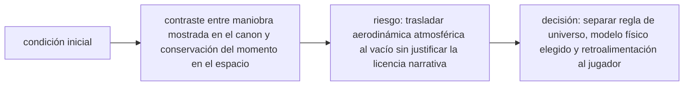

<!-- clase-meta
tipo_documento: clase
clase: 6
codigo: CAZAESTELAR-06
curso: caza-estelar
titulo: "Principios y operación del caza estelar"
modalidad: "resolución de problemas"
duracion_minutos: 90
nivel: introductorio
prerrequisito: CAZAESTELAR-05
competencia: "razonamiento_operacional"
resultados_aprendizaje:
  - "Explicar principios físicos, fases de operación, decisiones y errores frecuentes con vocabulario propio de Caza estelar."
  - "Aplicar esos conceptos a una decisión segura o a un escenario de simulación de Caza estelar."
evidencia: "Resolución argumentada de un escenario operacional."
criterio_aprobacion: "Aplica los principios correctos, anticipa consecuencias y respeta los límites del curso."
fuentes: manuales/fuentes.md
ultima_revision: 2026-09-10
-->

# 🧪 Principios y operación del caza estelar

[🏠 Inicio](../../../README.md) · [🛸 Curso: Caza estelar](../README.md) · 🧪 Principios

> ⚖️ Material educativo original; los derechos de las obras pertenecen a sus titulares.

Documento educativo y de divulgación. Aquí está el corazón del curso: las leyes
de Newton aplicadas al vacío y por qué el combate espacial real no se parece al
de las películas. Explica que si sería posible, que no, y sobre todo por qué.

## Las leyes de Newton en el vacío

- **Primera ley (inercia)**: sin fuerzas, un objeto mantiene su velocidad. En el
  vacío no hay aire ni rozamiento, así que al apagar el motor la nave no frena:
  sigue a la misma velocidad y en la misma dirección para siempre.
- **Segunda ley (fuerza y masa)**: la aceleración es la fuerza dividida por la
  masa. Una nave más pesada necesita más empuje para el mismo cambio de
  velocidad. No existe el "aceleron mágico" independiente de la masa.
- **Tercera ley (acción y reacción)**: para moverse hay que expulsar algo hacia
  el otro lado. El motor lanza propelente atrás y la nave avanza. Sin masa que
  expulsar, no hay empuje.

## Por qué no hay virajes como un avión

Un avión gira porque sus alas empujan el aire y el aire lo empuja a el; además
inclina el giro apoyandose en la atmósfera (viraje bancado). En el vacío no hay
aire: las alas no sirven y no existe ese apoyo. La nave solo puede rotar sobre
su eje con los RCS y cambiar su rumbo encendiendo el motor en la nueva
dirección. El giro cerrado y continuo tipo caza aéreo es imposible.

## Reorientar no es lo mismo que cambiar de rumbo

Este es el punto que más cuesta y el más importante. Apuntar la nariz hacia otro
lado (reorientar) no cambia por si solo hacia donde te mueves. Puedes ir
avanzando hacia adelante y girar la nave para mirar hacia atrás sin dejar de
moverte en la dirección original: el momento se conserva. Solo cuando enciendes
el motor en la nueva dirección empiezas a cambiar de rumbo, y eso lleva tiempo y
gasta propelente.

## Delta-v: el presupuesto de maniobra

Cada nave lleva una cantidad limitada de propelente. La medida útil no es
"cuanta gasolina queda", sino cuanto puede cambiar su velocidad en total: eso se
llama delta-v. Cada maniobra gasta parte de ese presupuesto. Cuando se agota, la
nave ya no puede acelerar, frenar ni cambiar de rumbo, aunque le sobre energía
eléctrica. Un piloto realista cuida el delta-v como su recurso más valioso.

## Que si y que no

| Idea de la ficción | Que si es real | Que no es real |
| --- | --- | --- |
| La nave frena al soltar gas | Se puede frenar con empuje contrario | No se frena sola sin rozamiento. |
| Giros cerrados tipo avión | Se puede rotar la nave sobre su eje | No hay viraje bancado sin aire. |
| Disparos con estela y ruido | Puede haber armas de proyectil | En el vacío no hay sonido ni estela de haz. |
| Explosiones con llamas y fuego | Puede haber destello y escombros | Sin oxígeno no hay fuego con llamas sostenidas. |
| Combate cuerpo a cuerpo cercano | Puede haber combate | Ocurriría a enormes distancias y velocidades. |
| Propulsión inagotable | El empuje por reacción es real | El propelente es finito (delta-v). |

## Cómo sería un combate realista

- Las naves se detectarían y dispararían a distancias enormes, no a la vista.
- Las maniobras serían lentas y planificadas, no giros bruscos continuos.
- No habría ruido: el vacío no transmite sonido.
- Ganar sería cuestión de gestión de energía, delta-v y sensores, no de
  reflejos de duelo aéreo.

## Relación con los niveles de realismo

- **Nivel 1 (educativo)**: mover la nave, orientarla y notar que no frena sola.
- **Nivel 2 (simplificado)**: sumar conservación del momento y RCS.
- **Nivel 3 (técnico)**: gestionar delta-v, masa, calor y combate a distancia.

Ver [`docs/03-niveles-de-realismo.md`](../../../docs/03-niveles-de-realismo.md)
para el detalle de cada nivel.

## 🧭 Guía de estudio aplicada

### Pregunta guía

¿Cómo ayuda **Las leyes de Newton en el vacío, Por qué no hay virajes como un avión, Reorientar no es lo mismo que cambiar de rumbo y Delta-v: el presupuesto de maniobra** a **resolver intercepción ficticia seguida de una maniobra de evasión sin agotar el margen operacional**?

### Explicación razonada

El principio rector puede resumirse así: contraste entre maniobra mostrada en el canon y conservación del momento en el espacio. Esto explica por qué una misma orden produce resultados distintos cuando cambian velocidad, carga, configuración o entorno. Operar bien consiste en leer la tendencia antes de agotar el margen y tomar esta decisión: separar regla de universo, modelo físico elegido y retroalimentación al jugador.

Esta clase se conecta con el resto del curso mediante **contraste entre maniobra mostrada en el canon y conservación del momento en el espacio**. El hilo de
seguridad consiste en reconocer a tiempo **trasladar aerodinámica atmosférica al vacío sin justificar la licencia narrativa** y poder justificar la decisión
**separar regla de universo, modelo físico elegido y retroalimentación al jugador**; en clases posteriores cambiará el ángulo de análisis, no esa relación causal.
La lectura funcional común sigue **fuente de energía ficticia → propulsión → control de actitud → trayectoria**, de modo que cada concepto pueda
ubicarse dentro del funcionamiento completo y no quede como un dato aislado.

**Apoyo documental:** [Star Wars Databank](https://www.starwars.com/databank) aporta canon narrativo y diseño visual;
[Beginner's Guide to Aeronautics](https://www1.grc.nasa.gov/beginners-guide-to-aeronautics/) se usa para contraste con física y vuelo reales. Estas fuentes
se contrastan con el alcance de la clase y no sustituyen un manual de equipo concreto.

### Caso resuelto: de la observación a la decisión

1. **Datos:** reconoce condiciones, configuración y margen disponibles en **intercepción ficticia seguida de una maniobra de evasión**.
2. **Modelo:** aplica **contraste entre maniobra mostrada en el canon y conservación del momento en el espacio** para predecir una tendencia antes de actuar.
3. **Riesgo:** explica mediante qué cadena de causas podría ocurrir **trasladar aerodinámica atmosférica al vacío sin justificar la licencia narrativa**.
4. **Decisión:** ejecuta mentalmente **separar regla de universo, modelo físico elegido y retroalimentación al jugador** y define qué observación confirmaría que funcionó.

### Comprueba tu comprensión

1. ¿Qué variable del principio «contraste entre maniobra mostrada en el canon y conservación del momento en el espacio» cambia primero en el caso?
2. ¿Cómo se propaga ese cambio hasta **trayectoria**?
3. ¿Qué evidencia confirmaría que **separar regla de universo, modelo físico elegido y retroalimentación al jugador** conservó margen operacional?

Orientación para revisar tus respuestas

- La primera respuesta debe relacionar el eslabón elegido con un efecto posterior, no solo nombrarlo.
- La segunda debe proponer una señal medible u observable y explicar qué tendencia sería preocupante.
- La tercera debe cambiar al menos una variable de capacidad, mando, entorno o margen de seguridad.

## 🎓 Cierre de clase

- **Actividad:** Resuelve un escenario de Caza estelar explicando, paso a paso, cómo intervienen principios físicos, fases de operación, decisiones y errores frecuentes.
- **Evidencia:** Resolución argumentada de un escenario operacional.
- **Criterio de aprobación:** Aplica los principios correctos, anticipa consecuencias y respeta los límites del curso.
- **Transferencia:** explica qué cambiaría al pasar a otra variante de esta máquina.

### Fuentes de esta clase

- [STARWARS-DATABANK](https://www.starwars.com/databank): Star Wars Databank, Lucasfilm. Uso: canon narrativo y diseño visual.
- [NASA-FLIGHT](https://www1.grc.nasa.gov/beginners-guide-to-aeronautics/): Beginner's Guide to Aeronautics, NASA. Uso: contraste con física y vuelo reales.

> Las fuentes sostienen el marco conceptual y normativo; esta clase no reemplaza el manual
> del fabricante, la formación certificada ni la habilitación exigida para operar equipos reales.

---

[⬅️ Anterior: Mandos](../mandos/manual-mandos-caza-estelar.md) · [➡️ Siguiente: Entornos](entornos-caza-estelar.md)
