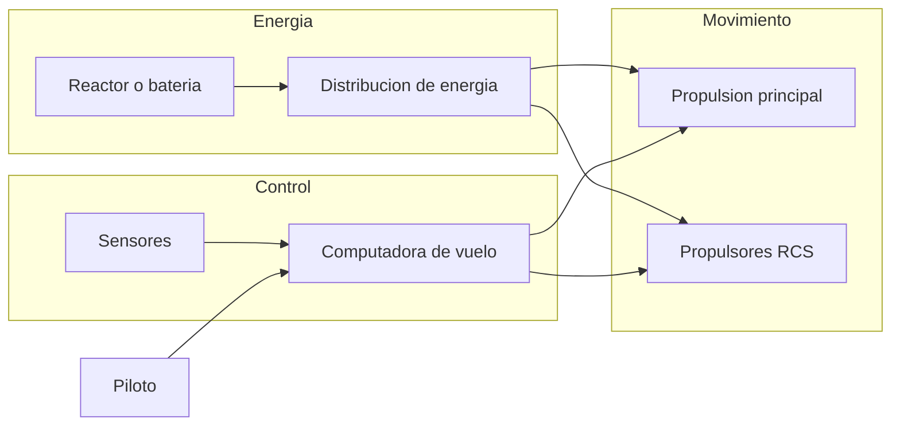
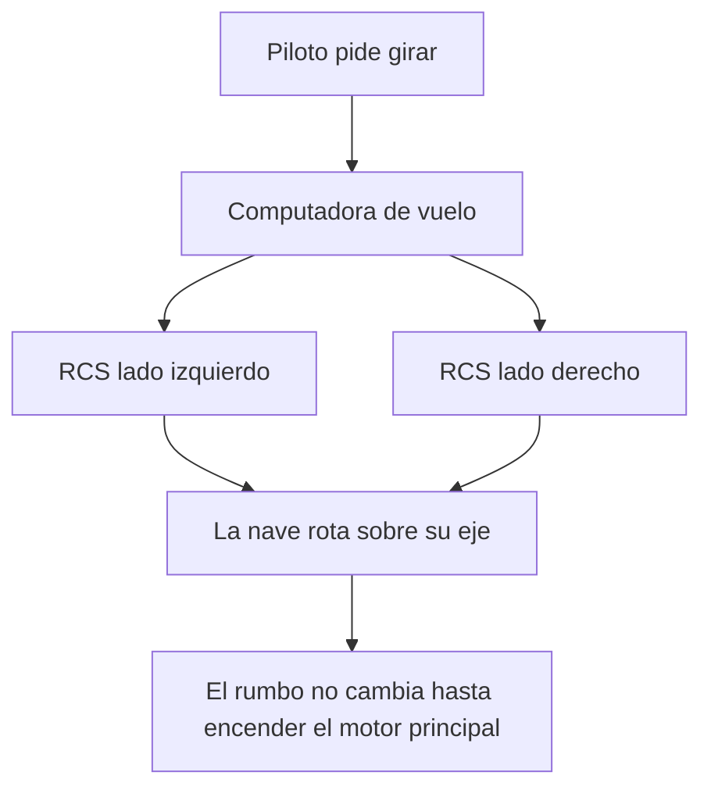

# 🔧 Sistemas mecanicos del caza estelar

[🏠 Inicio](../../../README.md) · [🛸 Curso: Caza estelar](../README.md) · 🔧 Sistemas mecanicos

> ⚖️ Material educativo original; los derechos de las obras pertenecen a sus titulares.

Este modulo abre el caza estelar por dentro. Compara la tecnologia imaginaria
de la ficcion con la fisica real que la haria funcionar (o que la desmiente).
La regla del curso es clara: describimos conceptos con nuestras palabras, sin
copiar planos ni especificaciones oficiales.

---

## 1. 🔋 Fuente de energia

En la ficcion, un reactor compacto entrega energia casi ilimitada. En la
realidad, la energia no es el unico limite: aunque tuvieras un reactor potente,
mover la nave exige expulsar masa (propelente) hacia atras. Sin masa que
expulsar, no hay empuje, por mucha energia que sobre.

| Concepto de ficcion | Fisica real que evoca | Veredicto |
| --- | --- | --- |
| Reactor de energia infinita | Fuentes de energia densas | Plausible como idea, no como "infinita". |
| Motor que no gasta nada | Motor de cohete que gasta propelente | No fisico: siempre se gasta masa. |
| Recarga instantanea | Almacenamiento de energia | Parcial: la energia si, el propelente no. |

---

## 2. 🚀 Propulsion principal

El chorro brillante de la parte trasera representa un motor de reaccion:
expulsa masa a gran velocidad y, por la tercera ley de Newton, la nave recibe
un empuje en sentido contrario. Esto si es real. Lo que no es real es que el
chorro se vea como una llama sostenida: sin oxigeno del aire no hay fuego con
llamas como en la Tierra, y en el vacio el brillo seria muy distinto.

| Idea de la ficcion | Que dice la fisica real |
| --- | --- |
| Llama naranja constante | Sin aire no hay combustion con llama sostenida. |
| La nave frena al apagar el motor | Sin rozamiento sigue a velocidad constante. |
| Aceleracion instantanea a tope | La aceleracion depende de empuje y masa. |
| Propelente que nunca se acaba | El propelente es finito y define el delta-v. |

---

## 3. 🛰️ Propulsores de control de reaccion (RCS)

Aqui esta la clave fisica del curso. Para apuntar la nave hacia otro lado no
sirve un volante: en el vacio no hay contra que "apoyarse". Se usan pequenos
propulsores repartidos por el casco, los RCS, que lanzan chorros cortos para
rotar la nave o desplazarla de lado. Reorientar la nariz no cambia por si solo
la direccion en que la nave se mueve: el momento se conserva.

- **Rotacion**: pares de RCS opuestos hacen girar la nave sin moverla de sitio.
- **Traslacion lateral**: un RCS empuja la nave completa hacia un costado.
- **Frenado de giro**: para dejar de rotar hay que aplicar un impulso contrario;
  no se detiene sola.

---

## 4. 🖥️ Computadora de vuelo y sensores

En la ficcion el piloto lo hace todo con instinto. En la realidad, coordinar
decenas de propulsores para lograr una maniobra limpia exige una computadora
que traduzca "quiero apuntar alli" en encendidos precisos de cada RCS. Los
sensores no verian al enemigo por la ventana, sino a enormes distancias con
instrumentos.

| Sistema | En la ficcion | En la realidad |
| --- | --- | --- |
| Punteria | El piloto mira y dispara de cerca | Combate a gran distancia con sensores. |
| Giro | Palanca tipo avion | Computadora dosifica los RCS. |
| Deteccion | Vista directa | Sensores de calor, radar y radio. |

---

## 5. 🪽 Alas, aletas y radiadores

Las alas grandes son casi puro estilo: sin atmosfera no generan sustentacion ni
permiten virar. Si tuvieran una funcion real, seria disipar calor: en el vacio
el calor no se va por el aire, asi que una nave necesita radiadores amplios
para no recalentarse.

| Elemento visible | Funcion en la ficcion | Funcion util real |
| --- | --- | --- |
| Alas | Maniobrar como avion | Ninguna aerodinamica; posible soporte. |
| Aletas | Estabilidad en giros | Sin efecto sin aire. |
| Paneles amplios | Estetica | Radiadores para expulsar calor. |

---

## 🔁 Como se conecta todo

1. La **energia** alimenta motores y sistemas.
2. La **propulsion principal** cambia la velocidad expulsando propelente.
3. Los **RCS** cambian la orientacion y hacen ajustes finos.
4. La **computadora** coordina todo respetando la conservacion del momento.
5. Los **sensores** informan a gran distancia, no por la ventanilla.

Con esto claro, el [Modulo 4: Mandos](../mandos/manual-mandos-caza-estelar.md)
muestra como el piloto operaria cada sistema.

---

[⬅️ Anterior: Caracteristicas](caracteristicas-caza-estelar.md) · [➡️ Siguiente: Mandos e instrumentos](../mandos/manual-mandos-caza-estelar.md)
