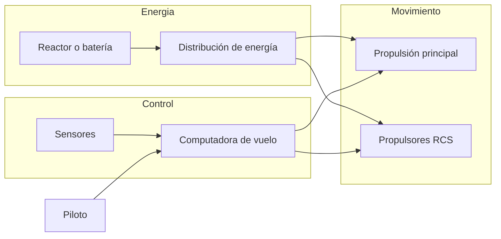
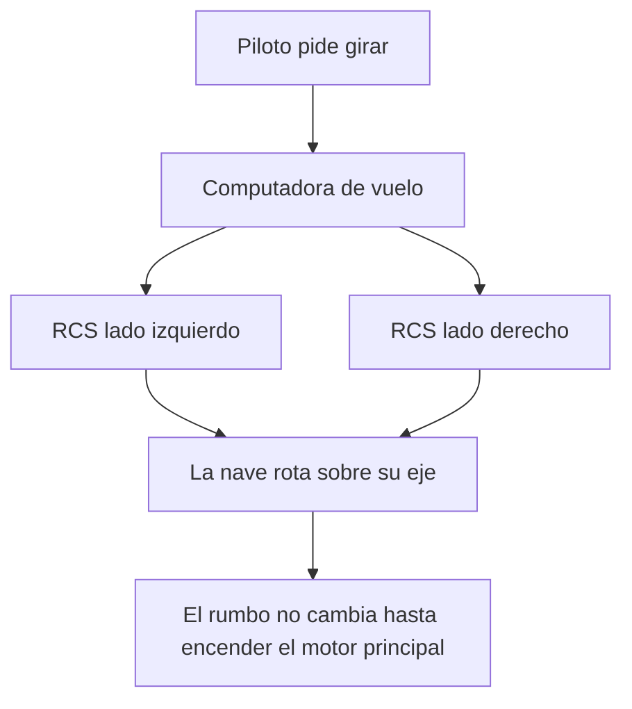
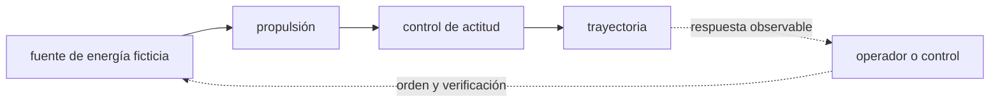

<!-- clase-meta
tipo_documento: clase
clase: 4
codigo: CAZAESTELAR-04
curso: caza-estelar
titulo: "Sistemas mecánicos del caza estelar"
modalidad: "teórica aplicada"
duracion_minutos: 90
nivel: introductorio
prerrequisito: CAZAESTELAR-03
competencia: "comprension_de_sistemas"
resultados_aprendizaje:
  - "Explicar Fuente de energía, Propulsión principal, Propulsores de control de reacción (RCS) y Computadora de vuelo y sensores con vocabulario propio de Caza estelar."
  - "Aplicar esos conceptos a una decisión segura o a un escenario de simulación de Caza estelar."
evidencia: "Esquema con flujos de energía, materia o información anotados."
criterio_aprobacion: "Las conexiones esenciales son correctas y la consecuencia de la falla se propaga de manera coherente."
fuentes: manuales/fuentes.md
ultima_revision: 2026-09-10
-->

# 🔧 Sistemas mecánicos del caza estelar

[🏠 Inicio](../../../README.md) · [🛸 Curso: Caza estelar](../README.md) · 🔧 Sistemas mecánicos

> ⚖️ Material educativo original; los derechos de las obras pertenecen a sus titulares.

Esta clase abre el caza estelar por dentro. Compara la tecnología imaginaria
de la ficción con la física real que la haría funcionar (o que la desmiente).
La regla del curso es clara: describimos conceptos con nuestras palabras, sin
copiar planos ni especificaciones oficiales.

```mermaid
flowchart LR
    subgraph Energia
        R[Reactor o batería] --> Dist[Distribución de energía]
    end
    subgraph Movimiento
        Dist --> Prop[Propulsión principal]
        Dist --> RCS[Propulsores RCS]
    end
    subgraph Control
        Sen[Sensores] --> Comp[Computadora de vuelo]
        Comp --> Prop
        Comp --> RCS
    end
    Piloto[Piloto] --> Comp
```

---

## 1. 🔋 Fuente de energía

En la ficción, un reactor compacto entrega energía casi ilimitada. En la
realidad, la energía no es el único límite: aunque tuvieras un reactor potente,
mover la nave exige expulsar masa (propelente) hacia atrás. Sin masa que
expulsar, no hay empuje, por mucha energía que sobre.

| Concepto de ficción | Física real que evoca | Veredicto |
| --- | --- | --- |
| Reactor de energía infinita | Fuentes de energía densas | Plausible como idea, no como "infinita". |
| Motor que no gasta nada | Motor de cohete que gasta propelente | No físico: siempre se gasta masa. |
| Recarga instantánea | Almacenamiento de energía | Parcial: la energía si, el propelente no. |

---

## 2. 🚀 Propulsión principal

El chorro brillante de la parte trasera representa un motor de reacción:
expulsa masa a gran velocidad y, por la tercera ley de Newton, la nave recibe
un empuje en sentido contrario. Esto si es real. Lo que no es real es que el
chorro se vea como una llama sostenida: sin oxígeno del aire no hay fuego con
llamas como en la Tierra, y en el vacío el brillo sería muy distinto.

```mermaid
flowchart LR
    Prop[Propelente] --> Camara[Cámara de empuje]
    Camara -->|expulsa masa atrás| Chorro[Chorro de escape]
    Chorro -->|reacción adelante| Nave[La nave acelera]
    Nave --> Momento[Gana momento y lo conserva]
```

| Idea de la ficción | Que dice la física real |
| --- | --- |
| Llama naranja constante | Sin aire no hay combustión con llama sostenida. |
| La nave frena al apagar el motor | Sin rozamiento sigue a velocidad constante. |
| Aceleración instantánea a tope | La aceleración depende de empuje y masa. |
| Propelente que nunca se acaba | El propelente es finito y define el delta-v. |

---

## 3. 🛰️ Propulsores de control de reacción (RCS)

Aquí está la clave física del curso. Para apuntar la nave hacia otro lado no
sirve un volante: en el vacío no hay contra que "apoyarse". Se usan pequeños
propulsores repartidos por el casco, los RCS, que lanzan chorros cortos para
rotar la nave o desplazarla de lado. Reorientar la nariz no cambia por si solo
la dirección en que la nave se mueve: el momento se conserva.

```mermaid
flowchart TD
    Piloto[Piloto pide girar] --> Comp[Computadora de vuelo]
    Comp --> Rcs1[RCS lado izquierdo]
    Comp --> Rcs2[RCS lado derecho]
    Rcs1 --> Rota[La nave rota sobre su eje]
    Rcs2 --> Rota
    Rota --> Nota[El rumbo no cambia hasta encender el motor principal]
```

- **Rotación**: pares de RCS opuestos hacen girar la nave sin moverla de sitio.
- **Traslación lateral**: un RCS empuja la nave completa hacia un costado.
- **Frenado de giro**: para dejar de rotar hay que aplicar un impulso contrario;
  no se detiene sola.

---

## 4. 🖥️ Computadora de vuelo y sensores

En la ficción el piloto lo hace todo con instinto. En la realidad, coordinar
decenas de propulsores para lograr una maniobra limpia exige una computadora
que traduzca "quiero apuntar allí" en encendidos precisos de cada RCS. Los
sensores no verían al enemigo por la ventana, sino a enormes distancias con
instrumentos.

| Sistema | En la ficción | En la realidad |
| --- | --- | --- |
| Puntería | El piloto mira y dispara de cerca | Combate a gran distancia con sensores. |
| Giro | Palanca tipo avión | Computadora dosifica los RCS. |
| Detección | Vista directa | Sensores de calor, radar y radio. |

---

## 5. 🪽 Alas, aletas y radiadores

Las alas grandes son casi puro estilo: sin atmósfera no generan sustentación ni
permiten virar. Si tuvieran una función real, sería disipar calor: en el vacío
el calor no se va por el aire, así que una nave necesita radiadores amplios
para no recalentarse.

| Elemento visible | Función en la ficción | Función útil real |
| --- | --- | --- |
| Alas | Maniobrar como avión | Ninguna aerodinámica; posible soporte. |
| Aletas | Estabilidad en giros | Sin efecto sin aire. |
| Paneles amplios | Estética | Radiadores para expulsar calor. |

---

## 🔁 Cómo se conecta todo

1. La **energía** alimenta motores y sistemas.
2. La **propulsión principal** cambia la velocidad expulsando propelente.
3. Los **RCS** cambian la orientación y hacen ajustes finos.
4. La **computadora** coordina todo respetando la conservación del momento.
5. Los **sensores** informan a gran distancia, no por la ventanilla.

Con esto claro, el [Clase 5: Mandos](../mandos/manual-mandos-caza-estelar.md)
muestra como el piloto operaría cada sistema.

## 🧭 Guía de estudio aplicada

### Pregunta guía

¿Cómo ayuda **Fuente de energía, Propulsión principal, Propulsores de control de reacción (RCS) y Computadora de vuelo y sensores** a **seguir una alteración desde fuente de energía ficticia hasta trayectoria durante intercepción ficticia seguida de una maniobra de evasión**?

### Explicación razonada

El funcionamiento puede leerse como una cadena causal: fuente de energía ficticia entrega o transforma energía; propulsión la adapta; control de actitud la transmite o gobierna; y trayectoria produce el efecto observable. La cadena no es lineal en sentido estricto: sensores, estructura y operador cierran el lazo. Si un eslabón se degrada, la señal importante es cómo cambia el estado de trayectoria y qué margen queda.

```mermaid
flowchart LR
    A["fuente de energía ficticia"] --> B["propulsión"] --> C["control de actitud"] --> D["trayectoria"]
    D -. respuesta observable .-> O["operador o control"]
    O -. orden y verificación .-> A
```

Esta clase se conecta con el resto del curso mediante **contraste entre maniobra mostrada en el canon y conservación del momento en el espacio**. El hilo de
seguridad consiste en reconocer a tiempo **trasladar aerodinámica atmosférica al vacío sin justificar la licencia narrativa** y poder justificar la decisión
**separar regla de universo, modelo físico elegido y retroalimentación al jugador**; en clases posteriores cambiará el ángulo de análisis, no esa relación causal.
La lectura funcional común sigue **fuente de energía ficticia → propulsión → control de actitud → trayectoria**, de modo que cada concepto pueda
ubicarse dentro del funcionamiento completo y no quede como un dato aislado.

**Apoyo documental:** [Star Wars Databank](https://www.starwars.com/databank) aporta canon narrativo y diseño visual;
[Beginner's Guide to Aeronautics](https://www1.grc.nasa.gov/beginners-guide-to-aeronautics/) se usa para contraste con física y vuelo reales. Estas fuentes
se contrastan con el alcance de la clase y no sustituyen un manual de equipo concreto.

### Caso resuelto: de la observación a la decisión

1. **Entrada:** identifica el estado inicial de **fuente de energía ficticia** durante **intercepción ficticia seguida de una maniobra de evasión**.
2. **Transformación:** explica qué hacen **propulsión** y **control de actitud**, y qué magnitud cambia en cada paso.
3. **Salida:** comprueba el efecto esperado en **trayectoria** y busca una desviación temprana.
4. **Falla razonada:** si aparece **trasladar aerodinámica atmosférica al vacío sin justificar la licencia narrativa**, retrocede por la cadena antes de ordenar otra acción.

### Comprueba tu comprensión

1. Si se degrada **propulsión**, ¿qué efecto esperarías primero en **control de actitud** y después en **trayectoria**?
2. ¿Qué observación ayudaría a diferenciar una falla de **fuente de energía ficticia** de una falla de **control de actitud**?
3. ¿Por qué una segunda orden podría agravar **trasladar aerodinámica atmosférica al vacío sin justificar la licencia narrativa**?

Orientación para revisar tus respuestas

- La primera respuesta debe relacionar el eslabón elegido con un efecto posterior, no solo nombrarlo.
- La segunda debe proponer una señal medible u observable y explicar qué tendencia sería preocupante.
- La tercera debe cambiar al menos una variable de capacidad, mando, entorno o margen de seguridad.

## 🎓 Cierre de clase

- **Actividad:** Dibuja un esquema funcional de Caza estelar que conecte Fuente de energía, Propulsión principal, Propulsores de control de reacción (RCS) y Computadora de vuelo y sensores; después predice el efecto de una falla simulada.
- **Evidencia:** Esquema con flujos de energía, materia o información anotados.
- **Criterio de aprobación:** Las conexiones esenciales son correctas y la consecuencia de la falla se propaga de manera coherente.
- **Transferencia:** explica qué cambiaría al pasar a otra variante de esta máquina.

### Fuentes de esta clase

- [STARWARS-DATABANK](https://www.starwars.com/databank): Star Wars Databank, Lucasfilm. Uso: canon narrativo y diseño visual.
- [NASA-FLIGHT](https://www1.grc.nasa.gov/beginners-guide-to-aeronautics/): Beginner's Guide to Aeronautics, NASA. Uso: contraste con física y vuelo reales.

> Las fuentes sostienen el marco conceptual y normativo; esta clase no reemplaza el manual
> del fabricante, la formación certificada ni la habilitación exigida para operar equipos reales.

---

[⬅️ Anterior: Modelos y variantes](../modelos/modelos-caza-estelar.md) · [➡️ Siguiente: Mandos e instrumentos](../mandos/manual-mandos-caza-estelar.md)
