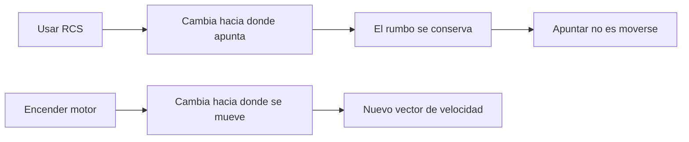

# 🧰 Recursos del caza estelar

[🏠 Inicio](../../../README.md) · [🛸 Curso: Caza estelar](../README.md) · 🧰 Recursos

> ⚖️ Material educativo original; los derechos de las obras pertenecen a sus titulares.

Glosario específico, enlaces y diagramas de apoyo del curso de caza estelar.
Amplia el [glosario general](../../../docs/05-glosario-general.md).

---

## 📖 Glosario específico

| Término | Definición |
| --- | --- |
| Vacío | Espacio sin aire; sin rozamiento ni sonido ni sustentación. |
| Inercia | Tendencia de un objeto a mantener su velocidad si no hay fuerzas. |
| Momento | Producto de masa por velocidad; se conserva sin fuerzas externas. |
| Delta-v | Cambio total de velocidad que la nave puede lograr con su propelente. |
| Propelente | Masa que el motor expulsa para generar empuje por reacción. |
| Empuje | Fuerza que impulsa la nave, resultado de expulsar masa. |
| RCS | Propulsores de control de reacción para rotar o trasladar la nave. |
| Orientación | Hacia donde apunta la nave, distinta de hacia donde se mueve. |
| Viraje bancado | Giro inclinado típico de un avión; imposible sin aire. |
| Reentrada | Entrada a una atmósfera, donde aparecen aire, calor y rozamiento. |

---

## 🗺️ Diagrama: apuntar frente a moverse

---

## 🔗 Enlaces y fuentes

- Portada del curso: [🛸 Curso: Caza estelar](../README.md)
- Catálogo de naves de ficción: [🌌 Naves de ficción](../../README.md)
- Glosario general: [📖 docs/05-glosario-general.md](../../../docs/05-glosario-general.md)
- Niveles de realismo: [🎚️ docs/03-niveles-de-realismo.md](../../../docs/03-niveles-de-realismo.md)
- Registro de fuentes: [📚 manuales/fuentes.md](../../../manuales/fuentes.md)

Registrar cada recurso nuevo con su origen y licencia, respetando el aviso de
derechos del catálogo de naves de ficción.

---

[🎓 Portada del curso](../README.md) · [⬅️ Anterior: Diseño de simulación](../simulacion/diseno-simulador-caza-estelar.md) · [➡️ Siguiente: Ejercicios](../ejercicios/ejercicios-caza-estelar.md)
