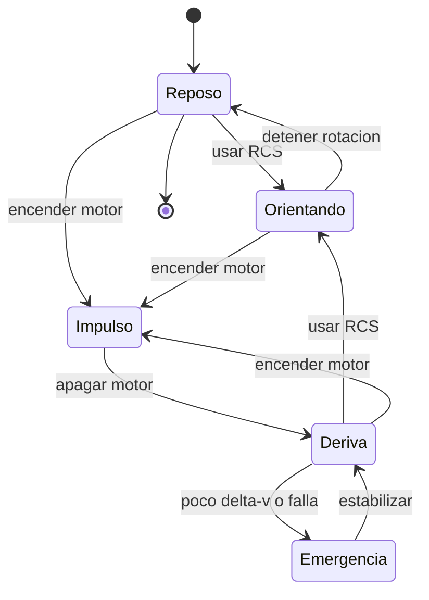

# 🎮 Diseno de simulacion del caza estelar

[🏠 Inicio](../../../README.md) · [🛸 Curso: Caza estelar](../README.md) · 🎮 Simulacion

> ⚖️ Material educativo original; los derechos de las obras pertenecen a sus titulares.

Como modelar de forma educativa y divertida un caza estelar. La idea central es
poder alternar entre la version espectacular de la ficcion y la version fiel a
la fisica, para que el usuario compare ambas con la misma nave.

## Objetivo de la simulacion

Que el usuario comprenda, jugando, que en el vacio la nave no frena sola, que
apuntar no es lo mismo que moverse, y que cada maniobra gasta un presupuesto de
delta-v. El modo ficcion sirve para engancharse; el modo ciencia, para aprender.

## Modo ciencia o ficcion

La variable mas importante del simulador es el **modo**:

- **Modo ficcion**: la nave frena al soltar el acelerador, vira como avion, los
  disparos suenan y se ven. Es divertido y familiar.
- **Modo ciencia**: se aplican las leyes de Newton, la conservacion del momento
  y el limite de delta-v. La nave deriva, hay silencio y el combate es lejano.

Al cambiar de modo, la interfaz avisa que reglas se activan o desactivan, para
que la comparacion sea explicita y educativa.

## Variables principales

| Variable | Tipo | Rango | Afecta a | Comentarios |
| --- | --- | --- | --- | --- |
| Modo | discreta | ciencia / ficcion | Todas las reglas | Interruptor central del aprendizaje. |
| Vector de velocidad | numerica | 0-varios km/s | Movimiento | En modo ciencia se conserva sin motor. |
| Orientacion | numerica | 0-360 grados por eje | Apuntado | Independiente del rumbo. |
| Empuje principal | numerica | 0-100% | Cambio de velocidad | No fija velocidad, la cambia. |
| Delta-v restante | numerica | 0-100% | Autonomia de maniobra | En ficcion puede ignorarse. |
| Masa total | numerica | fija + carga | Aceleracion | Mas masa, menos aceleracion. |
| Calor acumulado | numerica | 0-100% | Riesgo termico | Se disipa lento por radiadores. |
| Gravedad del entorno | numerica | 0-alta | Trayectoria | Curva el rumbo cerca de un planeta. |

## Ciclo basico

1. Leer entrada del usuario (empuje, rotacion, traslacion, disparo).
2. Comprobar el modo activo (ciencia o ficcion).
3. Calcular fuerzas: empuje principal y RCS.
4. Aplicar reglas del modo: en ciencia, conservar momento y descontar delta-v.
5. Aplicar el entorno: gravedad, aire si lo hay, obstaculos.
6. Actualizar velocidad, posicion y orientacion.
7. Refrescar instrumentos (vector de velocidad, delta-v, calor, sensores).

## Modos de juego futuros

- Tutorial de maniobra en vacio: aprender que la nave no frena sola.
- Reto de acoplamiento suave usando solo RCS.
- Comparador lado a lado: misma maniobra en modo ciencia y en modo ficcion.
- Gestion de delta-v en una mision con propelente limitado.
- Escenario de reentrada donde por fin las alas sirven.

## Elementos fuera de alcance

- Presentar la version de ficcion como si fuera fisica real sin avisarlo.
- Detalles de armamento presentados como datos tecnicos reales.
- Cualquier contenido que confunda espectaculo con ciencia sin distinguirlos.

## Pendientes

- [ ] Definir valores por defecto de cada variable por tipo de caza.
- [ ] Prototipar el ciclo basico con conservacion del momento.
- [ ] Ajustar el descuento de delta-v por maniobra.
- [ ] Agregar fuentes de divulgacion a [`manuales/fuentes.md`](../../../manuales/fuentes.md).

---

[⬅️ Anterior: Reglas del universo](../reglamentos/reglas-universo-caza-estelar.md) · [➡️ Siguiente: Recursos](../recursos/recursos-caza-estelar.md)
