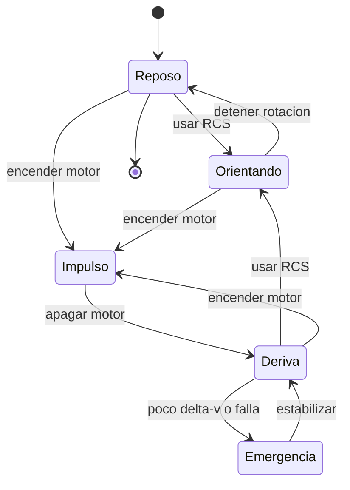

# 🎮 Diseño de simulación del caza estelar

[🏠 Inicio](../../../README.md) · [🛸 Curso: Caza estelar](../README.md) · 🎮 Simulación

> ⚖️ Material educativo original; los derechos de las obras pertenecen a sus titulares.

Como modelar de forma educativa y divertida un caza estelar. La idea central es
poder alternar entre la versión espectacular de la ficción y la versión fiel a
la física, para que el usuario compare ambas con la misma nave.

## Objetivo de la simulación

Que el usuario comprenda, jugando, que en el vacío la nave no frena sola, que
apuntar no es lo mismo que moverse, y que cada maniobra gasta un presupuesto de
delta-v. El modo ficción sirve para engancharse; el modo ciencia, para aprender.

## Modo ciencia o ficción

La variable más importante del simulador es el **modo**:

- **Modo ficción**: la nave frena al soltar el acelerador, vira como avión, los
  disparos suenan y se ven. Es divertido y familiar.
- **Modo ciencia**: se aplican las leyes de Newton, la conservación del momento
  y el límite de delta-v. La nave deriva, hay silencio y el combate es lejano.

Al cambiar de modo, la interfaz avisa que reglas se activan o desactivan, para
que la comparación sea explícita y educativa.

## Variables principales

| Variable | Tipo | Rango | Afecta a | Comentarios |
| --- | --- | --- | --- | --- |
| Modo | discreta | ciencia / ficción | Todas las reglas | Interruptor central del aprendizaje. |
| Vector de velocidad | numérica | 0-varios km/s | Movimiento | En modo ciencia se conserva sin motor. |
| Orientación | numérica | 0-360 grados por eje | Apuntado | Independiente del rumbo. |
| Empuje principal | numérica | 0-100% | Cambio de velocidad | No fija velocidad, la cambia. |
| Delta-v restante | numérica | 0-100% | Autonomía de maniobra | En ficción puede ignorarse. |
| Masa total | numérica | fija + carga | Aceleración | Más masa, menos aceleración. |
| Calor acumulado | numérica | 0-100% | Riesgo térmico | Se disipa lento por radiadores. |
| Gravedad del entorno | numérica | 0-alta | Trayectoria | Curva el rumbo cerca de un planeta. |

## Ciclo básico

1. Leer entrada del usuario (empuje, rotación, traslación, disparo).
2. Comprobar el modo activo (ciencia o ficción).
3. Calcular fuerzas: empuje principal y RCS.
4. Aplicar reglas del modo: en ciencia, conservar momento y descontar delta-v.
5. Aplicar el entorno: gravedad, aire si lo hay, obstáculos.
6. Actualizar velocidad, posición y orientación.
7. Refrescar instrumentos (vector de velocidad, delta-v, calor, sensores).

## Modos de juego futuros

- Tutorial de maniobra en vacío: aprender que la nave no frena sola.
- Reto de acoplamiento suave usando solo RCS.
- Comparador lado a lado: misma maniobra en modo ciencia y en modo ficción.
- Gestión de delta-v en una misión con propelente limitado.
- Escenario de reentrada donde por fin las alas sirven.

## Elementos fuera de alcance

- Presentar la versión de ficción como si fuera física real sin avisarlo.
- Detalles de armamento presentados como datos técnicos reales.
- Cualquier contenido que confunda espectáculo con ciencia sin distinguirlos.

## Pendientes

- [ ] Definir valores por defecto de cada variable por tipo de caza.
- [ ] Prototipar el ciclo básico con conservación del momento.
- [ ] Ajustar el descuento de delta-v por maniobra.
- [ ] Agregar fuentes de divulgación a [`manuales/fuentes.md`](../../../manuales/fuentes.md).

---

[⬅️ Anterior: Reglas del universo](../reglamentos/reglas-universo-caza-estelar.md) · [➡️ Siguiente: Recursos](../recursos/recursos-caza-estelar.md)
