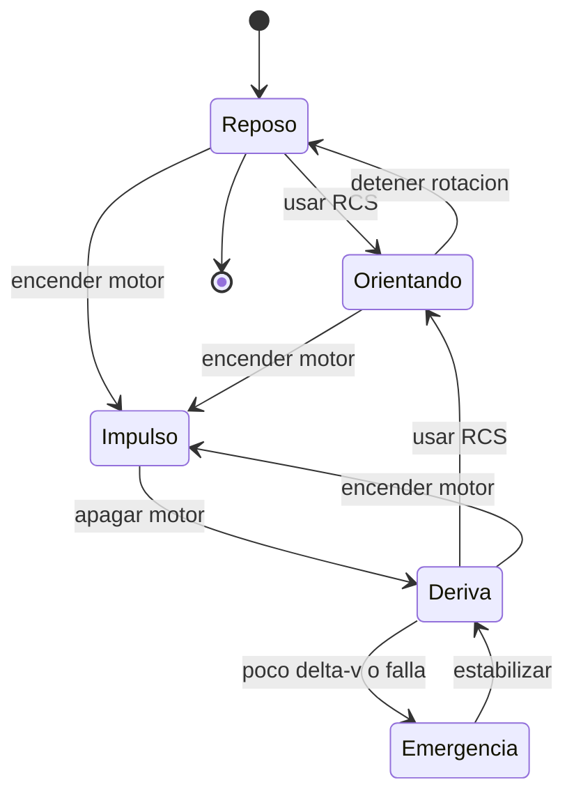
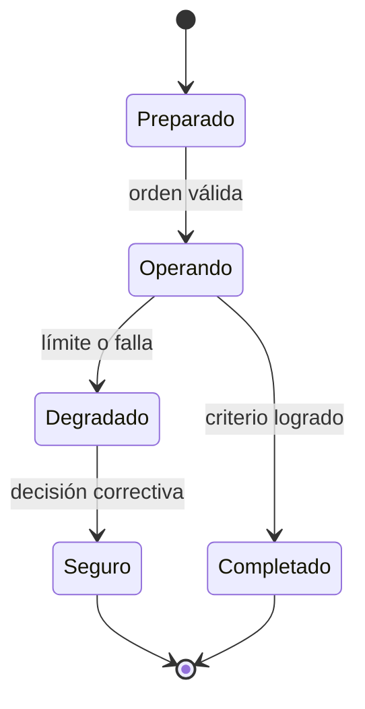

<!-- clase-meta
tipo_documento: clase
clase: 9
codigo: CAZAESTELAR-09
curso: caza-estelar
titulo: "Diseño de simulación del caza estelar"
modalidad: "laboratorio de diseño"
duracion_minutos: 90
nivel: introductorio
prerrequisito: CAZAESTELAR-08
competencia: "modelado_de_simulacion"
resultados_aprendizaje:
  - "Explicar objetivo, variables, estados, ciclo y escenarios de simulación con vocabulario propio de Caza estelar."
  - "Aplicar esos conceptos a una decisión segura o a un escenario de simulación de Caza estelar."
evidencia: "Ficha de escenario y diagrama de estados."
criterio_aprobacion: "El modelo es específico de la máquina, medible, seguro y trazable a clases anteriores."
fuentes: manuales/fuentes.md
ultima_revision: 2026-09-10
-->

# 🎮 Diseño de simulación del caza estelar

[🏠 Inicio](../../../README.md) · [🛸 Curso: Caza estelar](../README.md) · 🎮 Simulación

> ⚖️ Material educativo original; los derechos de las obras pertenecen a sus titulares.

Como modelar de forma educativa y divertida un caza estelar. La idea central es
poder alternar entre la versión espectacular de la ficción y la versión fiel a
la física, para que el usuario compare ambas con la misma nave.

```mermaid
stateDiagram-v2
    [*] --> Reposo
    Reposo --> Orientando: usar RCS
    Orientando --> Reposo: detener rotacion
    Reposo --> Impulso: encender motor
    Orientando --> Impulso: encender motor
    Impulso --> Deriva: apagar motor
    Deriva --> Orientando: usar RCS
    Deriva --> Impulso: encender motor
    Deriva --> Emergencia: poco delta-v o falla
    Emergencia --> Deriva: estabilizar
    Reposo --> [*]
```

## Objetivo de la simulación

Que el usuario comprenda, jugando, que en el vacío la nave no frena sola, que
apuntar no es lo mismo que moverse, y que cada maniobra gasta un presupuesto de
delta-v. El modo ficción sirve para engancharse; el modo ciencia, para aprender.

## Modo ciencia o ficción

La variable más importante del simulador es el **modo**:

- **Modo ficción**: la nave frena al soltar el acelerador, vira como avión, los
  disparos suenan y se ven. Es divertido y familiar.
- **Modo ciencia**: se aplican las leyes de Newton, la conservación del momento
  y el límite de delta-v. La nave deriva, hay silencio y el combate es lejano.

Al cambiar de modo, la interfaz avisa que reglas se activan o desactivan, para
que la comparación sea explícita y educativa.

## Variables principales

| Variable | Tipo | Rango | Afecta a | Comentarios |
| --- | --- | --- | --- | --- |
| Modo | discreta | ciencia / ficción | Todas las reglas | Interruptor central del aprendizaje. |
| Vector de velocidad | numérica | 0-varios km/s | Movimiento | En modo ciencia se conserva sin motor. |
| Orientación | numérica | 0-360 grados por eje | Apuntado | Independiente del rumbo. |
| Empuje principal | numérica | 0-100% | Cambio de velocidad | No fija velocidad, la cambia. |
| Delta-v restante | numérica | 0-100% | Autonomía de maniobra | En ficción puede ignorarse. |
| Masa total | numérica | fija + carga | Aceleración | Más masa, menos aceleración. |
| Calor acumulado | numérica | 0-100% | Riesgo térmico | Se disipa lento por radiadores. |
| Gravedad del entorno | numérica | 0-alta | Trayectoria | Curva el rumbo cerca de un planeta. |

## Ciclo básico

1. Leer entrada del usuario (empuje, rotación, traslación, disparo).
2. Comprobar el modo activo (ciencia o ficción).
3. Calcular fuerzas: empuje principal y RCS.
4. Aplicar reglas del modo: en ciencia, conservar momento y descontar delta-v.
5. Aplicar el entorno: gravedad, aire si lo hay, obstáculos.
6. Actualizar velocidad, posición y orientación.
7. Refrescar instrumentos (vector de velocidad, delta-v, calor, sensores).

## Modos de juego futuros

- Tutorial de maniobra en vacío: aprender que la nave no frena sola.
- Reto de acoplamiento suave usando solo RCS.
- Comparador lado a lado: misma maniobra en modo ciencia y en modo ficción.
- Gestión de delta-v en una misión con propelente limitado.
- Escenario de reentrada donde por fin las alas sirven.

## Elementos fuera de alcance

- Presentar la versión de ficción como si fuera física real sin avisarlo.
- Detalles de armamento presentados como datos técnicos reales.
- Cualquier contenido que confunda espectáculo con ciencia sin distinguirlos.

## Pendientes

- [ ] Definir valores por defecto de cada variable por tipo de caza.
- [ ] Prototipar el ciclo básico con conservación del momento.
- [ ] Ajustar el descuento de delta-v por maniobra.
- [ ] Agregar fuentes de divulgación a [`manuales/fuentes.md`](../../../manuales/fuentes.md).

## 🧭 Guía de estudio aplicada

### Pregunta guía

¿Cómo ayuda **Objetivo de la simulación, Modo ciencia o ficción, Variables principales y Ciclo básico** a **modelar intercepción ficticia seguida de una maniobra de evasión como estados, variables y decisiones observables**?

### Explicación razonada

Una simulación de Caza estelar es educativa si representa decisiones y consecuencias. Como mínimo debe modelar el estado de fuente de energía ficticia, la respuesta de propulsión, la transición en control de actitud y el resultado en trayectoria. El escenario «intercepción ficticia seguida de una maniobra de evasión» es valioso porque obliga a observar, formular una hipótesis, actuar y comprobar.

```mermaid
stateDiagram-v2
    [*] --> Preparado
    Preparado --> Operando: orden válida
    Operando --> Degradado: límite o falla
    Degradado --> Seguro: decisión correctiva
    Operando --> Completado: criterio logrado
    Seguro --> [*]
    Completado --> [*]
```

Esta clase se conecta con el resto del curso mediante **contraste entre maniobra mostrada en el canon y conservación del momento en el espacio**. El hilo de
seguridad consiste en reconocer a tiempo **trasladar aerodinámica atmosférica al vacío sin justificar la licencia narrativa** y poder justificar la decisión
**separar regla de universo, modelo físico elegido y retroalimentación al jugador**; en clases posteriores cambiará el ángulo de análisis, no esa relación causal.
La lectura funcional común sigue **fuente de energía ficticia → propulsión → control de actitud → trayectoria**, de modo que cada concepto pueda
ubicarse dentro del funcionamiento completo y no quede como un dato aislado.

**Apoyo documental:** [Star Wars Databank](https://www.starwars.com/databank) aporta canon narrativo y diseño visual;
[Beginner's Guide to Aeronautics](https://www1.grc.nasa.gov/beginners-guide-to-aeronautics/) se usa para contraste con física y vuelo reales. Estas fuentes
se contrastan con el alcance de la clase y no sustituyen un manual de equipo concreto.

### Caso resuelto: de la observación a la decisión

1. **Estado inicial:** representa intercepción ficticia seguida de una maniobra de evasión con valores observables para **fuente de energía ficticia**, **propulsión**, **control de actitud** y **trayectoria**.
2. **Decisión del estudiante:** ofrece una elección que cambie el estado, no una animación automática.
3. **Consecuencia:** modela la tendencia hacia **trasladar aerodinámica atmosférica al vacío sin justificar la licencia narrativa** y una señal previa que permita corregir.
4. **Cierre:** evalúa la explicación de la decisión, además de si el estudiante “ganó” el escenario.

### Comprueba tu comprensión

1. ¿Qué cuatro estados mínimos necesita el escenario «intercepción ficticia seguida de una maniobra de evasión»?
2. ¿Qué variable anticipa **trasladar aerodinámica atmosférica al vacío sin justificar la licencia narrativa** antes de llegar al estado de falla?
3. ¿Cómo evaluarías la explicación del estudiante y no solo el resultado final?

Orientación para revisar tus respuestas

- La primera respuesta debe relacionar el eslabón elegido con un efecto posterior, no solo nombrarlo.
- La segunda debe proponer una señal medible u observable y explicar qué tendencia sería preocupante.
- La tercera debe cambiar al menos una variable de capacidad, mando, entorno o margen de seguridad.

## 🎓 Cierre de clase

- **Actividad:** Diseña un escenario educativo de Caza estelar basado en objetivo, variables, estados, ciclo y escenarios de simulación, con entradas, estados, variables y criterio de cierre.
- **Evidencia:** Ficha de escenario y diagrama de estados.
- **Criterio de aprobación:** El modelo es específico de la máquina, medible, seguro y trazable a clases anteriores.
- **Transferencia:** explica qué cambiaría al pasar a otra variante de esta máquina.

### Fuentes de esta clase

- [STARWARS-DATABANK](https://www.starwars.com/databank): Star Wars Databank, Lucasfilm. Uso: canon narrativo y diseño visual.
- [NASA-FLIGHT](https://www1.grc.nasa.gov/beginners-guide-to-aeronautics/): Beginner's Guide to Aeronautics, NASA. Uso: contraste con física y vuelo reales.

> Las fuentes sostienen el marco conceptual y normativo; esta clase no reemplaza el manual
> del fabricante, la formación certificada ni la habilitación exigida para operar equipos reales.

---

[⬅️ Anterior: Reglas del universo](../reglamentos/reglas-universo-caza-estelar.md) · [➡️ Siguiente: Recursos](../recursos/recursos-caza-estelar.md)
