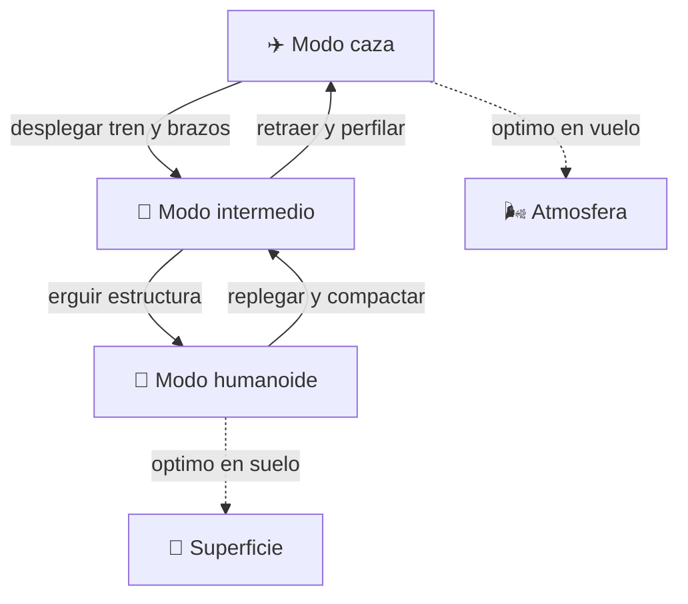

# 🤖 Curso: Caza transformable

[🏠 Inicio](../../README.md) · [🌌 Naves de ficcion](../README.md) · [🎓 Guia de curso](../../docs/08-guia-de-estilo-y-curso.md)

> ⚖️ Material educativo original; los derechos de las obras pertenecen a sus titulares.

---

> Curso de una nave de ficcion inspirada en el estilo "Robotech": un caza
> que cambia entre tres formas. Aqui estudiamos la fisica y la ingenieria
> que evoca (aerodinamica, mecanismos, centro de masa), separando con
> claridad lo que seria realizable de lo que pertenece a la fantasia.

---

## 🎯 Objetivos de aprendizaje

Al terminar este curso deberias poder:

- Explicar la aerodinamica basica de un caza: empuje, sustentacion y estabilidad.
- Razonar por que un cuerpo humanoide es aerodinamicamente pesimo en vuelo.
- Analizar como se desplaza el centro de masa al cambiar de forma.
- Describir mecanismos, actuadores y grados de libertad de una transformacion.
- Comprender las cargas estructurales y el problema de la masa y las juntas.
- Distinguir que partes serian realizables hoy y cuales no, y por que.
- Traducir todo lo anterior en variables de un simulador educativo.

---

## 🗺️ Mapa conceptual

---

## 📚 Modulos del curso

| # | Modulo | Contenido | Enlace |
| :-: | --- | --- | --- |
| 1 | 📜 Historia | Origen del concepto de caza transformable en la ficcion. | [Abrir](historia/historia-caza-transformable.md) |
| 2 | 📋 Caracteristicas | Que es, los tres modos y para que sirve cada uno. | [Abrir](operacion/caracteristicas-caza-transformable.md) |
| 3 | 🔧 Sistemas mecanicos | Mecanismos de transformacion frente a la fisica real. | [Abrir](operacion/sistemas-mecanicos-caza-transformable.md) |
| 4 | 🎛️ Mandos | Puesto de mando, controles y cambio de modo. | [Abrir](mandos/manual-mandos-caza-transformable.md) |
| 5 | 🧪 Principios | Que si, que no y por que; ficcion frente a realidad. | [Abrir](operacion/principios-caza-transformable.md) |
| 6 | 🌍 Entornos | Aire, suelo y espacio; como cambia la operacion. | [Abrir](operacion/entornos-caza-transformable.md) |
| 7 | ⚖️ Reglas del universo | Las leyes internas de la ficcion, no ley real. | [Abrir](reglamentos/reglas-universo-caza-transformable.md) |
| 8 | 🎮 Simulacion | Estados, transiciones y variables del simulador. | [Abrir](simulacion/diseno-simulador-caza-transformable.md) |
| 9 | 🧰 Recursos | Glosario, enlaces y diagramas. | [Abrir](recursos/recursos-caza-transformable.md) |

---

## 🧩 Requisitos previos

Ninguno estricto, aunque ayuda haber visto el curso de aeronaves o de motos
para tener nociones de fuerzas y equilibrio. Aqui todo se explica desde cero
con enfoque divulgativo.

---

[➡️ Empezar por el Modulo 1: Historia](historia/historia-caza-transformable.md)
