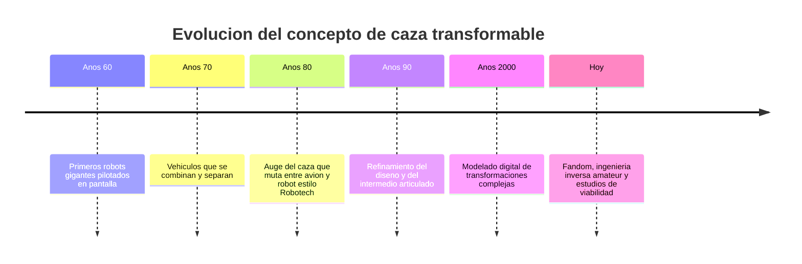

# 📜 Historia del caza transformable

[🏠 Inicio](../../../README.md) · [🤖 Curso: Caza transformable](../README.md) · 📜 Historia

> ⚖️ Material educativo original; los derechos de las obras pertenecen a sus titulares.

El caza transformable es un icono de la ciencia ficcion: una maquina que pasa de
avion de combate a robot humanoide, con una forma intermedia por el camino. En
este modulo repasamos, con nuestras palabras y a nivel divulgativo, como fue
madurando esta idea en la cultura audiovisual.

## Origen del concepto

La idea combina dos fantasias muy antiguas: la del gigante mecanico que camina y
la del avion veloz que domina el cielo. Unirlas en un solo objeto que cambia de
forma resulto atractiva porque promete lo mejor de ambos mundos: la velocidad de
un caza y la versatilidad de un cuerpo con brazos y piernas.

## Por que engancho tanto

- **Narrativa**: un vehiculo que se transforma da giros dramaticos a la accion.
- **Diseno**: el reto de "encajar" un avion dentro de un robot es memorable.
- **Identificacion**: el piloto sigue siendo humano y visible, no una IA lejana.
- **Juguetes**: la transformacion se traslada muy bien a modelos fisicos.

## Linea de tiempo

| Periodo | Hito narrativo | Importancia |
| --- | --- | --- |
| Anos 60 | Robots gigantes tripulados | Se instala la figura del piloto interior. |
| Anos 70 | Vehiculos que se combinan | Nace la idea de piezas que se reconfiguran. |
| Anos 80 | Caza que muta a robot | El concepto se vuelve un genero propio. |
| Anos 90 | Intermedio articulado | Se cuida la forma de transicion. |
| Anos 2000 | Transformacion digital | El CGI permite mecanismos imposibles a mano. |
| Hoy | Analisis de viabilidad | Aficionados estudian que seria realizable. |

## De la fantasia al analisis

Con el tiempo, muchos entusiastas empezaron a preguntarse en serio: cuanto de
esto podria construirse? Ese cambio de mirada, de la pura fantasia al analisis
tecnico, es justo el espiritu de este curso. No buscamos copiar ninguna nave
concreta, sino usar el concepto generico de "caza transformable" como excusa
para aprender aerodinamica, mecanismos y estructuras.

## Que estudiaremos con este ejemplo

- Como vuela un caza y por que su forma importa tanto.
- Por que un humanoide en el aire es un mal proyecto aerodinamico.
- Como el centro de masa se mueve al reconfigurar la estructura.
- Que actuadores y juntas harian falta y que problemas traen.

---

[🎓 Portada del curso](../README.md) · [➡️ Siguiente: Caracteristicas](../operacion/caracteristicas-caza-transformable.md)
