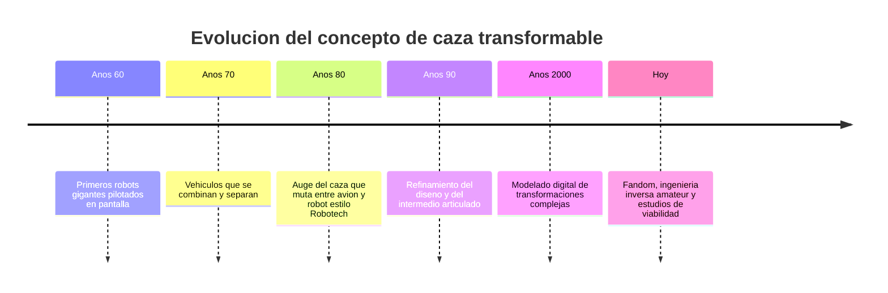

# 📜 Historia del caza transformable

[🏠 Inicio](../../../README.md) · [🤖 Curso: Caza transformable](../README.md) · 📜 Historia

> ⚖️ Material educativo original; los derechos de las obras pertenecen a sus titulares.

El caza transformable es un icono de la ciencia ficción: una máquina que pasa de
avión de combate a robot humanoide, con una forma intermedia por el camino. En
este módulo repasamos, con nuestras palabras y a nivel divulgativo, como fue
madurando esta idea en la cultura audiovisual.

## Origen del concepto

La idea combina dos fantasías muy antiguas: la del gigante mecánico que camina y
la del avión veloz que domina el cielo. Unirlas en un solo objeto que cambia de
forma resultó atractiva porque promete lo mejor de ambos mundos: la velocidad de
un caza y la versatilidad de un cuerpo con brazos y piernas.

## Por qué engancho tanto

- **Narrativa**: un vehículo que se transforma da giros dramáticos a la acción.
- **Diseño**: el reto de "encajar" un avión dentro de un robot es memorable.
- **Identificación**: el piloto sigue siendo humano y visible, no una IA lejana.
- **Juguetes**: la transformación se traslada muy bien a modelos físicos.

## Línea de tiempo

| Periodo | Hito narrativo | Importancia |
| --- | --- | --- |
| Años 60 | Robots gigantes tripulados | Se instala la figura del piloto interior. |
| Años 70 | Vehículos que se combinan | Nace la idea de piezas que se reconfiguran. |
| Años 80 | Caza que muta a robot | El concepto se vuelve un género propio. |
| Años 90 | Intermedio articulado | Se cuida la forma de transición. |
| Años 2000 | Transformación digital | El CGI permite mecanismos imposibles a mano. |
| Hoy | Análisis de viabilidad | Aficionados estudian que sería realizable. |

## De la fantasía al análisis

Con el tiempo, muchos entusiastas empezaron a preguntarse en serio: cuanto de
¿esto podría construirse? Ese cambio de mirada, de la pura fantasía al análisis
técnico, es justo el espíritu de este curso. No buscamos copiar ninguna nave
concreta, sino usar el concepto genérico de "caza transformable" como excusa
para aprender aerodinámica, mecanismos y estructuras.

## Que estudiaremos con este ejemplo

- Cómo vuela un caza y por qué su forma importa tanto.
- Por qué un humanoide en el aire es un mal proyecto aerodinámico.
- Como el centro de masa se mueve al reconfigurar la estructura.
- Que actuadores y juntas harían falta y que problemas traen.

---

[🎓 Portada del curso](../README.md) · [➡️ Siguiente: Características](../operacion/caracteristicas-caza-transformable.md)
