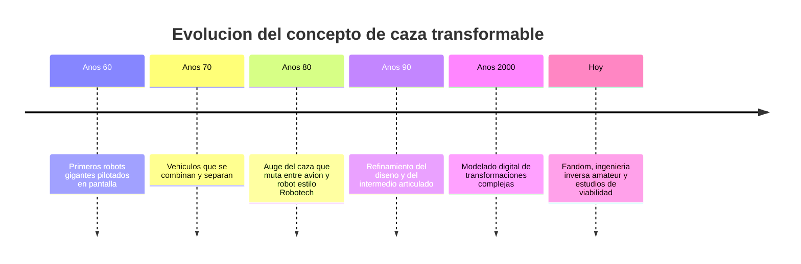

<!-- clase-meta
tipo_documento: clase
clase: 1
codigo: CAZATRANSFOR-01
curso: caza-transformable
titulo: "Historia del caza transformable"
modalidad: "teórica dialogada"
duracion_minutos: 45
nivel: introductorio
prerrequisito: ninguno
competencia: "contexto_historico"
resultados_aprendizaje:
  - "Explicar origen, evolución tecnológica, variantes representativas e impacto con vocabulario propio de Caza transformable."
  - "Aplicar esos conceptos a una decisión segura o a un escenario de simulación de Caza transformable."
evidencia: "Línea de tiempo comentada con cuatro hitos o más."
criterio_aprobacion: "Los hitos están ordenados, son pertinentes y dos relaciones de causa y efecto quedan justificadas."
fuentes: manuales/fuentes.md
ultima_revision: 2026-09-10
-->

# 📜 Historia del caza transformable

[🏠 Inicio](../../../README.md) · [🤖 Curso: Caza transformable](../README.md) · 📜 Historia

> ⚖️ Material educativo original; los derechos de las obras pertenecen a sus titulares.

El caza transformable es un icono de la ciencia ficción: una máquina que pasa de
avión de combate a robot humanoide, con una forma intermedia por el camino. En
este módulo repasamos, con nuestras palabras y a nivel divulgativo, como fue
madurando esta idea en la cultura audiovisual.

```mermaid
timeline
    title Evolucion del concepto de caza transformable
    Anos 60 : Primeros robots gigantes pilotados en pantalla
    Anos 70 : Vehiculos que se combinan y separan
    Anos 80 : Auge del caza que muta entre avion y robot estilo Robotech
    Anos 90 : Refinamiento del diseno y del intermedio articulado
    Anos 2000 : Modelado digital de transformaciones complejas
    Hoy : Fandom, ingenieria inversa amateur y estudios de viabilidad
```

## Origen del concepto

La idea combina dos fantasías muy antiguas: la del gigante mecánico que camina y
la del avión veloz que domina el cielo. Unirlas en un solo objeto que cambia de
forma resultó atractiva porque promete lo mejor de ambos mundos: la velocidad de
un caza y la versatilidad de un cuerpo con brazos y piernas.

## Por qué engancho tanto

- **Narrativa**: un vehículo que se transforma da giros dramáticos a la acción.
- **Diseño**: el reto de "encajar" un avión dentro de un robot es memorable.
- **Identificación**: el piloto sigue siendo humano y visible, no una IA lejana.
- **Juguetes**: la transformación se traslada muy bien a modelos físicos.

## Línea de tiempo

| Periodo | Hito narrativo | Importancia |
| --- | --- | --- |
| Años 60 | Robots gigantes tripulados | Se instala la figura del piloto interior. |
| Años 70 | Vehículos que se combinan | Nace la idea de piezas que se reconfiguran. |
| Años 80 | Caza que muta a robot | El concepto se vuelve un género propio. |
| Años 90 | Intermedio articulado | Se cuida la forma de transición. |
| Años 2000 | Transformación digital | El CGI permite mecanismos imposibles a mano. |
| Hoy | Análisis de viabilidad | Aficionados estudian que sería realizable. |

## De la fantasía al análisis

Con el tiempo, muchos entusiastas empezaron a preguntarse en serio: cuanto de
¿esto podría construirse? Ese cambio de mirada, de la pura fantasía al análisis
técnico, es justo el espíritu de este curso. No buscamos copiar ninguna nave
concreta, sino usar el concepto genérico de "caza transformable" como excusa
para aprender aerodinámica, mecanismos y estructuras.

## Que estudiaremos con este ejemplo

- Cómo vuela un caza y por qué su forma importa tanto.
- Por qué un humanoide en el aire es un mal proyecto aerodinámico.
- Como el centro de masa se mueve al reconfigurar la estructura.
- Que actuadores y juntas harían falta y que problemas traen.

## 🧭 Guía de estudio aplicada

### Pregunta guía

¿Cómo ayuda **Origen del concepto, Por qué engancho tanto, Línea de tiempo y De la fantasía al análisis** a **explicar cómo la evolución hizo posibles alternativas como modo caza frente a modo robot**?

### Explicación razonada

La evolución de Caza transformable se comprende mejor como una sucesión de respuestas a problemas, no como una lista de fechas. Los cambios en fuente de energía ficticia, actuadores de transformación, propulsión y configuración de vuelo o robot alteraron qué podía hacer la máquina, quién podía usarla y qué riesgos debían controlarse. El contraste «modo caza frente a modo robot» permite observar qué decisiones de diseño permanecieron y cuáles cambiaron con la tecnología y el propósito.

Esta clase se conecta con el resto del curso mediante **cambiar de configuración altera masa aparente, control, resistencia y función narrativa**. El hilo de
seguridad consiste en reconocer a tiempo **ocultar discontinuidades físicas bajo una animación sin reglas de estado** y poder justificar la decisión
**definir condiciones, costos y límites de cada transición antes de simularla**; en clases posteriores cambiará el ángulo de análisis, no esa relación causal.
La lectura funcional común sigue **fuente de energía ficticia → actuadores de transformación → propulsión → configuración de vuelo o robot**, de modo que cada concepto pueda
ubicarse dentro del funcionamiento completo y no quede como un dato aislado.

**Apoyo documental:** [Robotech](https://robotech.com/) aporta referencia oficial del universo ficticio;
[Aviation Handbooks and Manuals](https://www.faa.gov/regulations_policies/handbooks_manuals) se usa para aerodinámica, sistemas y operación. Estas fuentes
se contrastan con el alcance de la clase y no sustituyen un manual de equipo concreto.

### Caso resuelto: de la observación a la decisión

1. **Situar:** ordena los hitos que explican cómo se llegó a **modo caza frente a modo robot** y describe la necesidad que impulsó cada cambio.
2. **Relacionar:** explica qué se modificó en **fuente de energía ficticia**, **actuadores de transformación**, **propulsión** o **configuración de vuelo o robot**; una fecha sin mecanismo no basta.
3. **Interpretar:** vincula el cambio con una capacidad nueva y también con el riesgo **ocultar discontinuidades físicas bajo una animación sin reglas de estado**.
4. **Transferir:** usa la evolución para justificar por qué hoy conviene **definir condiciones, costos y límites de cada transición antes de simularla**.

### Comprueba tu comprensión

1. ¿Qué necesidad histórica impulsó un cambio en **fuente de energía ficticia** o **actuadores de transformación**?
2. ¿Qué hito modificó la relación entre capacidad y **ocultar discontinuidades físicas bajo una animación sin reglas de estado**?
3. ¿Por qué **modo caza frente a modo robot** no puede explicarse como una simple diferencia estética?

Orientación para revisar tus respuestas

- La primera respuesta debe relacionar el eslabón elegido con un efecto posterior, no solo nombrarlo.
- La segunda debe proponer una señal medible u observable y explicar qué tendencia sería preocupante.
- La tercera debe cambiar al menos una variable de capacidad, mando, entorno o margen de seguridad.

## 🎓 Cierre de clase

- **Actividad:** Construye una línea de tiempo de Caza transformable y explica cómo dos cambios históricos transformaron su función o su puesto de mando.
- **Evidencia:** Línea de tiempo comentada con cuatro hitos o más.
- **Criterio de aprobación:** Los hitos están ordenados, son pertinentes y dos relaciones de causa y efecto quedan justificadas.
- **Transferencia:** explica qué cambiaría al pasar a otra variante de esta máquina.

### Fuentes de esta clase

- [ROBOTECH-OFFICIAL](https://robotech.com/): Robotech, Harmony Gold. Uso: referencia oficial del universo ficticio.
- [US-FAA-HANDBOOKS](https://www.faa.gov/regulations_policies/handbooks_manuals): Aviation Handbooks and Manuals, FAA. Uso: aerodinámica, sistemas y operación.
- [NASA-FLIGHT](https://www1.grc.nasa.gov/beginners-guide-to-aeronautics/): Beginner's Guide to Aeronautics, NASA. Uso: contraste con física y vuelo reales.

> Las fuentes sostienen el marco conceptual y normativo; esta clase no reemplaza el manual
> del fabricante, la formación certificada ni la habilitación exigida para operar equipos reales.

---

[🎓 Portada del curso](../README.md) · [➡️ Siguiente: Características](../operacion/caracteristicas-caza-transformable.md)
