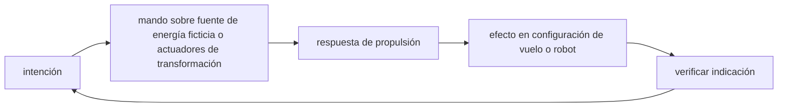

<!-- clase-meta
tipo_documento: clase
clase: 5
codigo: CAZATRANSFOR-05
curso: caza-transformable
titulo: "Mandos e instrumentos del caza transformable"
modalidad: "taller de simulación"
duracion_minutos: 60
nivel: introductorio
prerrequisito: CAZATRANSFOR-04
competencia: "lectura_y_mando"
resultados_aprendizaje:
  - "Explicar controles, instrumentos, entradas y estados del sistema con vocabulario propio de Caza transformable."
  - "Aplicar esos conceptos a una decisión segura o a un escenario de simulación de Caza transformable."
evidencia: "Mapa de mandos y resolución de dos estados del tablero."
criterio_aprobacion: "Reconoce los controles críticos y responde a los estados sin introducir acciones inseguras."
fuentes: manuales/fuentes.md
ultima_revision: 2026-09-10
-->

# 🎛️ Mandos e instrumentos del caza transformable

[🏠 Inicio](../../../README.md) · [🤖 Curso: Caza transformable](../README.md) · 🎛️ Mandos

> ⚖️ Material educativo original; los derechos de las obras pertenecen a sus titulares.

¿Cómo se pilota una máquina que cambia de forma? Esta clase describe, de manera
genérica y original, el puesto de mando imaginado y cómo se traduce en entradas
de simulación. La gran diferencia con un avión normal es que hay un control más:
el de cambio de modo.

---

## 🎯 Puesto de mando

El piloto se ubica en una cabina que debe seguir siendo utilizable en los tres
modos. Eso plantea un reto de diseño: los mandos que sirven para volar (palanca,
acelerador, pedales) conviven con los que sirven para caminar o manipular en modo
humanoide.

---

## Controles y su función

| Control | Modo principal | Función |
| --- | --- | --- |
| Palanca de vuelo | Caza | Controla cabeceo y alabeo en el aire. |
| Acelerador | Caza e intermedio | Regula el empuje de los motores. |
| Pedales | Caza | Controla la guiñada (giro sobre el eje vertical). |
| Selector de modo | Todos | Ordena la transformación entre formas. |
| Mando de extremidades | Humanoide | Coordina brazos y piernas. |
| Freno o punto de apoyo | Intermedio y humanoide | Estabiliza al tocar el suelo. |
| Panel de estado | Todos | Muestra la fase de transformación. |

---

## Instrumentos del tablero

| Instrumento | Que informa | Por qué importa |
| --- | --- | --- |
| Indicador de modo | Forma actual y transición | Evita cambiar de modo en mal momento. |
| Horizonte artificial | Actitud respecto al suelo | Clave en modo caza e intermedio. |
| Centro de masa | Posición del punto de equilibrio | Avisa de inestabilidad al transformar. |
| Energía disponible | Reserva para motores y actuadores | La transformación consume mucha. |
| Cargas estructurales | Esfuerzo en juntas críticas | Previene forzar el mecanismo. |
| Velocidad | Rapidez respecto al aire o al suelo | Limita cuando es seguro transformar. |

---

## Entradas de simulación

Para modelar el pilotaje en un simulador educativo, cada control se convierte en
una entrada con un rango definido. Incluimos de forma explícita el control de
cambio de modo.

| Entrada | Tipo | Rango | Efecto en el modelo |
| --- | --- | --- | --- |
| Empuje | numérica | 0-100% | Acelera o frena la máquina. |
| Cabeceo | numérica | -100..100 | Sube o baja el morro en vuelo. |
| Alabeo | numérica | -100..100 | Inclina hacia los lados. |
| Guiñada | numérica | -100..100 | Gira sobre el eje vertical. |
| Cambio de modo | discreta | caza, intermedio, humanoide | Lanza la secuencia de transformación. |
| Extremidades | numérica | -100..100 | Mueve brazos y piernas en el suelo. |
| Freno o apoyo | numérica | 0-100% | Estabiliza al contactar la superficie. |

---

## Buenas prácticas de pilotaje

- Verificar velocidad y energía antes de ordenar un cambio de modo.
- No transformar en plena maniobra brusca: el centro de masa se mueve.
- Vigilar las cargas estructurales para no forzar las juntas.
- Usar el modo intermedio como transición controlada, no como atajo.

## 🧭 Guía de estudio aplicada

### Pregunta guía

¿Cómo ayuda **Puesto de mando, Controles y su función, Instrumentos del tablero y Entradas de simulación** a **interpretar mandos e indicaciones durante transición simulada de vuelo a modo robot durante una misión**?

### Explicación razonada

Un mando no se aprende memorizando su nombre, sino recorriendo el ciclo intención → acción → indicación → verificación. En Caza transformable, el operador actúa sobre fuente de energía ficticia o actuadores de transformación, observa la respuesta en propulsión y confirma el efecto en configuración de vuelo o robot. Una indicación inesperada exige detener la secuencia mental, identificar el modo activo y evitar una segunda orden que agrave el estado.

Esta clase se conecta con el resto del curso mediante **cambiar de configuración altera masa aparente, control, resistencia y función narrativa**. El hilo de
seguridad consiste en reconocer a tiempo **ocultar discontinuidades físicas bajo una animación sin reglas de estado** y poder justificar la decisión
**definir condiciones, costos y límites de cada transición antes de simularla**; en clases posteriores cambiará el ángulo de análisis, no esa relación causal.
La lectura funcional común sigue **fuente de energía ficticia → actuadores de transformación → propulsión → configuración de vuelo o robot**, de modo que cada concepto pueda
ubicarse dentro del funcionamiento completo y no quede como un dato aislado.

**Apoyo documental:** [Robotech](https://robotech.com/) aporta referencia oficial del universo ficticio;
[Aviation Handbooks and Manuals](https://www.faa.gov/regulations_policies/handbooks_manuals) se usa para aerodinámica, sistemas y operación. Estas fuentes
se contrastan con el alcance de la clase y no sustituyen un manual de equipo concreto.

### Caso resuelto: de la observación a la decisión

1. **Intención:** formula qué cambio se necesita durante **transición simulada de vuelo a modo robot durante una misión**.
2. **Mando:** identifica el control que actúa sobre **fuente de energía ficticia** o **actuadores de transformación** y el modo que debe estar activo.
3. **Lectura:** localiza la indicación que confirma la respuesta de **propulsión** y el efecto en **configuración de vuelo o robot**.
4. **Verificación:** si la lectura no coincide, no acumules órdenes; estabiliza e investiga el estado.

### Comprueba tu comprensión

1. ¿Qué mando inicia la respuesta y qué instrumento confirma que el modo correcto está activo?
2. ¿Qué indicación temprana advertiría **ocultar discontinuidades físicas bajo una animación sin reglas de estado**?
3. ¿Qué secuencia usarías si la respuesta de **configuración de vuelo o robot** no coincide con la orden?

Orientación para revisar tus respuestas

- La primera respuesta debe relacionar el eslabón elegido con un efecto posterior, no solo nombrarlo.
- La segunda debe proponer una señal medible u observable y explicar qué tendencia sería preocupante.
- La tercera debe cambiar al menos una variable de capacidad, mando, entorno o margen de seguridad.

## 🎓 Cierre de clase

- **Actividad:** Recorre el puesto de mando simulado de Caza transformable: localiza los controles de controles, instrumentos, entradas y estados del sistema y asocia cada indicación con una decisión.
- **Evidencia:** Mapa de mandos y resolución de dos estados del tablero.
- **Criterio de aprobación:** Reconoce los controles críticos y responde a los estados sin introducir acciones inseguras.
- **Transferencia:** explica qué cambiaría al pasar a otra variante de esta máquina.

### Fuentes de esta clase

- [ROBOTECH-OFFICIAL](https://robotech.com/): Robotech, Harmony Gold. Uso: referencia oficial del universo ficticio.
- [US-FAA-HANDBOOKS](https://www.faa.gov/regulations_policies/handbooks_manuals): Aviation Handbooks and Manuals, FAA. Uso: aerodinámica, sistemas y operación.
- [NASA-FLIGHT](https://www1.grc.nasa.gov/beginners-guide-to-aeronautics/): Beginner's Guide to Aeronautics, NASA. Uso: contraste con física y vuelo reales.

> Las fuentes sostienen el marco conceptual y normativo; esta clase no reemplaza el manual
> del fabricante, la formación certificada ni la habilitación exigida para operar equipos reales.

---

[⬅️ Anterior: Sistemas mecánicos](../operacion/sistemas-mecanicos-caza-transformable.md) · [➡️ Siguiente: Principios y operación](../operacion/principios-caza-transformable.md)
