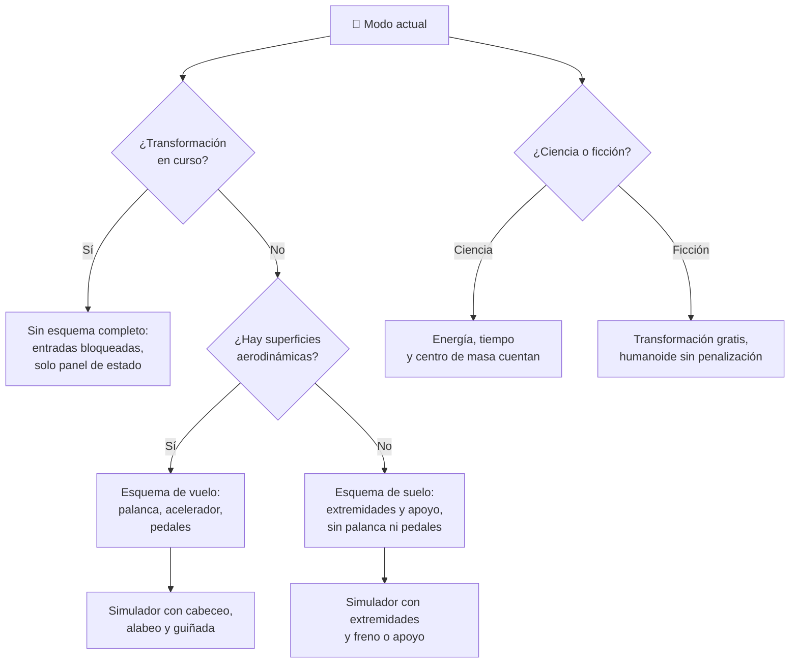

# 🧩 Modelos y variantes del caza transformable

[🏠 Inicio](../../../README.md) · [🤖 Curso: Caza transformable](../README.md) · 🧩 Modelos

El [Módulo 2](../operacion/caracteristicas-caza-transformable.md) ya dijo qué
modos tiene esta máquina y para qué sirve cada uno. Este módulo responde a lo
siguiente: **no todos se pilotan igual**, y esa diferencia no es de matiz. Cambia
qué mandos tiene la máquina y, por tanto, qué debe modelar el simulador.

> 🎯 **La idea que sostiene el módulo.** Aquí "modelo" no significa una variante
> de fábrica: significa **modo**. Un caza transformable no es una sola máquina
> desde el punto de vista del mando, sino tres que comparten fuselaje. En modo
> humanoide la palanca de vuelo no manda superficies aerodinámicas porque **no
> las hay**: no es que respondan peor, es que no existen. Un simulador que
> presente un solo esquema de control está representando un modo concreto aunque
> diga representarlos todos. Todo esto es material educativo original sobre una
> nave de ficción; los derechos de las obras que la inspiran pertenecen a sus
> titulares.

---

## 🧭 Por qué el modo decide el simulador

El [Módulo 5](../mandos/manual-mandos-caza-transformable.md) describe un puesto
de mando con palanca de vuelo, acelerador y pedales, más un selector de modo y un
mando de extremidades. El [Módulo 9](../simulacion/diseno-simulador-caza-transformable.md)
expone una variable `Modo actual` con valores `caza, intermedio, humanoide`.
Ambos describen la máquina completa, pero **ningún modo usa el puesto entero**.

En modo caza, el mando de extremidades no tiene nada que mover: los brazos y las
piernas están plegados y bloqueados. En modo humanoide, `Cabeceo`, `Alabeo` y
`Guiñada` pierden su significado aerodinámico porque las alas ya no son alas y no
hay timón que desviar. Si el simulador se construye sobre el esquema de vuelo y
luego se le "añade" el modo humanoide, el resultado es un humanoide que alabea
con alerones que no tiene.

---

## 🗂️ Qué cambia en el manejo

| Modo | Qué cambia al pilotarlo |
| --- | --- |
| ✈️ Caza | La referencia del curso: fuselaje limpio, arrastre bajo y superficies de control alineadas. Se pilota como un avión. |
| 🔀 Intermedio | Forma a medias: parte del perfil aerodinámico sigue ahí, pero el centro de masa ya se ha movido. Es el momento más inestable y el que más atención exige. |
| 🤖 Humanoide | El arrastre se dispara y la sustentación desaparece. El pilotaje deja de ser vuelo y pasa a ser apoyo, marcha y contacto con la superficie. |
| ⚠️ Transición en curso | Ni un modo ni otro: con el `Progreso de cambio` a medias hay acciones bloqueadas y la máquina no responde a ningún esquema completo. |

---

## 🎛️ Qué cambia en el mando

| Modo | Qué mando aparece o desaparece | Consecuencia |
| --- | --- | --- |
| ✈️ Caza | **Desaparece** el mando de extremidades; el freno o punto de apoyo no tiene superficie que tocar. | El puesto se reduce a palanca, acelerador y pedales: el esquema del Módulo 5 aplica como avión. |
| 🔀 Intermedio | **Conviven** los mandos de vuelo y los de apoyo, ninguno con autoridad plena. | El piloto tiene todo disponible y nada del todo fiable: es el peor momento para pedirle precisión. |
| 🤖 Humanoide | **Desaparecen** la palanca de vuelo y los pedales como mandos aerodinámicos. **Aparecen** el mando de extremidades y el freno o punto de apoyo. | El eje del pilotaje se muda de las superficies de control al reparto de peso sobre las piernas. |
| 🔁 Todos | El **selector de modo** y el **panel de estado** no desaparecen nunca. | Son el único mando común a los tres esquemas: la costura que los une. |

---

## 🎮 Qué cambia en el simulador

Contrastado con las variables del
[Módulo 9](../simulacion/diseno-simulador-caza-transformable.md):

| Modo | Variables que cambian | Esquema de control |
| --- | --- | --- |
| ✈️ Caza | Ninguna: es el caso base. `Arrastre` en su valor mínimo y `Centro de masa` en el margen de vuelo. | El del Módulo 5, con entradas de `Empuje`, `Cabeceo`, `Alabeo` y `Guiñada`. |
| 🔀 Intermedio | `Centro de masa` **abandona** su margen estable y pasa a ser la variable que decide el resultado. `Arrastre` sube a valores medios. | Mixto: entradas de vuelo con autoridad reducida más `Freno o apoyo`. |
| 🤖 Humanoide | `Arrastre` **se dispara**; la sustentación deja de calcularse. `Extremidades` **entra** en el modelo y `Cabeceo`, `Alabeo` y `Guiñada` **se eliminan** como entradas aerodinámicas. | Sin superficies de control: `Extremidades` y `Freno o apoyo` sobre la superficie. |
| ⚠️ Transición | `Progreso de cambio` **deja de ser 0 o 100** y pasa a bloquear acciones. `Energía` se drena y `Carga estructural` sube. | Ninguno completo: el simulador debe rechazar entradas, no interpolarlas. |
| 🔬 Modo ciencia | `Energía`, `Progreso de cambio` y `Carga estructural` tienen efecto real sobre lo que la máquina puede hacer. | Los tres esquemas anteriores, con costo. |
| 🎬 Modo ficción | `Progreso de cambio` es casi instantáneo y el `Arrastre` del humanoide no penaliza. | Los tres esquemas anteriores, sin costo. |

---

## 🗺️ Del modo al esquema de control

---

## ⚠️ Qué modos no comparten simulador

Dos casos no se resuelven con un ajuste de parámetros, porque su esquema de
control es otro:

- **El modo humanoide** frente al modo caza: desaparecen tres entradas de vuelo y
  aparece una que no existía. Es un esquema de control distinto, no una
  dificultad distinta. Modelarlo como "un caza que vuela peor" es exactamente el
  error que este curso quiere evitar.
- **La transición en curso** frente a los dos extremos: no es un modo intermedio
  de valores, es un estado sin esquema válido. Interpolar entre el mando de vuelo
  y el de suelo produce una máquina que no existe en ninguna fase.

El modo intermedio **estabilizado** sí cabe en el mismo simulador que el de caza
ajustando la autoridad de los mandos y el margen del centro de masa, tal como
plantean los [niveles de realismo](../../../docs/03-niveles-de-realismo.md): en
el nivel 1 los tres modos casi se pilotan igual, y las diferencias emergen a
medida que el nivel sube.

---

[⬅️ Anterior: Características](../operacion/caracteristicas-caza-transformable.md) · [➡️ Siguiente: Sistemas mecánicos](../operacion/sistemas-mecanicos-caza-transformable.md)
