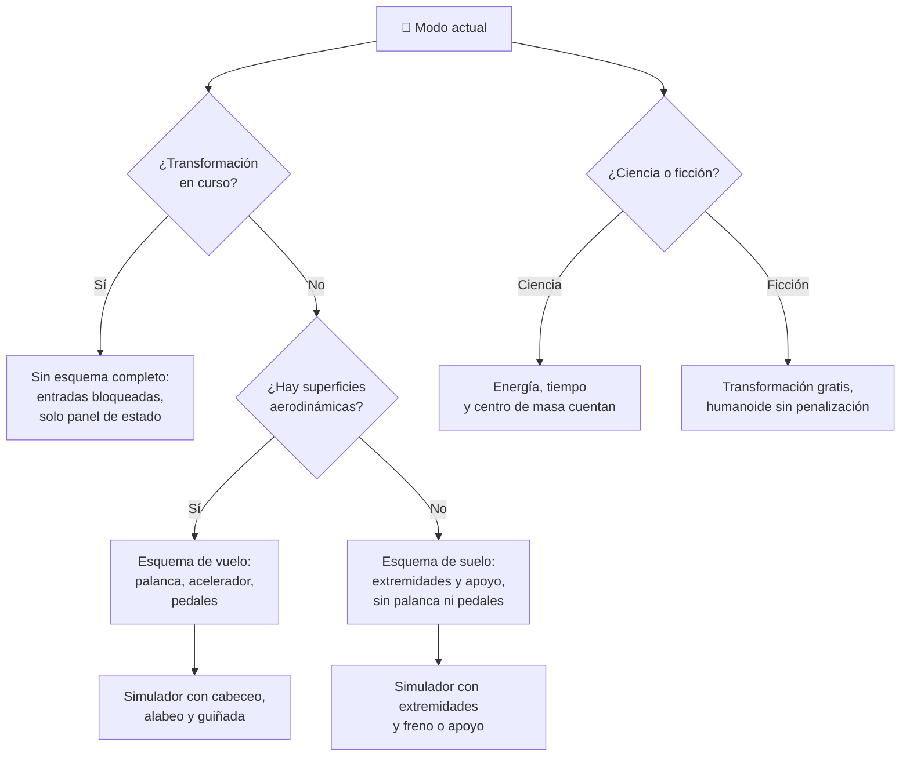

<!-- clase-meta
tipo_documento: clase
clase: 3
codigo: CAZATRANSFOR-03
curso: caza-transformable
titulo: "Modelos y variantes del caza transformable"
modalidad: "comparativa guiada"
duracion_minutos: 60
nivel: introductorio
prerrequisito: CAZATRANSFOR-02
competencia: "seleccion_de_configuracion"
resultados_aprendizaje:
  - "Explicar manejo, arquitectura de mandos y variables de simulación con vocabulario propio de Caza transformable."
  - "Aplicar esos conceptos a una decisión segura o a un escenario de simulación de Caza transformable."
evidencia: "Matriz comparativa y decisión justificada."
criterio_aprobacion: "La elección considera función, límites, mando y efecto en la simulación; no se apoya solo en preferencias."
fuentes: manuales/fuentes.md
ultima_revision: 2026-09-10
-->

# 🧩 Modelos y variantes del caza transformable

[🏠 Inicio](../../../README.md) · [🤖 Curso: Caza transformable](../README.md) · 🧩 Modelos

El [Clase 2](../operacion/caracteristicas-caza-transformable.md) ya dijo qué
modos tiene esta máquina y para qué sirve cada uno. Esta clase responde a lo
siguiente: **no todos se pilotan igual**, y esa diferencia no es de matiz. Cambia
qué mandos tiene la máquina y, por tanto, qué debe modelar el simulador.

> 🎯 **La idea que sostiene el módulo.** Aquí "modelo" no significa una variante
> de fábrica: significa **modo**. Un caza transformable no es una sola máquina
> desde el punto de vista del mando, sino tres que comparten fuselaje. En modo
> humanoide la palanca de vuelo no manda superficies aerodinámicas porque **no
> las hay**: no es que respondan peor, es que no existen. Un simulador que
> presente un solo esquema de control está representando un modo concreto aunque
> diga representarlos todos. Todo esto es material educativo original sobre una
> nave de ficción; los derechos de las obras que la inspiran pertenecen a sus
> titulares.

---

## 🧭 Por qué el modo decide el simulador

El [Clase 5](../mandos/manual-mandos-caza-transformable.md) describe un puesto
de mando con palanca de vuelo, acelerador y pedales, más un selector de modo y un
mando de extremidades. El [Clase 9](../simulacion/diseno-simulador-caza-transformable.md)
expone una variable `Modo actual` con valores `caza, intermedio, humanoide`.
Ambos describen la máquina completa, pero **ningún modo usa el puesto entero**.

En modo caza, el mando de extremidades no tiene nada que mover: los brazos y las
piernas están plegados y bloqueados. En modo humanoide, `Cabeceo`, `Alabeo` y
`Guiñada` pierden su significado aerodinámico porque las alas ya no son alas y no
hay timón que desviar. Si el simulador se construye sobre el esquema de vuelo y
luego se le "añade" el modo humanoide, el resultado es un humanoide que alabea
con alerones que no tiene.

---

## 🗂️ Qué cambia en el manejo

| Modo | Qué cambia al pilotarlo |
| --- | --- |
| ✈️ Caza | La referencia del curso: fuselaje limpio, arrastre bajo y superficies de control alineadas. Se pilota como un avión. |
| 🔀 Intermedio | Forma a medias: parte del perfil aerodinámico sigue ahí, pero el centro de masa ya se ha movido. Es el momento más inestable y el que más atención exige. |
| 🤖 Humanoide | El arrastre se dispara y la sustentación desaparece. El pilotaje deja de ser vuelo y pasa a ser apoyo, marcha y contacto con la superficie. |
| ⚠️ Transición en curso | Ni un modo ni otro: con el `Progreso de cambio` a medias hay acciones bloqueadas y la máquina no responde a ningún esquema completo. |

---

## 🎛️ Qué cambia en el mando

| Modo | Qué mando aparece o desaparece | Consecuencia |
| --- | --- | --- |
| ✈️ Caza | **Desaparece** el mando de extremidades; el freno o punto de apoyo no tiene superficie que tocar. | El puesto se reduce a palanca, acelerador y pedales: el esquema del Clase 5 aplica como avión. |
| 🔀 Intermedio | **Conviven** los mandos de vuelo y los de apoyo, ninguno con autoridad plena. | El piloto tiene todo disponible y nada del todo fiable: es el peor momento para pedirle precisión. |
| 🤖 Humanoide | **Desaparecen** la palanca de vuelo y los pedales como mandos aerodinámicos. **Aparecen** el mando de extremidades y el freno o punto de apoyo. | El eje del pilotaje se muda de las superficies de control al reparto de peso sobre las piernas. |
| 🔁 Todos | El **selector de modo** y el **panel de estado** no desaparecen nunca. | Son el único mando común a los tres esquemas: la costura que los une. |

---

## 🎮 Qué cambia en el simulador

Contrastado con las variables del
[Clase 9](../simulacion/diseno-simulador-caza-transformable.md):

| Modo | Variables que cambian | Esquema de control |
| --- | --- | --- |
| ✈️ Caza | Ninguna: es el caso base. `Arrastre` en su valor mínimo y `Centro de masa` en el margen de vuelo. | El del Clase 5, con entradas de `Empuje`, `Cabeceo`, `Alabeo` y `Guiñada`. |
| 🔀 Intermedio | `Centro de masa` **abandona** su margen estable y pasa a ser la variable que decide el resultado. `Arrastre` sube a valores medios. | Mixto: entradas de vuelo con autoridad reducida más `Freno o apoyo`. |
| 🤖 Humanoide | `Arrastre` **se dispara**; la sustentación deja de calcularse. `Extremidades` **entra** en el modelo y `Cabeceo`, `Alabeo` y `Guiñada` **se eliminan** como entradas aerodinámicas. | Sin superficies de control: `Extremidades` y `Freno o apoyo` sobre la superficie. |
| ⚠️ Transición | `Progreso de cambio` **deja de ser 0 o 100** y pasa a bloquear acciones. `Energía` se drena y `Carga estructural` sube. | Ninguno completo: el simulador debe rechazar entradas, no interpolarlas. |
| 🔬 Modo ciencia | `Energía`, `Progreso de cambio` y `Carga estructural` tienen efecto real sobre lo que la máquina puede hacer. | Los tres esquemas anteriores, con costo. |
| 🎬 Modo ficción | `Progreso de cambio` es casi instantáneo y el `Arrastre` del humanoide no penaliza. | Los tres esquemas anteriores, sin costo. |

---

## 🗺️ Del modo al esquema de control

```mermaid
flowchart TD
    Modo[🧩 Modo actual] --> Cambio{¿Transformación<br/>en curso?}
    Cambio -- Sí --> Bloq[Sin esquema completo:<br/>entradas bloqueadas,<br/>solo panel de estado]
    Cambio -- No --> Alas{¿Hay superficies<br/>aerodinámicas?}
    Alas -- Sí --> Vuelo[Esquema de vuelo:<br/>palanca, acelerador,<br/>pedales]
    Alas -- No --> Suelo[Esquema de suelo:<br/>extremidades y apoyo,<br/>sin palanca ni pedales]
    Vuelo --> Var1[Simulador con cabeceo,<br/>alabeo y guiñada]
    Suelo --> Var2[Simulador con extremidades<br/>y freno o apoyo]
    Modo --> Fisica{¿Ciencia o ficción?}
    Fisica -- Ciencia --> Costo[Energía, tiempo<br/>y centro de masa cuentan]
    Fisica -- Ficción --> Libre[Transformación gratis,<br/>humanoide sin penalización]
```

---

## ⚠️ Qué modos no comparten simulador

Dos casos no se resuelven con un ajuste de parámetros, porque su esquema de
control es otro:

- **El modo humanoide** frente al modo caza: desaparecen tres entradas de vuelo y
  aparece una que no existía. Es un esquema de control distinto, no una
  dificultad distinta. Modelarlo como "un caza que vuela peor" es exactamente el
  error que este curso quiere evitar.
- **La transición en curso** frente a los dos extremos: no es un modo intermedio
  de valores, es un estado sin esquema válido. Interpolar entre el mando de vuelo
  y el de suelo produce una máquina que no existe en ninguna fase.

El modo intermedio **estabilizado** sí cabe en el mismo simulador que el de caza
ajustando la autoridad de los mandos y el margen del centro de masa, tal como
plantean los [niveles de realismo](../../../docs/03-niveles-de-realismo.md): en
el nivel 1 los tres modos casi se pilotan igual, y las diferencias emergen a
medida que el nivel sube.

> ⚖️ **El principio detrás de todo esto.** Cuánto pesa la carga y dónde va no cambia
> solo los números: cambia qué puede hacer el operador. La física común a todas las
> máquinas del catálogo —sostener, girar, equilibrar y la masa que cambia en
> marcha— está en [⚖️ carga y manejo](../../../docs/09-carga-y-manejo.md).

## 🧭 Guía de estudio aplicada

### Pregunta guía

¿Cómo ayuda **Por qué el modo decide el simulador, Qué cambia en el manejo, Qué cambia en el mando y Qué cambia en el simulador** a **comparar modo caza frente a modo robot frente al mismo encargo**?

### Explicación razonada

Las variantes «modo caza frente a modo robot» resuelven prioridades distintas. Una comparación profesional sigue la cadena fuente de energía ficticia → actuadores de transformación → propulsión → configuración de vuelo o robot: cada cambio de arquitectura modifica mandos, respuesta, mantenimiento y variables que una simulación debe representar. Elegir un modelo significa justificar qué compromiso sirve mejor al caso, no declarar un favorito.

Esta clase se conecta con el resto del curso mediante **cambiar de configuración altera masa aparente, control, resistencia y función narrativa**. El hilo de
seguridad consiste en reconocer a tiempo **ocultar discontinuidades físicas bajo una animación sin reglas de estado** y poder justificar la decisión
**definir condiciones, costos y límites de cada transición antes de simularla**; en clases posteriores cambiará el ángulo de análisis, no esa relación causal.
La lectura funcional común sigue **fuente de energía ficticia → actuadores de transformación → propulsión → configuración de vuelo o robot**, de modo que cada concepto pueda
ubicarse dentro del funcionamiento completo y no quede como un dato aislado.

**Apoyo documental:** [Robotech](https://robotech.com/) aporta referencia oficial del universo ficticio;
[Aviation Handbooks and Manuals](https://www.faa.gov/regulations_policies/handbooks_manuals) se usa para aerodinámica, sistemas y operación. Estas fuentes
se contrastan con el alcance de la clase y no sustituyen un manual de equipo concreto.

### Caso resuelto: de la observación a la decisión

1. **Mantener el encargo constante:** ambas variantes deben evaluarse ante **transición simulada de vuelo a modo robot durante una misión**.
2. **Trazar consecuencias:** para cada variante sigue el efecto desde **fuente de energía ficticia** hasta **configuración de vuelo o robot**.
3. **Comparar el puesto de mando:** determina qué debe percibir y controlar el operador en cada arquitectura.
4. **Justificar:** elige una variante y explica qué sacrifica; toda selección técnica contiene un compromiso.

### Comprueba tu comprensión

1. ¿Qué cambia en la cadena **fuente de energía ficticia → actuadores de transformación → propulsión → configuración de vuelo o robot** entre las dos variantes?
2. ¿Qué indicación o mando adicional necesitaría una de ellas?
3. ¿Cuál elegirías para «transición simulada de vuelo a modo robot durante una misión» y qué desventaja aceptarías?

Orientación para revisar tus respuestas

- La primera respuesta debe relacionar el eslabón elegido con un efecto posterior, no solo nombrarlo.
- La segunda debe proponer una señal medible u observable y explicar qué tendencia sería preocupante.
- La tercera debe cambiar al menos una variable de capacidad, mando, entorno o margen de seguridad.

## 🎓 Cierre de clase

- **Actividad:** Compara variantes de Caza transformable mediante los ejes «manejo, arquitectura de mandos y variables de simulación» y elige una para un caso de uso razonado.
- **Evidencia:** Matriz comparativa y decisión justificada.
- **Criterio de aprobación:** La elección considera función, límites, mando y efecto en la simulación; no se apoya solo en preferencias.
- **Transferencia:** explica qué cambiaría al pasar a otra variante de esta máquina.

### Fuentes de esta clase

- [ROBOTECH-OFFICIAL](https://robotech.com/): Robotech, Harmony Gold. Uso: referencia oficial del universo ficticio.
- [US-FAA-HANDBOOKS](https://www.faa.gov/regulations_policies/handbooks_manuals): Aviation Handbooks and Manuals, FAA. Uso: aerodinámica, sistemas y operación.
- [NASA-FLIGHT](https://www1.grc.nasa.gov/beginners-guide-to-aeronautics/): Beginner's Guide to Aeronautics, NASA. Uso: contraste con física y vuelo reales.

> Las fuentes sostienen el marco conceptual y normativo; esta clase no reemplaza el manual
> del fabricante, la formación certificada ni la habilitación exigida para operar equipos reales.

---

[⬅️ Anterior: Características](../operacion/caracteristicas-caza-transformable.md) · [➡️ Siguiente: Sistemas mecánicos](../operacion/sistemas-mecanicos-caza-transformable.md)
