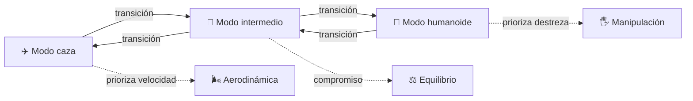

# 📋 Características del caza transformable

[🏠 Inicio](../../../README.md) · [🤖 Curso: Caza transformable](../README.md) · 📋 Características

> ⚖️ Material educativo original; los derechos de las obras pertenecen a sus titulares.

Este módulo describe que es un caza transformable y presenta sus tres modos. La
idea clave es que una misma máquina adopta formas muy distintas según lo que
necesite: cruzar el cielo a gran velocidad o moverse y manipular objetos en el
suelo.

---

## Los tres modos

### ✈️ Modo caza

Perfil de avión: fuselaje alargado, alas y superficies de control. Todo se
esconde o se alinea para reducir la resistencia del aire. Es el modo óptimo para
volar rápido y lejos.

### 🔀 Modo intermedio

Una forma de transición, a medio camino. Ya asoman brazos o tren de aterrizaje,
pero conserva parte del perfil aerodinámico. Sirve para maniobras especiales y
como paso obligado entre los otros dos modos.

### 🤖 Modo humanoide

Cuerpo con torso, brazos y piernas. Gana destreza y capacidad de manipular, pero
pierde casi toda la eficiencia aerodinámica. Es el modo óptimo para operar en el
suelo o en contacto con estructuras.

---

## Comparación de los modos

| Aspecto | ✈️ Caza | 🔀 Intermedio | 🤖 Humanoide |
| --- | --- | --- | --- |
| Prioridad | Velocidad | Compromiso | Destreza |
| Resistencia al aire | Baja | Media | Muy alta |
| Superficie frontal | Pequeña | Media | Grande |
| Manipulación | Nula | Limitada | Alta |
| Estabilidad en vuelo | Alta | Media | Muy baja |
| Uso ideal | Cruzar el cielo | Transición y maniobra | Suelo y contacto |

---

## Para qué sirve cada modo

- **Caza**: desplazarse rápido, recorrer grandes distancias, patrullar.
- **Intermedio**: ajustar la trayectoria, frenar, prepararse para el contacto.
- **Humanoide**: caminar, sujetar, empujar, interactuar con el entorno.

La gracia del concepto es no tener que elegir de forma permanente: la máquina se
adapta a cada situación. El costo de esa flexibilidad, como veremos en el módulo
de sistemas, es enorme en peso, mecanismos y estructura.

---

[⬅️ Anterior: Historia](../historia/historia-caza-transformable.md) · [➡️ Siguiente: Sistemas mecánicos](sistemas-mecanicos-caza-transformable.md)
