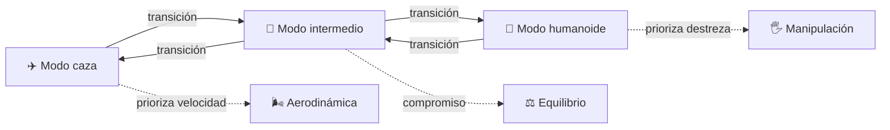

<!-- clase-meta
tipo_documento: clase
clase: 2
codigo: CAZATRANSFOR-02
curso: caza-transformable
titulo: "Características del caza transformable"
modalidad: "teórica aplicada"
duracion_minutos: 45
nivel: introductorio
prerrequisito: CAZATRANSFOR-01
competencia: "identificacion_funcional"
resultados_aprendizaje:
  - "Explicar definición, rasgos funcionales, tipos y usos con vocabulario propio de Caza transformable."
  - "Aplicar esos conceptos a una decisión segura o a un escenario de simulación de Caza transformable."
evidencia: "Matriz comparativa y decisión justificada."
criterio_aprobacion: "La elección considera función, límites, mando y efecto en la simulación; no se apoya solo en preferencias."
fuentes: manuales/fuentes.md
ultima_revision: 2026-09-10
-->

# 📋 Características del caza transformable

[🏠 Inicio](../../../README.md) · [🤖 Curso: Caza transformable](../README.md) · 📋 Características

> ⚖️ Material educativo original; los derechos de las obras pertenecen a sus titulares.

Esta clase describe que es un caza transformable y presenta sus tres modos. La
idea clave es que una misma máquina adopta formas muy distintas según lo que
necesite: cruzar el cielo a gran velocidad o moverse y manipular objetos en el
suelo.

```mermaid
flowchart LR
    Caza[✈️ Modo caza] -->|transición| Intermedio[🔀 Modo intermedio]
    Intermedio -->|transición| Humanoide[🤖 Modo humanoide]
    Humanoide -->|transición| Intermedio
    Intermedio -->|transición| Caza
    Caza -.->|prioriza velocidad| Vel[🌬️ Aerodinámica]
    Humanoide -.->|prioriza destreza| Des[🖐️ Manipulación]
    Intermedio -.->|compromiso| Mix[⚖️ Equilibrio]
```

---

## Los tres modos

### ✈️ Modo caza

Perfil de avión: fuselaje alargado, alas y superficies de control. Todo se
esconde o se alinea para reducir la resistencia del aire. Es el modo óptimo para
volar rápido y lejos.

### 🔀 Modo intermedio

Una forma de transición, a medio camino. Ya asoman brazos o tren de aterrizaje,
pero conserva parte del perfil aerodinámico. Sirve para maniobras especiales y
como paso obligado entre los otros dos modos.

### 🤖 Modo humanoide

Cuerpo con torso, brazos y piernas. Gana destreza y capacidad de manipular, pero
pierde casi toda la eficiencia aerodinámica. Es el modo óptimo para operar en el
suelo o en contacto con estructuras.

---

## Comparación de los modos

| Aspecto | ✈️ Caza | 🔀 Intermedio | 🤖 Humanoide |
| --- | --- | --- | --- |
| Prioridad | Velocidad | Compromiso | Destreza |
| Resistencia al aire | Baja | Media | Muy alta |
| Superficie frontal | Pequeña | Media | Grande |
| Manipulación | Nula | Limitada | Alta |
| Estabilidad en vuelo | Alta | Media | Muy baja |
| Uso ideal | Cruzar el cielo | Transición y maniobra | Suelo y contacto |

---

## Para qué sirve cada modo

- **Caza**: desplazarse rápido, recorrer grandes distancias, patrullar.
- **Intermedio**: ajustar la trayectoria, frenar, prepararse para el contacto.
- **Humanoide**: caminar, sujetar, empujar, interactuar con el entorno.

La gracia del concepto es no tener que elegir de forma permanente: la máquina se
adapta a cada situación. El costo de esa flexibilidad, como veremos en el módulo
de sistemas, es enorme en peso, mecanismos y estructura.

## 🧭 Guía de estudio aplicada

### Pregunta guía

¿Cómo ayuda **Los tres modos, Comparación de los modos, Para qué sirve cada modo y Guía de estudio aplicada** a **elegir una configuración adecuada para transición simulada de vuelo a modo robot durante una misión**?

### Explicación razonada

Una característica solo es útil cuando permite anticipar comportamiento. En Caza transformable, la relación entre fuente de energía ficticia, actuadores de transformación, propulsión y configuración de vuelo o robot determina capacidad, respuesta y límites. Por eso «modo caza frente a modo robot» no se compara por apariencia: se compara por misión, entorno, carga de trabajo y exposición al riesgo «ocultar discontinuidades físicas bajo una animación sin reglas de estado».

Esta clase se conecta con el resto del curso mediante **cambiar de configuración altera masa aparente, control, resistencia y función narrativa**. El hilo de
seguridad consiste en reconocer a tiempo **ocultar discontinuidades físicas bajo una animación sin reglas de estado** y poder justificar la decisión
**definir condiciones, costos y límites de cada transición antes de simularla**; en clases posteriores cambiará el ángulo de análisis, no esa relación causal.
La lectura funcional común sigue **fuente de energía ficticia → actuadores de transformación → propulsión → configuración de vuelo o robot**, de modo que cada concepto pueda
ubicarse dentro del funcionamiento completo y no quede como un dato aislado.

**Apoyo documental:** [Robotech](https://robotech.com/) aporta referencia oficial del universo ficticio;
[Aviation Handbooks and Manuals](https://www.faa.gov/regulations_policies/handbooks_manuals) se usa para aerodinámica, sistemas y operación. Estas fuentes
se contrastan con el alcance de la clase y no sustituyen un manual de equipo concreto.

### Caso resuelto: de la observación a la decisión

1. **Definir la necesidad:** convierte «transición simulada de vuelo a modo robot durante una misión» en requisitos de capacidad, entorno y respuesta.
2. **Comparar:** contrasta **modo caza frente a modo robot** usando esos requisitos y la cadena **fuente de energía ficticia → actuadores de transformación → propulsión → configuración de vuelo o robot**.
3. **Descartar:** elimina la alternativa que deja menos margen frente a **ocultar discontinuidades físicas bajo una animación sin reglas de estado**.
4. **Elegir:** declara la variante escogida, la evidencia usada y una limitación que todavía debe respetarse.

### Comprueba tu comprensión

1. ¿Qué característica de **configuración de vuelo o robot** condiciona primero el caso «transición simulada de vuelo a modo robot durante una misión»?
2. ¿Qué requisito descartaría una de las alternativas **modo caza frente a modo robot**?
3. ¿Qué límite debe declararse junto con la variante elegida?

Orientación para revisar tus respuestas

- La primera respuesta debe relacionar el eslabón elegido con un efecto posterior, no solo nombrarlo.
- La segunda debe proponer una señal medible u observable y explicar qué tendencia sería preocupante.
- La tercera debe cambiar al menos una variable de capacidad, mando, entorno o margen de seguridad.

## 🎓 Cierre de clase

- **Actividad:** Compara variantes de Caza transformable mediante los ejes «definición, rasgos funcionales, tipos y usos» y elige una para un caso de uso razonado.
- **Evidencia:** Matriz comparativa y decisión justificada.
- **Criterio de aprobación:** La elección considera función, límites, mando y efecto en la simulación; no se apoya solo en preferencias.
- **Transferencia:** explica qué cambiaría al pasar a otra variante de esta máquina.

### Fuentes de esta clase

- [ROBOTECH-OFFICIAL](https://robotech.com/): Robotech, Harmony Gold. Uso: referencia oficial del universo ficticio.
- [US-FAA-HANDBOOKS](https://www.faa.gov/regulations_policies/handbooks_manuals): Aviation Handbooks and Manuals, FAA. Uso: aerodinámica, sistemas y operación.
- [NASA-FLIGHT](https://www1.grc.nasa.gov/beginners-guide-to-aeronautics/): Beginner's Guide to Aeronautics, NASA. Uso: contraste con física y vuelo reales.

> Las fuentes sostienen el marco conceptual y normativo; esta clase no reemplaza el manual
> del fabricante, la formación certificada ni la habilitación exigida para operar equipos reales.

---

[⬅️ Anterior: Historia](../historia/historia-caza-transformable.md) · [➡️ Siguiente: Modelos y variantes](../modelos/modelos-caza-transformable.md)
