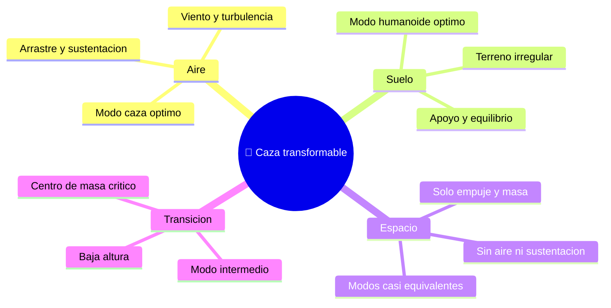

# 🌍 Entornos de operación del caza transformable

[🏠 Inicio](../../../README.md) · [🤖 Curso: Caza transformable](../README.md) · 🌍 Entornos

> ⚖️ Material educativo original; los derechos de las obras pertenecen a sus titulares.

Dónde opera un caza transformable y como cada entorno favorece un modo distinto.
La riqueza del concepto es justamente que puede adaptarse: lo que en el aire pide
velocidad, en el suelo pide destreza.

---

## 🗺️ Entornos y factores

---

## Cómo cambia la operación

| Entorno | Modo favorito | Reto principal | Ajuste de pilotaje |
| --- | --- | --- | --- |
| Aire | ✈️ Caza | Minimizar arrastre | Volar limpio y estable. |
| Suelo | 🤖 Humanoide | Mantener equilibrio | Apoyo firme, pasos medidos. |
| Espacio | ✈️ o 🤖 | Falta de aire | El modo casi no cambia la aerodinámica. |
| Transición | 🔀 Intermedio | Centro de masa móvil | Transformar a baja velocidad. |

---

## 🌬️ El papel del aire

En la atmósfera, el aire lo condiciona todo. En modo caza ayuda (genera
sustentación) pero también frena (arrastre). En modo humanoide solo estorba,
porque la forma no aprovecha el aire y si sufre su resistencia.

En el espacio la situación se invierte: sin aire no hay sustentación ni arrastre,
así que la forma aerodinámica deja de importar. Allí lo que manda es la masa y la
dirección del empuje, y los dos modos se comportan de forma parecida.

---

## 🧱 El papel del suelo

En el suelo aparece el reto del equilibrio. El modo humanoide debe repartir el
peso sobre las piernas y mantener el centro de masa sobre su base de apoyo, igual
que una persona al caminar. Un terreno irregular complica mucho esta tarea.

---

## 🎮 Traducción a simulación

Cada entorno se convierte en un escenario con sus reglas: presencia o ausencia de
aire, tipo de superficie y condiciones. Se detalla en el
[Módulo 8: Simulación](../simulacion/diseno-simulador-caza-transformable.md).

---

[⬅️ Anterior: Principios y operación](principios-caza-transformable.md) · [➡️ Siguiente: Reglas del universo](../reglamentos/reglas-universo-caza-transformable.md)
