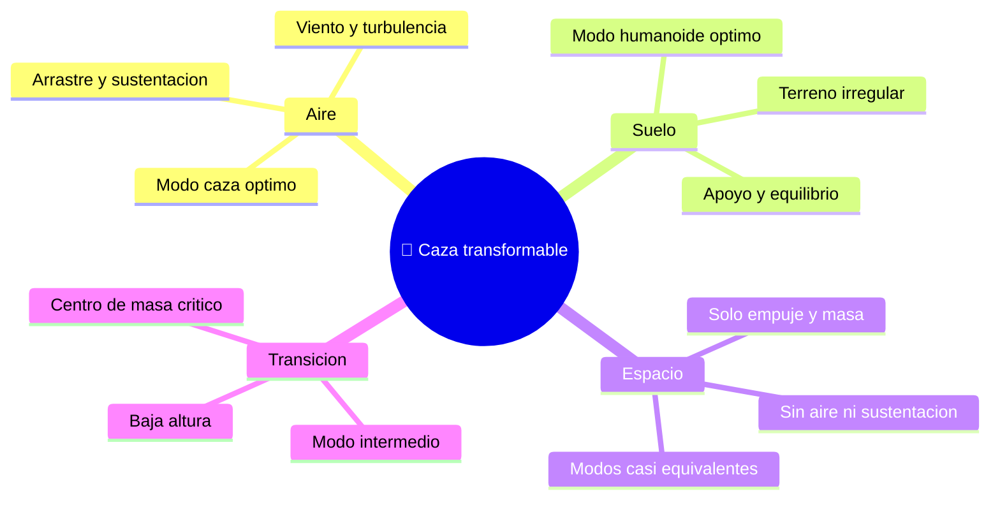

<!-- clase-meta
tipo_documento: clase
clase: 7
codigo: CAZATRANSFOR-07
curso: caza-transformable
titulo: "Entornos de operación del caza transformable"
modalidad: "análisis de escenarios"
duracion_minutos: 60
nivel: introductorio
prerrequisito: CAZATRANSFOR-06
competencia: "adaptacion_al_entorno"
resultados_aprendizaje:
  - "Explicar entornos, factores ambientales, riesgos y respuesta de simulación con vocabulario propio de Caza transformable."
  - "Aplicar esos conceptos a una decisión segura o a un escenario de simulación de Caza transformable."
evidencia: "Matriz entorno–cambio–riesgo–respuesta."
criterio_aprobacion: "Cada respuesta se adapta al entorno y distingue riesgos que no son intercambiables entre escenarios."
fuentes: manuales/fuentes.md
ultima_revision: 2026-09-10
-->

# 🌍 Entornos de operación del caza transformable

[🏠 Inicio](../../../README.md) · [🤖 Curso: Caza transformable](../README.md) · 🌍 Entornos

> ⚖️ Material educativo original; los derechos de las obras pertenecen a sus titulares.

Dónde opera un caza transformable y como cada entorno favorece un modo distinto.
La riqueza del concepto es justamente que puede adaptarse: lo que en el aire pide
velocidad, en el suelo pide destreza.

---

## 🗺️ Entornos y factores

```mermaid
mindmap
  root((🤖 Caza transformable))
    Aire
      Modo caza optimo
      Arrastre y sustentacion
      Viento y turbulencia
    Suelo
      Modo humanoide optimo
      Terreno irregular
      Apoyo y equilibrio
    Espacio
      Sin aire ni sustentacion
      Solo empuje y masa
      Modos casi equivalentes
    Transicion
      Modo intermedio
      Centro de masa critico
      Baja altura
```

---

## Cómo cambia la operación

| Entorno | Modo favorito | Reto principal | Ajuste de pilotaje |
| --- | --- | --- | --- |
| Aire | ✈️ Caza | Minimizar arrastre | Volar limpio y estable. |
| Suelo | 🤖 Humanoide | Mantener equilibrio | Apoyo firme, pasos medidos. |
| Espacio | ✈️ o 🤖 | Falta de aire | El modo casi no cambia la aerodinámica. |
| Transición | 🔀 Intermedio | Centro de masa móvil | Transformar a baja velocidad. |

---

## 🌬️ El papel del aire

En la atmósfera, el aire lo condiciona todo. En modo caza ayuda (genera
sustentación) pero también frena (arrastre). En modo humanoide solo estorba,
porque la forma no aprovecha el aire y si sufre su resistencia.

En el espacio la situación se invierte: sin aire no hay sustentación ni arrastre,
así que la forma aerodinámica deja de importar. Allí lo que manda es la masa y la
dirección del empuje, y los dos modos se comportan de forma parecida.

---

## 🧱 El papel del suelo

En el suelo aparece el reto del equilibrio. El modo humanoide debe repartir el
peso sobre las piernas y mantener el centro de masa sobre su base de apoyo, igual
que una persona al caminar. Un terreno irregular complica mucho esta tarea.

---

## 🎮 Traducción a simulación

Cada entorno se convierte en un escenario con sus reglas: presencia o ausencia de
aire, tipo de superficie y condiciones. Se detalla en el
[Clase 9: Simulación](../simulacion/diseno-simulador-caza-transformable.md).

## 🧭 Guía de estudio aplicada

### Pregunta guía

¿Cómo ayuda **Entornos y factores, Cómo cambia la operación, El papel del aire y El papel del suelo** a **adaptar transición simulada de vuelo a modo robot durante una misión a tres condiciones ambientales distintas**?

### Explicación razonada

El entorno no es decoración: modifica las fuerzas, la percepción y el tiempo disponible. En el caso «transición simulada de vuelo a modo robot durante una misión», cambia el comportamiento de configuración de vuelo o robot y aumenta la probabilidad de ocultar discontinuidades físicas bajo una animación sin reglas de estado. La respuesta correcta empieza por reconocer qué variable cambió y después adaptar límites, ruta o misión.

Esta clase se conecta con el resto del curso mediante **cambiar de configuración altera masa aparente, control, resistencia y función narrativa**. El hilo de
seguridad consiste en reconocer a tiempo **ocultar discontinuidades físicas bajo una animación sin reglas de estado** y poder justificar la decisión
**definir condiciones, costos y límites de cada transición antes de simularla**; en clases posteriores cambiará el ángulo de análisis, no esa relación causal.
La lectura funcional común sigue **fuente de energía ficticia → actuadores de transformación → propulsión → configuración de vuelo o robot**, de modo que cada concepto pueda
ubicarse dentro del funcionamiento completo y no quede como un dato aislado.

**Apoyo documental:** [Robotech](https://robotech.com/) aporta referencia oficial del universo ficticio;
[Aviation Handbooks and Manuals](https://www.faa.gov/regulations_policies/handbooks_manuals) se usa para aerodinámica, sistemas y operación. Estas fuentes
se contrastan con el alcance de la clase y no sustituyen un manual de equipo concreto.

### Caso resuelto: de la observación a la decisión

1. **Escenario base:** conserva la misión «transición simulada de vuelo a modo robot durante una misión» para poder comparar.
2. **Cambiar una condición:** modifica sucesivamente superficie o medio, visibilidad y perturbación externa.
3. **Recalcular margen:** explica cómo cada cambio afecta **configuración de vuelo o robot** y acerca o aleja **ocultar discontinuidades físicas bajo una animación sin reglas de estado**.
4. **Adaptar:** cambia límite, ruta, configuración o incluso cancela; no mantengas la misma respuesta por hábito.

### Comprueba tu comprensión

1. ¿Cómo cambiaría **configuración de vuelo o robot** si empeora la perturbación externa?
2. ¿Qué condición ambiental acerca más el escenario a **ocultar discontinuidades físicas bajo una animación sin reglas de estado**?
3. ¿Cuándo adaptarías la maniobra y cuándo la cancelarías?

Orientación para revisar tus respuestas

- La primera respuesta debe relacionar el eslabón elegido con un efecto posterior, no solo nombrarlo.
- La segunda debe proponer una señal medible u observable y explicar qué tendencia sería preocupante.
- La tercera debe cambiar al menos una variable de capacidad, mando, entorno o margen de seguridad.

## 🎓 Cierre de clase

- **Actividad:** Contrasta tres entornos de Caza transformable a partir de entornos, factores ambientales, riesgos y respuesta de simulación y determina cómo cambian variables, percepción, riesgos y respuesta.
- **Evidencia:** Matriz entorno–cambio–riesgo–respuesta.
- **Criterio de aprobación:** Cada respuesta se adapta al entorno y distingue riesgos que no son intercambiables entre escenarios.
- **Transferencia:** explica qué cambiaría al pasar a otra variante de esta máquina.

### Fuentes de esta clase

- [ROBOTECH-OFFICIAL](https://robotech.com/): Robotech, Harmony Gold. Uso: referencia oficial del universo ficticio.
- [US-FAA-HANDBOOKS](https://www.faa.gov/regulations_policies/handbooks_manuals): Aviation Handbooks and Manuals, FAA. Uso: aerodinámica, sistemas y operación.
- [NASA-FLIGHT](https://www1.grc.nasa.gov/beginners-guide-to-aeronautics/): Beginner's Guide to Aeronautics, NASA. Uso: contraste con física y vuelo reales.

> Las fuentes sostienen el marco conceptual y normativo; esta clase no reemplaza el manual
> del fabricante, la formación certificada ni la habilitación exigida para operar equipos reales.

---

[⬅️ Anterior: Principios y operación](principios-caza-transformable.md) · [➡️ Siguiente: Reglas del universo](../reglamentos/reglas-universo-caza-transformable.md)
