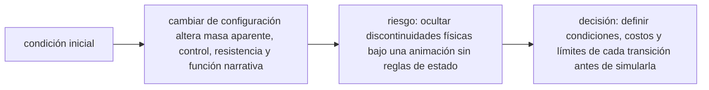

<!-- clase-meta
tipo_documento: clase
clase: 6
codigo: CAZATRANSFOR-06
curso: caza-transformable
titulo: "Principios y operación del caza transformable"
modalidad: "resolución de problemas"
duracion_minutos: 90
nivel: introductorio
prerrequisito: CAZATRANSFOR-05
competencia: "razonamiento_operacional"
resultados_aprendizaje:
  - "Explicar principios físicos, fases de operación, decisiones y errores frecuentes con vocabulario propio de Caza transformable."
  - "Aplicar esos conceptos a una decisión segura o a un escenario de simulación de Caza transformable."
evidencia: "Resolución argumentada de un escenario operacional."
criterio_aprobacion: "Aplica los principios correctos, anticipa consecuencias y respeta los límites del curso."
fuentes: manuales/fuentes.md
ultima_revision: 2026-09-10
-->

# 🧪 Principios y operación del caza transformable

[🏠 Inicio](../../../README.md) · [🤖 Curso: Caza transformable](../README.md) · 🧪 Principios

> ⚖️ Material educativo original; los derechos de las obras pertenecen a sus titulares.

Esta clase va al corazón del curso: que principios físicos serían posibles, que
no, y por qué. Usamos el concepto de caza transformable para entender
aerodinámica, estabilidad y el costo real de cambiar de forma.

---

## 🌬️ Aerodinámica de un caza

Un avión vuela gracias al equilibrio de cuatro fuerzas:

- **Empuje**: lo generan los motores y lo mueve hacia adelante.
- **Resistencia (arrastre)**: el aire frena el avance; crece con la velocidad.
- **Sustentación**: las alas desvian el aire y generan fuerza hacia arriba.
- **Peso**: la gravedad tira del conjunto hacia abajo.

Un caza bien disenado tiene una forma alargada y limpia que minimiza el arrastre
y coloca la sustentación donde toca para volar estable y maniobrar.

---

## 🤖 Por qué un humanoide es un mal avión

Aquí está la lección central. Un cuerpo humanoide caminando en la atmósfera es
aerodinamicamente pésimo por varias razones:

- **Superficie frontal grande**: un torso con brazos y piernas presenta mucha
  área al aire, y el arrastre crece con esa área.
- **Formas angulosas**: las extremidades crean turbulencias y remolinos que
  disipan energía.
- **Sin superficies de sustentación**: no tiene alas de verdad, así que no
  genera sustentación eficiente.
- **Control difícil**: un cuerpo articulado no tiene superficies de control
  aerodinámico estables como timones o alerones.

Por eso, en la práctica, el modo humanoide solo tiene sentido en el suelo o
sujeto a algo, no cruzando el cielo a gran velocidad.

---

## 🎯 El centro de masa y la estabilidad

Al transformarse, el centro de masa se desplaza. Para volar estable, ese punto
debe quedar en una posición precisa respecto de las alas. Si se corre demasiado
hacia atrás o hacia adelante, el aparato se vuelve inestable. Por eso el momento
más delicado es el modo intermedio, cuando la forma está a medias.

---

## Ficción frente a realidad

| Principio | En la ficción | En la realidad |
| --- | --- | --- |
| Volar en modo humanoide | Se hace con soltura | El arrastre y la falta de alas lo impiden. |
| Transformar en pleno combate | Instantáneo | Requeriría segundos y mucha energía. |
| Centro de masa | Nunca molesta | Su desplazamiento amenaza el control. |
| Superficie frontal | Irrelevante | Determina cuanta energía se pierde. |
| Estructura ligera | Se da por hecha | Las juntas suman peso y restan rigidez. |

---

## Fases de operación

1. **Despegue y ascenso**: en modo caza, priorizando empuje y sustentación.
2. **Crucero**: modo caza, minimizando arrastre para ahorrar energía.
3. **Aproximación**: transición al modo intermedio, vigilando el centro de masa.
4. **Contacto con el suelo**: modo humanoide, con las piernas soportando el peso.
5. **Operación en superficie**: caminar y manipular en modo humanoide.

---

## Niveles de realismo

Cuanta física real incorporar es una decisión de diseño. Este curso se apoya en
la escala descrita en [niveles de realismo](../../../docs/03-niveles-de-realismo.md):
se puede simular la transformación como algo instantáneo y mágico, o modelar de
verdad la energía, el tiempo y el desplazamiento del centro de masa.

## 🧭 Guía de estudio aplicada

### Pregunta guía

¿Cómo ayuda **Aerodinámica de un caza, Por qué un humanoide es un mal avión, El centro de masa y la estabilidad y Ficción frente a realidad** a **resolver transición simulada de vuelo a modo robot durante una misión sin agotar el margen operacional**?

### Explicación razonada

El principio rector puede resumirse así: cambiar de configuración altera masa aparente, control, resistencia y función narrativa. Esto explica por qué una misma orden produce resultados distintos cuando cambian velocidad, carga, configuración o entorno. Operar bien consiste en leer la tendencia antes de agotar el margen y tomar esta decisión: definir condiciones, costos y límites de cada transición antes de simularla.

Esta clase se conecta con el resto del curso mediante **cambiar de configuración altera masa aparente, control, resistencia y función narrativa**. El hilo de
seguridad consiste en reconocer a tiempo **ocultar discontinuidades físicas bajo una animación sin reglas de estado** y poder justificar la decisión
**definir condiciones, costos y límites de cada transición antes de simularla**; en clases posteriores cambiará el ángulo de análisis, no esa relación causal.
La lectura funcional común sigue **fuente de energía ficticia → actuadores de transformación → propulsión → configuración de vuelo o robot**, de modo que cada concepto pueda
ubicarse dentro del funcionamiento completo y no quede como un dato aislado.

**Apoyo documental:** [Robotech](https://robotech.com/) aporta referencia oficial del universo ficticio;
[Aviation Handbooks and Manuals](https://www.faa.gov/regulations_policies/handbooks_manuals) se usa para aerodinámica, sistemas y operación. Estas fuentes
se contrastan con el alcance de la clase y no sustituyen un manual de equipo concreto.

### Caso resuelto: de la observación a la decisión

1. **Datos:** reconoce condiciones, configuración y margen disponibles en **transición simulada de vuelo a modo robot durante una misión**.
2. **Modelo:** aplica **cambiar de configuración altera masa aparente, control, resistencia y función narrativa** para predecir una tendencia antes de actuar.
3. **Riesgo:** explica mediante qué cadena de causas podría ocurrir **ocultar discontinuidades físicas bajo una animación sin reglas de estado**.
4. **Decisión:** ejecuta mentalmente **definir condiciones, costos y límites de cada transición antes de simularla** y define qué observación confirmaría que funcionó.

### Comprueba tu comprensión

1. ¿Qué variable del principio «cambiar de configuración altera masa aparente, control, resistencia y función narrativa» cambia primero en el caso?
2. ¿Cómo se propaga ese cambio hasta **configuración de vuelo o robot**?
3. ¿Qué evidencia confirmaría que **definir condiciones, costos y límites de cada transición antes de simularla** conservó margen operacional?

Orientación para revisar tus respuestas

- La primera respuesta debe relacionar el eslabón elegido con un efecto posterior, no solo nombrarlo.
- La segunda debe proponer una señal medible u observable y explicar qué tendencia sería preocupante.
- La tercera debe cambiar al menos una variable de capacidad, mando, entorno o margen de seguridad.

## 🎓 Cierre de clase

- **Actividad:** Resuelve un escenario de Caza transformable explicando, paso a paso, cómo intervienen principios físicos, fases de operación, decisiones y errores frecuentes.
- **Evidencia:** Resolución argumentada de un escenario operacional.
- **Criterio de aprobación:** Aplica los principios correctos, anticipa consecuencias y respeta los límites del curso.
- **Transferencia:** explica qué cambiaría al pasar a otra variante de esta máquina.

### Fuentes de esta clase

- [ROBOTECH-OFFICIAL](https://robotech.com/): Robotech, Harmony Gold. Uso: referencia oficial del universo ficticio.
- [US-FAA-HANDBOOKS](https://www.faa.gov/regulations_policies/handbooks_manuals): Aviation Handbooks and Manuals, FAA. Uso: aerodinámica, sistemas y operación.
- [NASA-FLIGHT](https://www1.grc.nasa.gov/beginners-guide-to-aeronautics/): Beginner's Guide to Aeronautics, NASA. Uso: contraste con física y vuelo reales.

> Las fuentes sostienen el marco conceptual y normativo; esta clase no reemplaza el manual
> del fabricante, la formación certificada ni la habilitación exigida para operar equipos reales.

---

[⬅️ Anterior: Mandos](../mandos/manual-mandos-caza-transformable.md) · [➡️ Siguiente: Entornos](entornos-caza-transformable.md)
