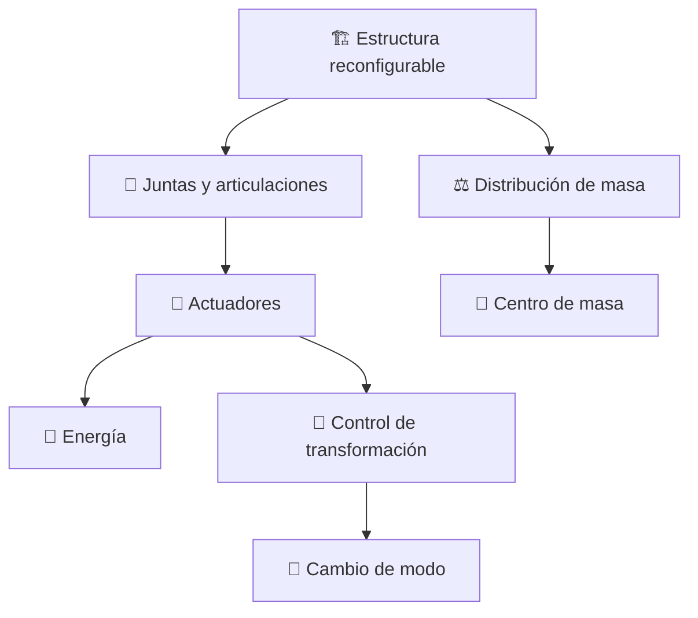
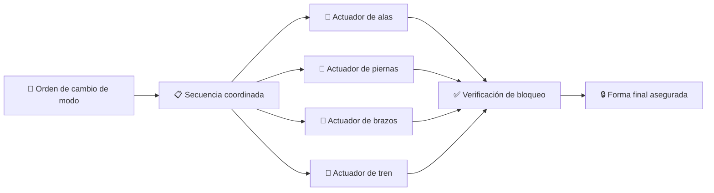

# 🔧 Sistemas mecánicos del caza transformable

[🏠 Inicio](../../../README.md) · [🤖 Curso: Caza transformable](../README.md) · 🔧 Sistemas mecánicos

> ⚖️ Material educativo original; los derechos de las obras pertenecen a sus titulares.

Este es el módulo más técnico del curso. Abrimos la máquina por dentro y
comparamos la tecnología imaginaria de la transformación con la física y la
ingeniería reales. La conclusión no es "es imposible", sino "esto cuesta mucho y
por estas razones concretas".

---

## 1. 🏗️ La estructura que se reconfigura

En un avión normal la estructura es fija: su forma está optimizada para volar y
no cambia. En un caza transformable, en cambio, el mismo material debe formar un
fuselaje aerodinámico y después un cuerpo con extremidades. Eso obliga a partir
la estructura en muchos bloques unidos por juntas móviles.

Cada junta es un punto donde la estructura es más débil y más pesada que una
pieza continua. Aquí aparece el primer gran problema real: **cada grado de
libertad que añades resta rigidez y suma masa**.

---

## 2. 🔩 Juntas, actuadores y grados de libertad

Un "grado de libertad" es cada movimiento independiente que permite una junta
(girar, deslizar, plegar). Una transformación completa necesita decenas de
ellos, coordinados con precisión.

Los actuadores son los "músculos" que mueven las juntas. Pueden ser hidráulicos,
eléctricos o neumáticos. El problema es que para mover piezas grandes y
soportar cargas de vuelo hacen falta actuadores potentes, y potentes significa
pesados y hambrientos de energía.

| Concepto | Que es | Problema real |
| --- | --- | --- |
| Grado de libertad | Un movimiento independiente | Más libertad, menos rigidez. |
| Actuador | El músculo que mueve la junta | Potencia alta implica peso alto. |
| Bloqueo estructural | Fijar una junta ya movida | Debe aguantar cargas de vuelo. |
| Secuencia | Orden en que se mueve todo | Un fallo parcial deja una forma inválida. |

---

## 3. 🎯 El centro de masa que se desplaza

Cuando la máquina cambia de forma, sus piezas se reordenan y el centro de masa
(el punto donde se puede considerar concentrado todo el peso) se mueve. En vuelo
esto es crítico: la posición del centro de masa respecto de las superficies
aerodinámicas decide si el aparato es estable o incontrolable.

Un avión se disena para que su centro de masa quede en un margen estrecho. Si al
transformarse ese punto se desplaza demasiado, en el modo intermedio la máquina
podría volverse inestable justo cuando más control necesita.

---

## 4. 💪 El problema de la masa y las cargas

En modo caza, las alas soportan la sustentación y transmiten esas fuerzas a un
fuselaje pensado para ello. En modo humanoide, las piernas deben soportar todo el
peso al caminar o aterrizar. La misma pieza cambia de función, y diseñar algo que
sea buena ala **y** buena pierna es un compromiso que empeora ambas cosas.

Además, todo el mecanismo de transformación es masa muerta: en modo caza cargas
con el peso de las piernas y los brazos plegados, y en modo humanoide cargas con
el peso de las alas. Nunca aprovechas todo a la vez.

---

## Ficción frente a realidad

| Elemento | Como se muestra en la ficción | Que dice la ingeniería real |
| --- | --- | --- |
| Transformación | Rápida, fluida y sin esfuerzo | Lenta, con actuadores potentes y mucha energía. |
| Juntas | Invisibles y perfectas | Puntos débiles, pesados y de mantenimiento. |
| Masa | Parece no importar | La masa muerta penaliza todos los modos. |
| Centro de masa | Nunca da problemas | Su desplazamiento amenaza la estabilidad. |
| Materiales | Aguantan todo | Los actuales fatigan y ceden en las juntas. |

---

## Que sería realizable y que no

| Parte | Realizable hoy? | Motivo |
| --- | --- | --- |
| Alas plegables | Si, parcialmente | Ya existen en aviones navales. |
| Tren retráctil | Si | Tecnología madura y común. |
| Un modo intermedio simple | Quizás, a baja escala | Prototipos experimentales lo insinuan. |
| Humanoide que vuela como caza | No | Aerodinámica y masa lo hacen inviable. |
| Transformación completa en segundos | No | Ni actuadores ni estructura lo permiten. |

La lectura educativa es clara: piezas sueltas del concepto existen o son
plausibles, pero el conjunto completo, rápido y ligero pertenece por ahora a la
ficción.

---

[⬅️ Anterior: Características](caracteristicas-caza-transformable.md) · [➡️ Siguiente: Mandos e instrumentos](../mandos/manual-mandos-caza-transformable.md)
