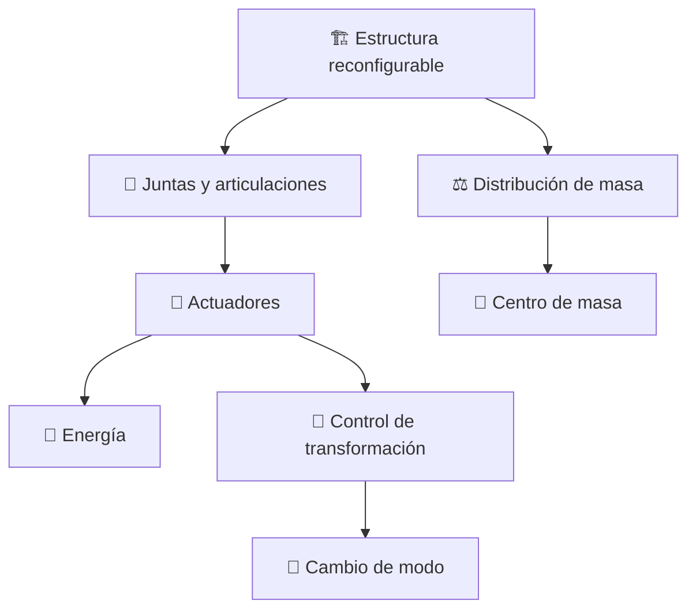
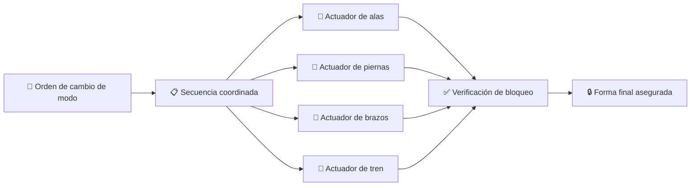
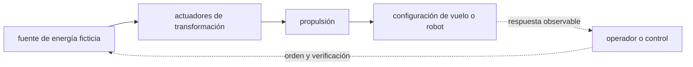

<!-- clase-meta
tipo_documento: clase
clase: 4
codigo: CAZATRANSFOR-04
curso: caza-transformable
titulo: "Sistemas mecánicos del caza transformable"
modalidad: "teórica aplicada"
duracion_minutos: 90
nivel: introductorio
prerrequisito: CAZATRANSFOR-03
competencia: "comprension_de_sistemas"
resultados_aprendizaje:
  - "Explicar La estructura que se reconfigura, Juntas, actuadores y grados de libertad, El centro de masa que se desplaza y El problema de la masa y las cargas con vocabulario propio de Caza transformable."
  - "Aplicar esos conceptos a una decisión segura o a un escenario de simulación de Caza transformable."
evidencia: "Esquema con flujos de energía, materia o información anotados."
criterio_aprobacion: "Las conexiones esenciales son correctas y la consecuencia de la falla se propaga de manera coherente."
fuentes: manuales/fuentes.md
ultima_revision: 2026-09-10
-->

# 🔧 Sistemas mecánicos del caza transformable

[🏠 Inicio](../../../README.md) · [🤖 Curso: Caza transformable](../README.md) · 🔧 Sistemas mecánicos

> ⚖️ Material educativo original; los derechos de las obras pertenecen a sus titulares.

Este es el módulo más técnico del curso. Abrimos la máquina por dentro y
comparamos la tecnología imaginaria de la transformación con la física y la
ingeniería reales. La conclusión no es "es imposible", sino "esto cuesta mucho y
por estas razones concretas".

```mermaid
flowchart TD
    Estructura[🏗️ Estructura reconfigurable] --> Juntas[🔩 Juntas y articulaciones]
    Juntas --> Actuadores[💪 Actuadores]
    Actuadores --> Energia[🔋 Energía]
    Estructura --> Masa[⚖️ Distribución de masa]
    Masa --> CentroMasa[🎯 Centro de masa]
    Actuadores --> Control[🧠 Control de transformación]
    Control --> Modo[🔀 Cambio de modo]
```

---

## 1. 🏗️ La estructura que se reconfigura

En un avión normal la estructura es fija: su forma está optimizada para volar y
no cambia. En un caza transformable, en cambio, el mismo material debe formar un
fuselaje aerodinámico y después un cuerpo con extremidades. Eso obliga a partir
la estructura en muchos bloques unidos por juntas móviles.

Cada junta es un punto donde la estructura es más débil y más pesada que una
pieza continua. Aquí aparece el primer gran problema real: **cada grado de
libertad que añades resta rigidez y suma masa**.

---

## 2. 🔩 Juntas, actuadores y grados de libertad

Un "grado de libertad" es cada movimiento independiente que permite una junta
(girar, deslizar, plegar). Una transformación completa necesita decenas de
ellos, coordinados con precisión.

```mermaid
flowchart LR
    Orden[🧠 Orden de cambio de modo] --> Sec[📋 Secuencia coordinada]
    Sec --> A1[💪 Actuador de alas]
    Sec --> A2[💪 Actuador de piernas]
    Sec --> A3[💪 Actuador de brazos]
    Sec --> A4[💪 Actuador de tren]
    A1 --> Ver[✅ Verificación de bloqueo]
    A2 --> Ver
    A3 --> Ver
    A4 --> Ver
    Ver --> Fin[🔒 Forma final asegurada]
```

Los actuadores son los "músculos" que mueven las juntas. Pueden ser hidráulicos,
eléctricos o neumáticos. El problema es que para mover piezas grandes y
soportar cargas de vuelo hacen falta actuadores potentes, y potentes significa
pesados y hambrientos de energía.

| Concepto | Que es | Problema real |
| --- | --- | --- |
| Grado de libertad | Un movimiento independiente | Más libertad, menos rigidez. |
| Actuador | El músculo que mueve la junta | Potencia alta implica peso alto. |
| Bloqueo estructural | Fijar una junta ya movida | Debe aguantar cargas de vuelo. |
| Secuencia | Orden en que se mueve todo | Un fallo parcial deja una forma inválida. |

---

## 3. 🎯 El centro de masa que se desplaza

Cuando la máquina cambia de forma, sus piezas se reordenan y el centro de masa
(el punto donde se puede considerar concentrado todo el peso) se mueve. En vuelo
esto es crítico: la posición del centro de masa respecto de las superficies
aerodinámicas decide si el aparato es estable o incontrolable.

Un avión se disena para que su centro de masa quede en un margen estrecho. Si al
transformarse ese punto se desplaza demasiado, en el modo intermedio la máquina
podría volverse inestable justo cuando más control necesita.

---

## 4. 💪 El problema de la masa y las cargas

En modo caza, las alas soportan la sustentación y transmiten esas fuerzas a un
fuselaje pensado para ello. En modo humanoide, las piernas deben soportar todo el
peso al caminar o aterrizar. La misma pieza cambia de función, y diseñar algo que
sea buena ala **y** buena pierna es un compromiso que empeora ambas cosas.

Además, todo el mecanismo de transformación es masa muerta: en modo caza cargas
con el peso de las piernas y los brazos plegados, y en modo humanoide cargas con
el peso de las alas. Nunca aprovechas todo a la vez.

---

## Ficción frente a realidad

| Elemento | Como se muestra en la ficción | Que dice la ingeniería real |
| --- | --- | --- |
| Transformación | Rápida, fluida y sin esfuerzo | Lenta, con actuadores potentes y mucha energía. |
| Juntas | Invisibles y perfectas | Puntos débiles, pesados y de mantenimiento. |
| Masa | Parece no importar | La masa muerta penaliza todos los modos. |
| Centro de masa | Nunca da problemas | Su desplazamiento amenaza la estabilidad. |
| Materiales | Aguantan todo | Los actuales fatigan y ceden en las juntas. |

---

## Que sería realizable y que no

| Parte | Realizable hoy? | Motivo |
| --- | --- | --- |
| Alas plegables | Si, parcialmente | Ya existen en aviones navales. |
| Tren retráctil | Si | Tecnología madura y común. |
| Un modo intermedio simple | Quizás, a baja escala | Prototipos experimentales lo insinuan. |
| Humanoide que vuela como caza | No | Aerodinámica y masa lo hacen inviable. |
| Transformación completa en segundos | No | Ni actuadores ni estructura lo permiten. |

La lectura educativa es clara: piezas sueltas del concepto existen o son
plausibles, pero el conjunto completo, rápido y ligero pertenece por ahora a la
ficción.

## 🧭 Guía de estudio aplicada

### Pregunta guía

¿Cómo ayuda **La estructura que se reconfigura, Juntas, actuadores y grados de libertad, El centro de masa que se desplaza y El problema de la masa y las cargas** a **seguir una alteración desde fuente de energía ficticia hasta configuración de vuelo o robot durante transición simulada de vuelo a modo robot durante una misión**?

### Explicación razonada

El funcionamiento puede leerse como una cadena causal: fuente de energía ficticia entrega o transforma energía; actuadores de transformación la adapta; propulsión la transmite o gobierna; y configuración de vuelo o robot produce el efecto observable. La cadena no es lineal en sentido estricto: sensores, estructura y operador cierran el lazo. Si un eslabón se degrada, la señal importante es cómo cambia el estado de configuración de vuelo o robot y qué margen queda.

```mermaid
flowchart LR
    A["fuente de energía ficticia"] --> B["actuadores de transformación"] --> C["propulsión"] --> D["configuración de vuelo o robot"]
    D -. respuesta observable .-> O["operador o control"]
    O -. orden y verificación .-> A
```

Esta clase se conecta con el resto del curso mediante **cambiar de configuración altera masa aparente, control, resistencia y función narrativa**. El hilo de
seguridad consiste en reconocer a tiempo **ocultar discontinuidades físicas bajo una animación sin reglas de estado** y poder justificar la decisión
**definir condiciones, costos y límites de cada transición antes de simularla**; en clases posteriores cambiará el ángulo de análisis, no esa relación causal.
La lectura funcional común sigue **fuente de energía ficticia → actuadores de transformación → propulsión → configuración de vuelo o robot**, de modo que cada concepto pueda
ubicarse dentro del funcionamiento completo y no quede como un dato aislado.

**Apoyo documental:** [Robotech](https://robotech.com/) aporta referencia oficial del universo ficticio;
[Aviation Handbooks and Manuals](https://www.faa.gov/regulations_policies/handbooks_manuals) se usa para aerodinámica, sistemas y operación. Estas fuentes
se contrastan con el alcance de la clase y no sustituyen un manual de equipo concreto.

### Caso resuelto: de la observación a la decisión

1. **Entrada:** identifica el estado inicial de **fuente de energía ficticia** durante **transición simulada de vuelo a modo robot durante una misión**.
2. **Transformación:** explica qué hacen **actuadores de transformación** y **propulsión**, y qué magnitud cambia en cada paso.
3. **Salida:** comprueba el efecto esperado en **configuración de vuelo o robot** y busca una desviación temprana.
4. **Falla razonada:** si aparece **ocultar discontinuidades físicas bajo una animación sin reglas de estado**, retrocede por la cadena antes de ordenar otra acción.

### Comprueba tu comprensión

1. Si se degrada **actuadores de transformación**, ¿qué efecto esperarías primero en **propulsión** y después en **configuración de vuelo o robot**?
2. ¿Qué observación ayudaría a diferenciar una falla de **fuente de energía ficticia** de una falla de **propulsión**?
3. ¿Por qué una segunda orden podría agravar **ocultar discontinuidades físicas bajo una animación sin reglas de estado**?

Orientación para revisar tus respuestas

- La primera respuesta debe relacionar el eslabón elegido con un efecto posterior, no solo nombrarlo.
- La segunda debe proponer una señal medible u observable y explicar qué tendencia sería preocupante.
- La tercera debe cambiar al menos una variable de capacidad, mando, entorno o margen de seguridad.

## 🎓 Cierre de clase

- **Actividad:** Dibuja un esquema funcional de Caza transformable que conecte La estructura que se reconfigura, Juntas, actuadores y grados de libertad, El centro de masa que se desplaza y El problema de la masa y las cargas; después predice el efecto de una falla simulada.
- **Evidencia:** Esquema con flujos de energía, materia o información anotados.
- **Criterio de aprobación:** Las conexiones esenciales son correctas y la consecuencia de la falla se propaga de manera coherente.
- **Transferencia:** explica qué cambiaría al pasar a otra variante de esta máquina.

### Fuentes de esta clase

- [ROBOTECH-OFFICIAL](https://robotech.com/): Robotech, Harmony Gold. Uso: referencia oficial del universo ficticio.
- [US-FAA-HANDBOOKS](https://www.faa.gov/regulations_policies/handbooks_manuals): Aviation Handbooks and Manuals, FAA. Uso: aerodinámica, sistemas y operación.
- [NASA-FLIGHT](https://www1.grc.nasa.gov/beginners-guide-to-aeronautics/): Beginner's Guide to Aeronautics, NASA. Uso: contraste con física y vuelo reales.

> Las fuentes sostienen el marco conceptual y normativo; esta clase no reemplaza el manual
> del fabricante, la formación certificada ni la habilitación exigida para operar equipos reales.

---

[⬅️ Anterior: Modelos y variantes](../modelos/modelos-caza-transformable.md) · [➡️ Siguiente: Mandos e instrumentos](../mandos/manual-mandos-caza-transformable.md)
