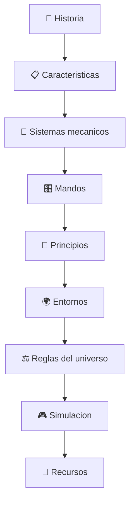

# 🧰 Recursos del caza transformable

[🏠 Inicio](../../../README.md) · [🤖 Curso: Caza transformable](../README.md) · 🧰 Recursos

> ⚖️ Material educativo original; los derechos de las obras pertenecen a sus titulares.

Cierre del curso: un glosario de los terminos clave, un mapa visual de como se
conectan los modulos y enlaces utiles para seguir aprendiendo.

---

## 📖 Glosario

| Termino | Significado |
| --- | --- |
| Empuje | Fuerza que impulsa la maquina hacia adelante. |
| Sustentacion | Fuerza hacia arriba que generan las alas. |
| Arrastre | Resistencia del aire al avance. |
| Centro de masa | Punto donde se puede considerar concentrado el peso. |
| Grado de libertad | Cada movimiento independiente de una junta. |
| Actuador | Dispositivo que mueve una junta, como un musculo. |
| Modo caza | Forma de avion, optimizada para volar. |
| Modo humanoide | Forma de robot, optima en el suelo. |
| Modo intermedio | Forma de transicion entre los otros dos. |
| Carga estructural | Esfuerzo que soporta una pieza o junta. |
| Masa muerta | Peso que se carga sin usarse en el modo actual. |

---

## 🗺️ Mapa del curso

---

## 🔗 Enlaces utiles

- [Glosario general del repositorio](../../../docs/05-glosario-general.md)
- [Portada del curso](../README.md)
- [Catalogo de naves de ficcion](../../README.md)

---

## 🧭 Como seguir

- Repasa el modulo de principios para afianzar la aerodinamica.
- Compara el modo ciencia y el modo ficcion en el simulador.
- Aplica lo aprendido a otras naves del catalogo de ficcion.

---

[🎓 Portada del curso](../README.md) · [⬅️ Anterior: Diseno de simulacion](../simulacion/diseno-simulador-caza-transformable.md)
