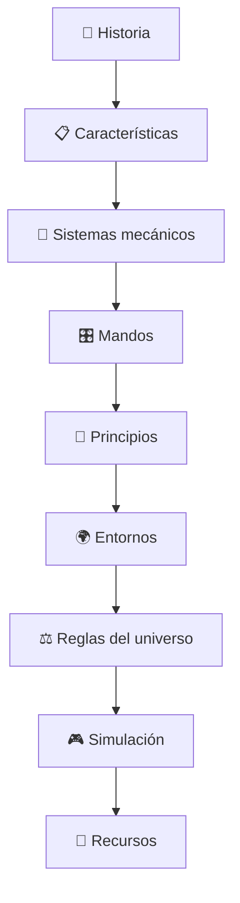

<!-- clase-meta
tipo_documento: clase
clase: 10
codigo: CAZATRANSFOR-10
curso: caza-transformable
titulo: "Recursos del caza transformable"
modalidad: "taller documental"
duracion_minutos: 45
nivel: introductorio
prerrequisito: CAZATRANSFOR-09
competencia: "alfabetizacion_tecnica"
resultados_aprendizaje:
  - "Explicar glosario, esquemas y trazabilidad de fuentes con vocabulario propio de Caza transformable."
  - "Aplicar esos conceptos a una decisión segura o a un escenario de simulación de Caza transformable."
evidencia: "Glosario aplicado y ficha breve de trazabilidad."
criterio_aprobacion: "Los términos permiten interpretar el curso y las fuentes se distinguen por autoridad, alcance y vigencia."
fuentes: manuales/fuentes.md
ultima_revision: 2026-09-10
-->

# 🧰 Recursos del caza transformable

[🏠 Inicio](../../../README.md) · [🤖 Curso: Caza transformable](../README.md) · 🧰 Recursos

> ⚖️ Material educativo original; los derechos de las obras pertenecen a sus titulares.

Cierre del curso: un glosario de los términos clave, un mapa visual de cómo se
conectan los módulos y enlaces útiles para seguir aprendiendo.

---

## 📖 Glosario

| Término | Significado |
| --- | --- |
| Empuje | Fuerza que impulsa la máquina hacia adelante. |
| Sustentación | Fuerza hacia arriba que generan las alas. |
| Arrastre | Resistencia del aire al avance. |
| Centro de masa | Punto donde se puede considerar concentrado el peso. |
| Grado de libertad | Cada movimiento independiente de una junta. |
| Actuador | Dispositivo que mueve una junta, como un músculo. |
| Modo caza | Forma de avión, optimizada para volar. |
| Modo humanoide | Forma de robot, óptima en el suelo. |
| Modo intermedio | Forma de transición entre los otros dos. |
| Carga estructural | Esfuerzo que soporta una pieza o junta. |
| Masa muerta | Peso que se carga sin usarse en el modo actual. |

---

## 🗺️ Mapa del curso

```mermaid
flowchart TD
    H[📜 Historia] --> C[📋 Características]
    C --> S[🔧 Sistemas mecánicos]
    S --> M[🎛️ Mandos]
    M --> P[🧪 Principios]
    P --> E[🌍 Entornos]
    E --> R[⚖️ Reglas del universo]
    R --> Sim[🎮 Simulación]
    Sim --> Rec[🧰 Recursos]
```

---

## 🔗 Enlaces útiles

- [Glosario general del repositorio](../../../docs/05-glosario-general.md)
- [Portada del curso](../README.md)
- [Catálogo de naves de ficción](../../README.md)

---

## 🧭 Cómo seguir

- Repasa el módulo de principios para afianzar la aerodinámica.
- Compara el modo ciencia y el modo ficción en el simulador.
- Aplica lo aprendido a otras naves del catálogo de ficción.

## 🧭 Guía de estudio aplicada

### Pregunta guía

¿Cómo ayuda **Glosario, Mapa del curso, Enlaces útiles y Cómo seguir** a **explicar con fuentes los términos fuente de energía ficticia, actuadores de transformación, propulsión y configuración de vuelo o robot**?

### Explicación razonada

El vocabulario técnico organiza relaciones: fuente de energía ficticia, actuadores de transformación, propulsión y configuración de vuelo o robot nombran partes distintas de una misma cadena funcional. Una fuente se usa para sostener una afirmación concreta —principio, límite, procedimiento o contexto— y debe distinguirse del manual particular de un fabricante o de una regla narrativa.

Esta clase se conecta con el resto del curso mediante **cambiar de configuración altera masa aparente, control, resistencia y función narrativa**. El hilo de
seguridad consiste en reconocer a tiempo **ocultar discontinuidades físicas bajo una animación sin reglas de estado** y poder justificar la decisión
**definir condiciones, costos y límites de cada transición antes de simularla**; en clases posteriores cambiará el ángulo de análisis, no esa relación causal.
La lectura funcional común sigue **fuente de energía ficticia → actuadores de transformación → propulsión → configuración de vuelo o robot**, de modo que cada concepto pueda
ubicarse dentro del funcionamiento completo y no quede como un dato aislado.

**Apoyo documental:** [Robotech](https://robotech.com/) aporta referencia oficial del universo ficticio;
[Aviation Handbooks and Manuals](https://www.faa.gov/regulations_policies/handbooks_manuals) se usa para aerodinámica, sistemas y operación. Estas fuentes
se contrastan con el alcance de la clase y no sustituyen un manual de equipo concreto.

### Caso resuelto: de la observación a la decisión

1. **Definir en contexto:** explica **fuente de energía ficticia**, **actuadores de transformación**, **propulsión** y **configuración de vuelo o robot** por su función y relación.
2. **Respaldar:** enlaza cada afirmación importante con una fuente identificable y declara su alcance.
3. **Contrastar:** separa principios generales, requisitos locales, manual de fabricante y —si aplica— canon ficticio.
4. **Reformular:** convierte una definición copiada en una explicación propia con un ejemplo de **Caza transformable**.

### Comprueba tu comprensión

1. Explica la diferencia funcional entre **actuadores de transformación** y **propulsión** sin copiar una definición.
2. ¿Qué fuente respalda el principio «cambiar de configuración altera masa aparente, control, resistencia y función narrativa» y cuál es su alcance?
3. ¿Qué dato exigiría un manual de fabricante en vez de una fuente general?

Orientación para revisar tus respuestas

- La primera respuesta debe relacionar el eslabón elegido con un efecto posterior, no solo nombrarlo.
- La segunda debe proponer una señal medible u observable y explicar qué tendencia sería preocupante.
- La tercera debe cambiar al menos una variable de capacidad, mando, entorno o margen de seguridad.

## 🎓 Cierre de clase

- **Actividad:** Selecciona términos de glosario, esquemas y trazabilidad de fuentes, explícalos en contexto de Caza transformable y verifica la procedencia de las fuentes utilizadas.
- **Evidencia:** Glosario aplicado y ficha breve de trazabilidad.
- **Criterio de aprobación:** Los términos permiten interpretar el curso y las fuentes se distinguen por autoridad, alcance y vigencia.
- **Transferencia:** explica qué cambiaría al pasar a otra variante de esta máquina.

### Fuentes de esta clase

- [ROBOTECH-OFFICIAL](https://robotech.com/): Robotech, Harmony Gold. Uso: referencia oficial del universo ficticio.
- [US-FAA-HANDBOOKS](https://www.faa.gov/regulations_policies/handbooks_manuals): Aviation Handbooks and Manuals, FAA. Uso: aerodinámica, sistemas y operación.
- [NASA-FLIGHT](https://www1.grc.nasa.gov/beginners-guide-to-aeronautics/): Beginner's Guide to Aeronautics, NASA. Uso: contraste con física y vuelo reales.

> Las fuentes sostienen el marco conceptual y normativo; esta clase no reemplaza el manual
> del fabricante, la formación certificada ni la habilitación exigida para operar equipos reales.

---

[🎓 Portada del curso](../README.md) · [⬅️ Anterior: Diseño de simulación](../simulacion/diseno-simulador-caza-transformable.md) · [➡️ Siguiente: Ejercicios](../ejercicios/ejercicios-caza-transformable.md)
