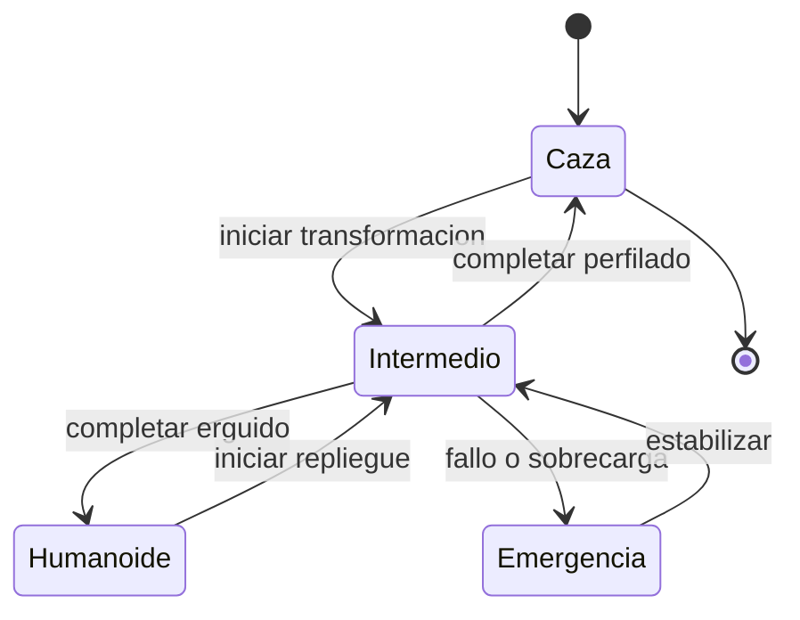

# 🎮 Diseno de simulacion del caza transformable

[🏠 Inicio](../../../README.md) · [🤖 Curso: Caza transformable](../README.md) · 🎮 Simulacion

> ⚖️ Material educativo original; los derechos de las obras pertenecen a sus titulares.

Este modulo traduce todo lo aprendido en un modelo de simulador educativo. El
corazon del diseno es la maquina de estados: los tres modos y las transiciones
entre ellos, con sus costos de tiempo y energia.

---

## Objetivo de la simulacion

Que el usuario entienda, jugando, por que cada modo sirve para algo distinto:
cruzar el cielo en modo caza, maniobrar en el intermedio y operar en el suelo en
modo humanoide. Y sobre todo, que perciba que transformar tiene un costo.

---

## Modo ciencia frente a modo ficcion

El simulador ofrece dos formas de tratar la fisica, seleccionables con una
variable de modo:

- **Modo ciencia**: la transformacion tarda, consume energia y desplaza el centro
  de masa. El humanoide vuela fatal por su arrastre. Es el modo realista.
- **Modo ficcion**: la transformacion es casi instantanea y el humanoide vuela
  sin penalizacion. Es el modo espectacular, fiel al estilo de la ficcion.

Comparar ambos modos es en si mismo la mejor leccion del curso.

---

## Variables principales

| Variable | Tipo | Rango | Afecta a | Comentarios |
| --- | --- | --- | --- | --- |
| Modo actual | discreta | caza, intermedio, humanoide | Aerodinamica y control | Estado central. |
| Modo ciencia/ficcion | discreta | ciencia, ficcion | Realismo del modelo | Cambia las reglas fisicas. |
| Energia | numerica | 0-100% | Motores y transformacion | Transformar la consume. |
| Progreso de cambio | numerica | 0-100% | Fase de transicion | Bloquea acciones a medias. |
| Centro de masa | numerica | -1..1 | Estabilidad | Se desplaza al transformar. |
| Velocidad | numerica | 0-100% | Arrastre y sustentacion | Limita cuando transformar. |
| Carga estructural | numerica | 0-100% | Riesgo de dano | Sube al forzar el mecanismo. |
| Arrastre | numerica | 0-100% | Consumo y velocidad | Muy alto en modo humanoide. |

---

## Ciclo basico

1. Leer entradas del usuario (empuje, ejes de vuelo, cambio de modo).
2. Actualizar el estado de transformacion segun el modo elegido.
3. En modo ciencia, aplicar tiempo, energia y desplazamiento del centro de masa.
4. Calcular fuerzas: empuje, arrastre y sustentacion segun el modo actual.
5. Actualizar velocidad, actitud y posicion.
6. Refrescar instrumentos: modo, energia, centro de masa y cargas.

---

## Modos de juego futuros

- Tutorial de las tres formas y sus transiciones.
- Reto de cruzar una distancia gastando la minima energia.
- Comparativa lado a lado de modo ciencia frente a modo ficcion.
- Maniobras de aproximacion y contacto con el suelo.

---

## Elementos fuera de alcance

- Cualquier contenido que presente la violencia como objetivo del juego.
- Datos que pretendan replicar sistemas de armas reales.
- Escenas sensibles ajenas al proposito educativo.

---

## Pendientes

- [ ] Ajustar el costo energetico de cada transformacion.
- [ ] Modelar el arrastre del modo humanoide con mas detalle.
- [ ] Prototipar la maquina de estados en un motor simple.

---

[⬅️ Anterior: Reglas del universo](../reglamentos/reglas-universo-caza-transformable.md) · [➡️ Siguiente: Recursos](../recursos/recursos-caza-transformable.md)
