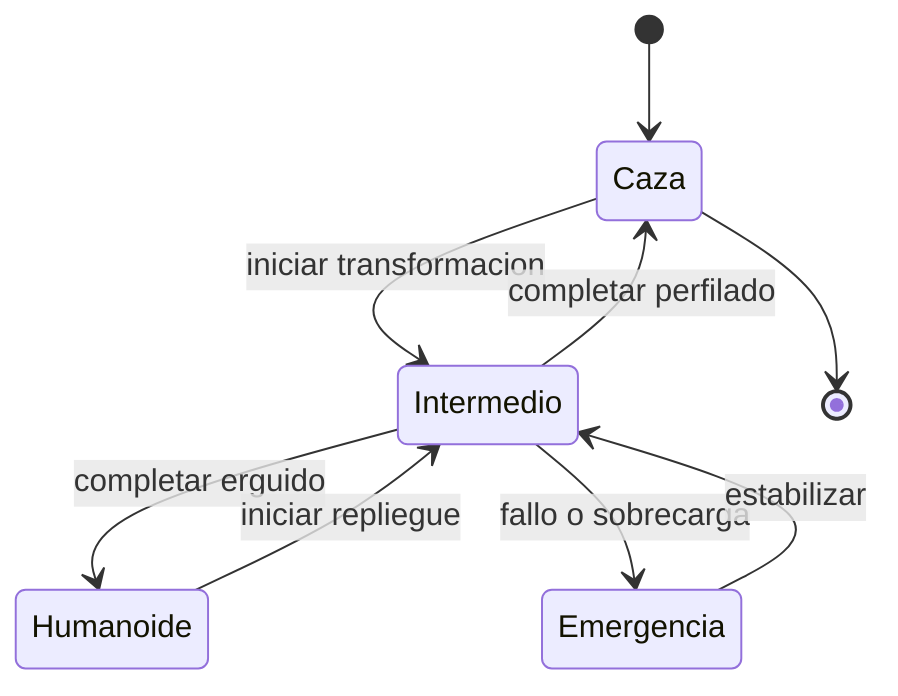

# 🎮 Diseño de simulación del caza transformable

[🏠 Inicio](../../../README.md) · [🤖 Curso: Caza transformable](../README.md) · 🎮 Simulación

> ⚖️ Material educativo original; los derechos de las obras pertenecen a sus titulares.

Este módulo traduce todo lo aprendido en un modelo de simulador educativo. El
corazón del diseño es la máquina de estados: los tres modos y las transiciones
entre ellos, con sus costos de tiempo y energía.

---

## Objetivo de la simulación

Que el usuario entienda, jugando, por  qué cada modo sirve para algo distinto:
cruzar el cielo en modo caza, maniobrar en el intermedio y operar en el suelo en
modo humanoide. Y sobre todo, que perciba que transformar tiene un costo.

---

## Modo ciencia frente a modo ficción

El simulador ofrece dos formas de tratar la física, seleccionables con una
variable de modo:

- **Modo ciencia**: la transformación tarda, consume energía y desplaza el centro
  de masa. El humanoide vuela fatal por su arrastre. Es el modo realista.
- **Modo ficción**: la transformación es casi instantánea y el humanoide vuela
  sin penalización. Es el modo espectacular, fiel al estilo de la ficción.

Comparar ambos modos es en si mismo la mejor lección del curso.

---

## Variables principales

| Variable | Tipo | Rango | Afecta a | Comentarios |
| --- | --- | --- | --- | --- |
| Modo actual | discreta | caza, intermedio, humanoide | Aerodinámica y control | Estado central. |
| Modo ciencia/ficción | discreta | ciencia, ficción | Realismo del modelo | Cambia las reglas físicas. |
| Energía | numérica | 0-100% | Motores y transformación | Transformar la consume. |
| Progreso de cambio | numérica | 0-100% | Fase de transición | Bloquea acciones a medias. |
| Centro de masa | numérica | -1..1 | Estabilidad | Se desplaza al transformar. |
| Velocidad | numérica | 0-100% | Arrastre y sustentación | Limita cuando transformar. |
| Carga estructural | numérica | 0-100% | Riesgo de daño | Sube al forzar el mecanismo. |
| Arrastre | numérica | 0-100% | Consumo y velocidad | Muy alto en modo humanoide. |

---

## Ciclo básico

1. Leer entradas del usuario (empuje, ejes de vuelo, cambio de modo).
2. Actualizar el estado de transformación según el modo elegido.
3. En modo ciencia, aplicar tiempo, energía y desplazamiento del centro de masa.
4. Calcular fuerzas: empuje, arrastre y sustentación según el modo actual.
5. Actualizar velocidad, actitud y posición.
6. Refrescar instrumentos: modo, energía, centro de masa y cargas.

---

## Modos de juego futuros

- Tutorial de las tres formas y sus transiciones.
- Reto de cruzar una distancia gastando la mínima energía.
- Comparativa lado a lado de modo ciencia frente a modo ficción.
- Maniobras de aproximación y contacto con el suelo.

---

## Elementos fuera de alcance

- Cualquier contenido que presente la violencia como objetivo del juego.
- Datos que pretendan replicar sistemas de armas reales.
- Escenas sensibles ajenas al propósito educativo.

---

## Pendientes

- [ ] Ajustar el costo energético de cada transformación.
- [ ] Modelar el arrastre del modo humanoide con más detalle.
- [ ] Prototipar la máquina de estados en un motor simple.

---

[⬅️ Anterior: Reglas del universo](../reglamentos/reglas-universo-caza-transformable.md) · [➡️ Siguiente: Recursos](../recursos/recursos-caza-transformable.md)
