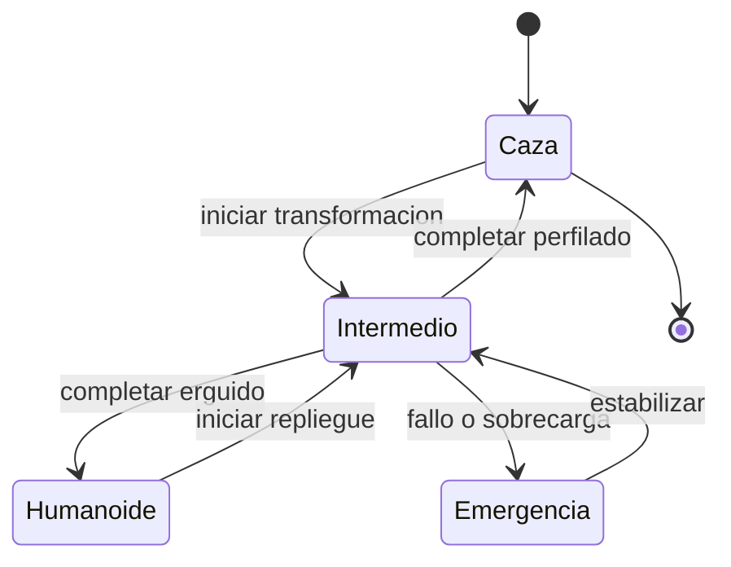
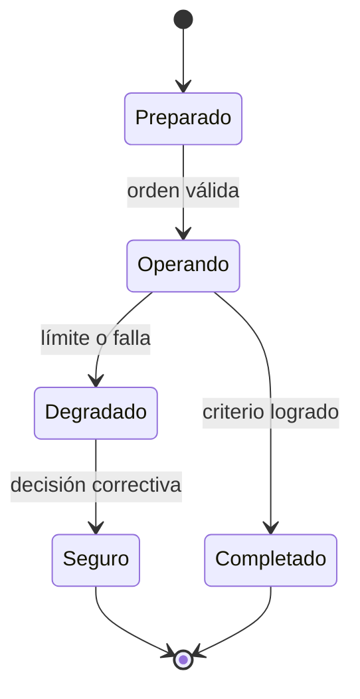

<!-- clase-meta
tipo_documento: clase
clase: 9
codigo: CAZATRANSFOR-09
curso: caza-transformable
titulo: "Diseño de simulación del caza transformable"
modalidad: "laboratorio de diseño"
duracion_minutos: 90
nivel: introductorio
prerrequisito: CAZATRANSFOR-08
competencia: "modelado_de_simulacion"
resultados_aprendizaje:
  - "Explicar objetivo, variables, estados, ciclo y escenarios de simulación con vocabulario propio de Caza transformable."
  - "Aplicar esos conceptos a una decisión segura o a un escenario de simulación de Caza transformable."
evidencia: "Ficha de escenario y diagrama de estados."
criterio_aprobacion: "El modelo es específico de la máquina, medible, seguro y trazable a clases anteriores."
fuentes: manuales/fuentes.md
ultima_revision: 2026-09-10
-->

# 🎮 Diseño de simulación del caza transformable

[🏠 Inicio](../../../README.md) · [🤖 Curso: Caza transformable](../README.md) · 🎮 Simulación

> ⚖️ Material educativo original; los derechos de las obras pertenecen a sus titulares.

Esta clase traduce todo lo aprendido en un modelo de simulador educativo. El
corazón del diseño es la máquina de estados: los tres modos y las transiciones
entre ellos, con sus costos de tiempo y energía.

```mermaid
stateDiagram-v2
    [*] --> Caza
    Caza --> Intermedio: iniciar transformacion
    Intermedio --> Humanoide: completar erguido
    Humanoide --> Intermedio: iniciar repliegue
    Intermedio --> Caza: completar perfilado
    Intermedio --> Emergencia: fallo o sobrecarga
    Emergencia --> Intermedio: estabilizar
    Caza --> [*]
```

---

## Objetivo de la simulación

Que el usuario entienda, jugando, por qué cada modo sirve para algo distinto:
cruzar el cielo en modo caza, maniobrar en el intermedio y operar en el suelo en
modo humanoide. Y sobre todo, que perciba que transformar tiene un costo.

---

## Modo ciencia frente a modo ficción

El simulador ofrece dos formas de tratar la física, seleccionables con una
variable de modo:

- **Modo ciencia**: la transformación tarda, consume energía y desplaza el centro
  de masa. El humanoide vuela fatal por su arrastre. Es el modo realista.
- **Modo ficción**: la transformación es casi instantánea y el humanoide vuela
  sin penalización. Es el modo espectacular, fiel al estilo de la ficción.

Comparar ambos modos es en si mismo la mejor lección del curso.

---

## Variables principales

| Variable | Tipo | Rango | Afecta a | Comentarios |
| --- | --- | --- | --- | --- |
| Modo actual | discreta | caza, intermedio, humanoide | Aerodinámica y control | Estado central. |
| Modo ciencia/ficción | discreta | ciencia, ficción | Realismo del modelo | Cambia las reglas físicas. |
| Energía | numérica | 0-100% | Motores y transformación | Transformar la consume. |
| Progreso de cambio | numérica | 0-100% | Fase de transición | Bloquea acciones a medias. |
| Centro de masa | numérica | -1..1 | Estabilidad | Se desplaza al transformar. |
| Velocidad | numérica | 0-100% | Arrastre y sustentación | Limita cuando transformar. |
| Carga estructural | numérica | 0-100% | Riesgo de daño | Sube al forzar el mecanismo. |
| Arrastre | numérica | 0-100% | Consumo y velocidad | Muy alto en modo humanoide. |

---

## Ciclo básico

1. Leer entradas del usuario (empuje, ejes de vuelo, cambio de modo).
2. Actualizar el estado de transformación según el modo elegido.
3. En modo ciencia, aplicar tiempo, energía y desplazamiento del centro de masa.
4. Calcular fuerzas: empuje, arrastre y sustentación según el modo actual.
5. Actualizar velocidad, actitud y posición.
6. Refrescar instrumentos: modo, energía, centro de masa y cargas.

---

## Modos de juego futuros

- Tutorial de las tres formas y sus transiciones.
- Reto de cruzar una distancia gastando la mínima energía.
- Comparativa lado a lado de modo ciencia frente a modo ficción.
- Maniobras de aproximación y contacto con el suelo.

---

## Elementos fuera de alcance

- Cualquier contenido que presente la violencia como objetivo del juego.
- Datos que pretendan replicar sistemas de armas reales.
- Escenas sensibles ajenas al propósito educativo.

---

## Pendientes

- [ ] Ajustar el costo energético de cada transformación.
- [ ] Modelar el arrastre del modo humanoide con más detalle.
- [ ] Prototipar la máquina de estados en un motor simple.

## 🧭 Guía de estudio aplicada

### Pregunta guía

¿Cómo ayuda **Objetivo de la simulación, Modo ciencia frente a modo ficción, Variables principales y Ciclo básico** a **modelar transición simulada de vuelo a modo robot durante una misión como estados, variables y decisiones observables**?

### Explicación razonada

Una simulación de Caza transformable es educativa si representa decisiones y consecuencias. Como mínimo debe modelar el estado de fuente de energía ficticia, la respuesta de actuadores de transformación, la transición en propulsión y el resultado en configuración de vuelo o robot. El escenario «transición simulada de vuelo a modo robot durante una misión» es valioso porque obliga a observar, formular una hipótesis, actuar y comprobar.

```mermaid
stateDiagram-v2
    [*] --> Preparado
    Preparado --> Operando: orden válida
    Operando --> Degradado: límite o falla
    Degradado --> Seguro: decisión correctiva
    Operando --> Completado: criterio logrado
    Seguro --> [*]
    Completado --> [*]
```

Esta clase se conecta con el resto del curso mediante **cambiar de configuración altera masa aparente, control, resistencia y función narrativa**. El hilo de
seguridad consiste en reconocer a tiempo **ocultar discontinuidades físicas bajo una animación sin reglas de estado** y poder justificar la decisión
**definir condiciones, costos y límites de cada transición antes de simularla**; en clases posteriores cambiará el ángulo de análisis, no esa relación causal.
La lectura funcional común sigue **fuente de energía ficticia → actuadores de transformación → propulsión → configuración de vuelo o robot**, de modo que cada concepto pueda
ubicarse dentro del funcionamiento completo y no quede como un dato aislado.

**Apoyo documental:** [Robotech](https://robotech.com/) aporta referencia oficial del universo ficticio;
[Aviation Handbooks and Manuals](https://www.faa.gov/regulations_policies/handbooks_manuals) se usa para aerodinámica, sistemas y operación. Estas fuentes
se contrastan con el alcance de la clase y no sustituyen un manual de equipo concreto.

### Caso resuelto: de la observación a la decisión

1. **Estado inicial:** representa transición simulada de vuelo a modo robot durante una misión con valores observables para **fuente de energía ficticia**, **actuadores de transformación**, **propulsión** y **configuración de vuelo o robot**.
2. **Decisión del estudiante:** ofrece una elección que cambie el estado, no una animación automática.
3. **Consecuencia:** modela la tendencia hacia **ocultar discontinuidades físicas bajo una animación sin reglas de estado** y una señal previa que permita corregir.
4. **Cierre:** evalúa la explicación de la decisión, además de si el estudiante “ganó” el escenario.

### Comprueba tu comprensión

1. ¿Qué cuatro estados mínimos necesita el escenario «transición simulada de vuelo a modo robot durante una misión»?
2. ¿Qué variable anticipa **ocultar discontinuidades físicas bajo una animación sin reglas de estado** antes de llegar al estado de falla?
3. ¿Cómo evaluarías la explicación del estudiante y no solo el resultado final?

Orientación para revisar tus respuestas

- La primera respuesta debe relacionar el eslabón elegido con un efecto posterior, no solo nombrarlo.
- La segunda debe proponer una señal medible u observable y explicar qué tendencia sería preocupante.
- La tercera debe cambiar al menos una variable de capacidad, mando, entorno o margen de seguridad.

## 🎓 Cierre de clase

- **Actividad:** Diseña un escenario educativo de Caza transformable basado en objetivo, variables, estados, ciclo y escenarios de simulación, con entradas, estados, variables y criterio de cierre.
- **Evidencia:** Ficha de escenario y diagrama de estados.
- **Criterio de aprobación:** El modelo es específico de la máquina, medible, seguro y trazable a clases anteriores.
- **Transferencia:** explica qué cambiaría al pasar a otra variante de esta máquina.

### Fuentes de esta clase

- [ROBOTECH-OFFICIAL](https://robotech.com/): Robotech, Harmony Gold. Uso: referencia oficial del universo ficticio.
- [US-FAA-HANDBOOKS](https://www.faa.gov/regulations_policies/handbooks_manuals): Aviation Handbooks and Manuals, FAA. Uso: aerodinámica, sistemas y operación.
- [NASA-FLIGHT](https://www1.grc.nasa.gov/beginners-guide-to-aeronautics/): Beginner's Guide to Aeronautics, NASA. Uso: contraste con física y vuelo reales.

> Las fuentes sostienen el marco conceptual y normativo; esta clase no reemplaza el manual
> del fabricante, la formación certificada ni la habilitación exigida para operar equipos reales.

---

[⬅️ Anterior: Reglas del universo](../reglamentos/reglas-universo-caza-transformable.md) · [➡️ Siguiente: Recursos](../recursos/recursos-caza-transformable.md)
