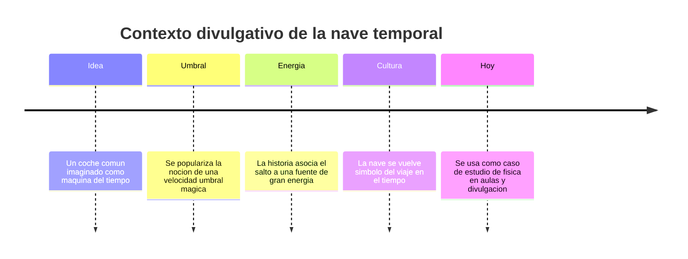

# 📜 Historia de la DeLorean temporal

[🏠 Inicio](../../../README.md) · [🕰️ Curso: DeLorean temporal](../README.md) · 📜 Historia

> ⚖️ Material educativo original; los derechos de las obras pertenecen a sus titulares.

Este modulo situa la nave en su contexto cultural, con nuestras palabras y a
nivel divulgativo. No reproducimos guiones, dialogos ni arte de la obra
original: solo explicamos por que un vehiculo cotidiano convertido en maquina
del tiempo se volvio un simbolo util para hablar de fisica.

---

## 🎬 Contexto de la obra

La nave que estudiamos esta inspirada en la saga "Volver al Futuro", una comedia
de aventuras que popularizo la idea de convertir un automovil comun en una
maquina capaz de moverse por el tiempo. La eleccion de un coche de calle, en vez
de una nave espacial futurista, hizo que el publico sintiera el viaje temporal
como algo cercano y divertido.

Nos interesa esa nave como recurso educativo: es una excusa amable para preguntar
que dice la fisica real sobre la energia, la velocidad y el tiempo.

---

## 🕰️ Linea de tiempo divulgativa

---

## 🧭 Por que funciona como recurso educativo

| Elemento de la ficcion | Pregunta de fisica que despierta |
| --- | --- |
| Alcanzar una velocidad concreta | Que es una velocidad umbral y por que la fisica real no la usa asi. |
| Necesitar mucha energia | Cual es la diferencia entre energia y potencia. |
| Saltar a otra fecha | Se puede realmente retroceder en el tiempo. |
| Evitar cambiar el pasado | Que es la causalidad y por que importa. |
| Un vehiculo cotidiano | Como distinguimos ingenieria real de licencia narrativa. |

---

## 🌍 Impacto cultural

La nave ayudo a que millones de personas conversaran sobre el tiempo, las
paradojas y la posibilidad de cambiar la historia personal. Ese interes es
valioso: convierte un tema abstracto de fisica en algo emocionante. Nuestro
trabajo en los siguientes modulos es aprovechar esa curiosidad y ordenarla con
rigor, separando la parte real de la parte inventada.

---

## 📌 Que veremos despues

- En **Caracteristicas** describimos los modos y rasgos de la nave.
- En **Sistemas mecanicos** comparamos su tecnologia imaginaria con la fisica.
- En **Principios** decidimos que seria posible y que no.

---

[🎓 Portada del curso](../README.md) · [➡️ Siguiente: Caracteristicas](../operacion/caracteristicas-delorean.md)
