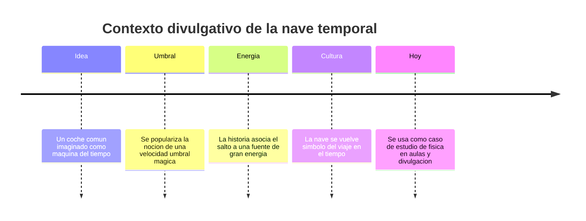

# 📜 Historia de la DeLorean temporal

[🏠 Inicio](../../../README.md) · [🕰️ Curso: DeLorean temporal](../README.md) · 📜 Historia

> ⚖️ Material educativo original; los derechos de las obras pertenecen a sus titulares.

Este módulo situa la nave en su contexto cultural, con nuestras palabras y a
nivel divulgativo. No reproducimos guiones, diálogos ni arte de la obra
original: solo explicamos por  qué un vehículo cotidiano convertido en máquina
del tiempo se volvió un símbolo útil para hablar de física.

---

## 🎬 Contexto de la obra

La nave que estudiamos está inspirada en la saga "Volver al Futuro", una comedia
de aventuras que popularizo la idea de convertir un automóvil común en una
máquina capaz de moverse por el tiempo. La elección de un coche de calle, en vez
de una nave espacial futurista, hizo que el público sintiera el viaje temporal
como algo cercano y divertido.

Nos interesa esa nave como recurso educativo: es una excusa amable para preguntar
que dice la física real sobre la energía, la velocidad y el tiempo.

---

## 🕰️ Línea de tiempo divulgativa

---

## 🧭 Por  qué funciona como recurso educativo

| Elemento de la ficción | Pregunta de física que despierta |
| --- | --- |
| Alcanzar una velocidad concreta | Que es una velocidad umbral y por  qué la física real no la usa así. |
| Necesitar mucha energía | Cual es la diferencia entre energía y potencia. |
| Saltar a otra fecha | Se puede realmente retroceder en el tiempo. |
| Evitar cambiar el pasado | Que es la causalidad y por  qué importa. |
| Un vehículo cotidiano | Como distinguimos ingeniería real de licencia narrativa. |

---

## 🌍 Impacto cultural

La nave ayudo a que millones de personas conversaran sobre el tiempo, las
paradojas y la posibilidad de cambiar la historia personal. Ese interés es
valioso: convierte un tema abstracto de física en algo emocionante. Nuestro
trabajo en los siguientes módulos es aprovechar esa curiosidad y ordenarla con
rigor, separando la parte real de la parte inventada.

---

## 📌 Que veremos después

- En **Características** describimos los modos y rasgos de la nave.
- En **Sistemas mecánicos** comparamos su tecnología imaginaria con la física.
- En **Principios** decidimos que sería posible y que no.

---

[🎓 Portada del curso](../README.md) · [➡️ Siguiente: Características](../operacion/caracteristicas-delorean.md)
