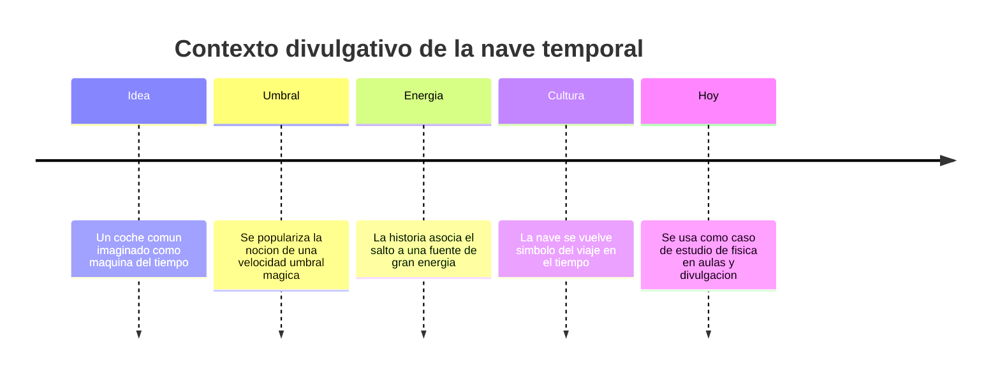

<!-- clase-meta
tipo_documento: clase
clase: 1
codigo: DELOREAN-01
curso: delorean
titulo: "Historia de la DeLorean temporal"
modalidad: "teórica dialogada"
duracion_minutos: 45
nivel: introductorio
prerrequisito: ninguno
competencia: "contexto_historico"
resultados_aprendizaje:
  - "Explicar origen, evolución tecnológica, variantes representativas e impacto con vocabulario propio de DeLorean temporal."
  - "Aplicar esos conceptos a una decisión segura o a un escenario de simulación de DeLorean temporal."
evidencia: "Línea de tiempo comentada con cuatro hitos o más."
criterio_aprobacion: "Los hitos están ordenados, son pertinentes y dos relaciones de causa y efecto quedan justificadas."
fuentes: manuales/fuentes.md
ultima_revision: 2026-09-10
-->

# 📜 Historia de la DeLorean temporal

[🏠 Inicio](../../../README.md) · [🕰️ Curso: DeLorean temporal](../README.md) · 📜 Historia

> ⚖️ Material educativo original; los derechos de las obras pertenecen a sus titulares.

Esta clase situa la nave en su contexto cultural, con nuestras palabras y a
nivel divulgativo. No reproducimos guiones, diálogos ni arte de la obra
original: solo explicamos por qué un vehículo cotidiano convertido en máquina
del tiempo se volvió un símbolo útil para hablar de física.

---

## 🎬 Contexto de la obra

La nave que estudiamos está inspirada en la saga "Volver al Futuro", una comedia
de aventuras que popularizo la idea de convertir un automóvil común en una
máquina capaz de moverse por el tiempo. La elección de un coche de calle, en vez
de una nave espacial futurista, hizo que el público sintiera el viaje temporal
como algo cercano y divertido.

Nos interesa esa nave como recurso educativo: es una excusa amable para preguntar
que dice la física real sobre la energía, la velocidad y el tiempo.

---

## 🕰️ Línea de tiempo divulgativa

```mermaid
timeline
    title Contexto divulgativo de la nave temporal
    Idea : Un coche comun imaginado como maquina del tiempo
    Umbral : Se populariza la nocion de una velocidad umbral magica
    Energia : La historia asocia el salto a una fuente de gran energia
    Cultura : La nave se vuelve simbolo del viaje en el tiempo
    Hoy : Se usa como caso de estudio de fisica en aulas y divulgacion
```

---

## 🧭 Por qué funciona como recurso educativo

| Elemento de la ficción | Pregunta de física que despierta |
| --- | --- |
| Alcanzar una velocidad concreta | Que es una velocidad umbral y por qué la física real no la usa así. |
| Necesitar mucha energía | Cual es la diferencia entre energía y potencia. |
| Saltar a otra fecha | Se puede realmente retroceder en el tiempo. |
| Evitar cambiar el pasado | Que es la causalidad y por qué importa. |
| Un vehículo cotidiano | Como distinguimos ingeniería real de licencia narrativa. |

---

## 🌍 Impacto cultural

La nave ayudo a que millones de personas conversaran sobre el tiempo, las
paradojas y la posibilidad de cambiar la historia personal. Ese interés es
valioso: convierte un tema abstracto de física en algo emocionante. Nuestro
trabajo en los siguientes módulos es aprovechar esa curiosidad y ordenarla con
rigor, separando la parte real de la parte inventada.

---

## 📌 Que veremos después

- En **Características** describimos los modos y rasgos de la nave.
- En **Sistemas mecánicos** comparamos su tecnología imaginaria con la física.
- En **Principios** decidimos que sería posible y que no.

## 🧭 Guía de estudio aplicada

### Pregunta guía

¿Cómo ayuda **Contexto de la obra, Línea de tiempo divulgativa, Por qué funciona como recurso educativo y Impacto cultural** a **explicar cómo la evolución hizo posibles alternativas como DeLorean de serie frente a máquina temporal ficticia**?

### Explicación razonada

La evolución de DeLorean temporal se comprende mejor como una sucesión de respuestas a problemas, no como una lista de fechas. Los cambios en motor y alimentación ficticia, transmisión, ruedas y sistema temporal alteraron qué podía hacer la máquina, quién podía usarla y qué riesgos debían controlarse. El contraste «DeLorean de serie frente a máquina temporal ficticia» permite observar qué decisiones de diseño permanecieron y cuáles cambiaron con la tecnología y el propósito.

Esta clase se conecta con el resto del curso mediante **separación entre mecánica automotriz plausible y regla narrativa de velocidad y energía**. El hilo de
seguridad consiste en reconocer a tiempo **confundir canon con física real y omitir los riesgos ordinarios del automóvil** y poder justificar la decisión
**declarar qué regla pertenece al relato y modelar aparte movimiento, energía y seguridad reales**; en clases posteriores cambiará el ángulo de análisis, no esa relación causal.
La lectura funcional común sigue **motor y alimentación ficticia → transmisión → ruedas → sistema temporal**, de modo que cada concepto pueda
ubicarse dentro del funcionamiento completo y no quede como un dato aislado.

**Apoyo documental:** [Back to the Future](https://www.universalpicturesathome.com/movies/back-to-the-future) aporta obra audiovisual primaria;
[Vehicle Safety](https://www.nhtsa.gov/vehicle-safety) se usa para seguridad de vehículos terrestres. Estas fuentes
se contrastan con el alcance de la clase y no sustituyen un manual de equipo concreto.

### Caso resuelto: de la observación a la decisión

1. **Situar:** ordena los hitos que explican cómo se llegó a **DeLorean de serie frente a máquina temporal ficticia** y describe la necesidad que impulsó cada cambio.
2. **Relacionar:** explica qué se modificó en **motor y alimentación ficticia**, **transmisión**, **ruedas** o **sistema temporal**; una fecha sin mecanismo no basta.
3. **Interpretar:** vincula el cambio con una capacidad nueva y también con el riesgo **confundir canon con física real y omitir los riesgos ordinarios del automóvil**.
4. **Transferir:** usa la evolución para justificar por qué hoy conviene **declarar qué regla pertenece al relato y modelar aparte movimiento, energía y seguridad reales**.

### Comprueba tu comprensión

1. ¿Qué necesidad histórica impulsó un cambio en **motor y alimentación ficticia** o **transmisión**?
2. ¿Qué hito modificó la relación entre capacidad y **confundir canon con física real y omitir los riesgos ordinarios del automóvil**?
3. ¿Por qué **DeLorean de serie frente a máquina temporal ficticia** no puede explicarse como una simple diferencia estética?

Orientación para revisar tus respuestas

- La primera respuesta debe relacionar el eslabón elegido con un efecto posterior, no solo nombrarlo.
- La segunda debe proponer una señal medible u observable y explicar qué tendencia sería preocupante.
- La tercera debe cambiar al menos una variable de capacidad, mando, entorno o margen de seguridad.

## 🎓 Cierre de clase

- **Actividad:** Construye una línea de tiempo de DeLorean temporal y explica cómo dos cambios históricos transformaron su función o su puesto de mando.
- **Evidencia:** Línea de tiempo comentada con cuatro hitos o más.
- **Criterio de aprobación:** Los hitos están ordenados, son pertinentes y dos relaciones de causa y efecto quedan justificadas.
- **Transferencia:** explica qué cambiaría al pasar a otra variante de esta máquina.

### Fuentes de esta clase

- [UNIVERSAL-BTTF](https://www.universalpicturesathome.com/movies/back-to-the-future): Back to the Future, Universal Pictures At Home. Uso: obra audiovisual primaria.
- [US-NHTSA](https://www.nhtsa.gov/vehicle-safety): Vehicle Safety, NHTSA. Uso: seguridad de vehículos terrestres.
- [NASA-FLIGHT](https://www1.grc.nasa.gov/beginners-guide-to-aeronautics/): Beginner's Guide to Aeronautics, NASA. Uso: contraste con física y vuelo reales.

> Las fuentes sostienen el marco conceptual y normativo; esta clase no reemplaza el manual
> del fabricante, la formación certificada ni la habilitación exigida para operar equipos reales.

---

[🎓 Portada del curso](../README.md) · [➡️ Siguiente: Características](../operacion/caracteristicas-delorean.md)
