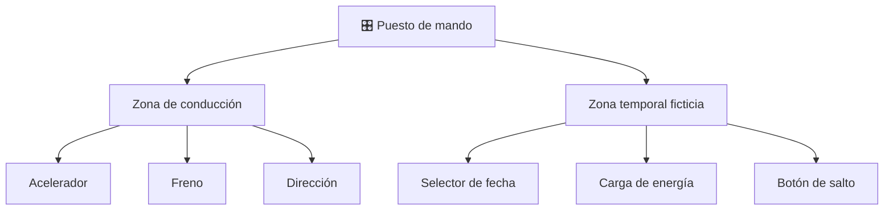

# 🎛️ Mandos e instrumentos de la DeLorean temporal

[🏠 Inicio](../../../README.md) · [🕰️ Curso: DeLorean temporal](../README.md) · 🎛️ Mandos

> ⚖️ Material educativo original; los derechos de las obras pertenecen a sus titulares.

Este módulo describe un puesto de mando conceptual y original para la nave. No
reproduce ningún tablero ni arte de la obra: propone controles útiles para
enseñar los conceptos de física del curso y para alimentar un simulador.

---

## 🧭 Vista general del puesto de mando

El puesto conceptual se divide en dos zonas. La **zona de conducción** es la de
cualquier coche: acelerador, freno y dirección. La **zona temporal** es
ficticia y sirve para ilustrar los conceptos: un selector de fecha, un medidor
de energía y un indicador de velocidad umbral.

---

## 🎚️ Mapa de controles

---

## 🕹️ Controles y su función

| Zona | Control | Función | Base |
| --- | --- | --- | --- |
| Conducción | Acelerador | Aumentar la velocidad del vehículo | Real |
| Conducción | Freno | Reducir la velocidad | Real |
| Conducción | Dirección | Cambiar el rumbo | Real |
| Temporal | Selector de fecha | Elegir la fecha objetivo del salto | Ficticio |
| Temporal | Carga de energía | Acumular la energía narrativa del salto | Ficticio |
| Temporal | Botón de salto | Ejecutar el salto al llegar al umbral | Ficticio |
| Temporal | Interruptor ciencia/ficción | Alternar entre reglas reales y de guion | Educativo |

---

## 📟 Instrumentos principales

| Instrumento | Muestra | Unidad | Base |
| --- | --- | --- | --- |
| Velocímetro | Velocidad actual | km/h | Real |
| Medidor de energía | Energía acumulada para el salto | fracción | Ficticio |
| Indicador de umbral | Cercanía a la velocidad umbral | porcentaje | Ficticio |
| Pantalla de fecha | Fecha objetivo elegida | fecha | Ficticio |
| Aviso de causalidad | Riesgo de paradoja en el destino | nivel | Educativo |

---

## 🎮 Entradas de simulación

| Acción | Teclado | Controlador | Comentarios |
| --- | --- | --- | --- |
| Acelerar | Flecha arriba | Gatillo derecho | Progresivo, sube la velocidad. |
| Frenar | Flecha abajo | Gatillo izquierdo | Reduce la velocidad. |
| Girar | Flechas izq/der | Stick izquierdo | Cambia el rumbo. |
| Cargar energía | Tecla C | Botón superior | Solo activo en modo ficción. |
| Elegir fecha | Teclas más/menos | Cruceta | Ajusta la fecha objetivo. |
| Ejecutar salto | Barra espaciadora | Botón central | Requiere umbral y energía llena. |
| Cambiar modo | Tecla M | Botón lateral | Alterna ciencia y ficción. |

---

## 🧠 Observaciones de diseño

- El velocímetro y el indicador de umbral deben verse siempre juntos, para que
  el usuario relacione velocidad con la condición del salto.
- El interruptor ciencia/ficción es la pieza educativa central: en modo ciencia
  el botón de salto queda deshabilitado y se explica por qué.
- El aviso de causalidad no castiga; informa y abre la discusión sobre
  paradojas, que se detalla en el Módulo 7.

---

[⬅️ Anterior: Sistemas mecánicos](../operacion/sistemas-mecanicos-delorean.md) · [➡️ Siguiente: Principios y operación](../operacion/principios-delorean.md)
