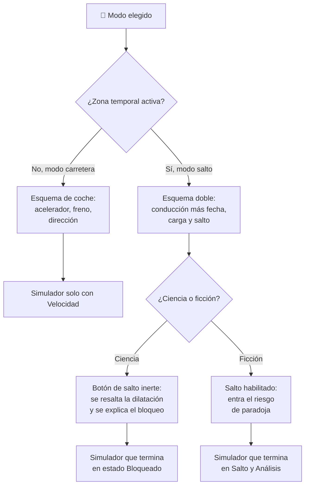

# 🧩 Modelos y variantes del DeLorean temporal

[🏠 Inicio](../../../README.md) · [🕰️ Curso: DeLorean temporal](../README.md) · 🧩 Modelos

> ⚖️ Material educativo original; los derechos de las obras pertenecen a sus titulares.

El [Módulo 2](../operacion/caracteristicas-delorean.md) ya dijo que esta nave es
un objeto doble: un automóvil que obedece la física y una máquina imaginaria que
la rompe para contar una historia. Este módulo responde a lo siguiente: **esa
dualidad no es un matiz de ambientación**. Cambia qué mandos tienen función y,
por tanto, qué debe modelar el simulador.

> 🎯 **La idea que sostiene el módulo.** Aquí no hay una familia de vehículos:
> hay **una sola nave con varios modos**, y cada modo es un esquema de mando
> distinto sobre el mismo chasis. Un simulador que presente un único esquema de
> control está representando un modo concreto aunque diga representar la nave
> entera. Todo lo que sigue es ficción descrita con palabras propias: los
> derechos de las obras pertenecen a sus titulares.

---

## 🧭 Por qué el modo decide el simulador

El [Módulo 5](../mandos/manual-mandos-delorean.md) describe un puesto de mando
partido en dos zonas: una **zona de conducción** con acelerador, freno y
dirección, y una **zona temporal** ficticia con selector de fecha, carga de
energía y botón de salto. El [Módulo 9](../simulacion/diseno-simulador-delorean.md)
expone variables de ambas: `Velocidad` junto a `Energía acumulada`,
`Fecha objetivo` y `Riesgo de paradoja`.

Ninguna partida usa las dos zonas a la vez con la misma autoridad. En **modo
carretera** solo actúa la parte real, tal como dice el
[Módulo 4](../operacion/sistemas-mecanicos-delorean.md): motor, frenos y ruedas.
La zona temporal está ahí, visible, sin función. En **modo salto** se activa la
parte ficticia, que no corresponde a ninguna tecnología conocida.

Y por encima de ese eje hay un segundo interruptor, que es el corazón educativo
del curso: el **modo ciencia/ficción**. No cambia el vehículo; cambia qué reglas
se aplican al mismo vehículo. En modo ciencia el botón de salto queda
deshabilitado y se explica por qué. Ese es el punto delicado del diseño: el
control **sigue existiendo** y **deja de hacer algo**, que no es lo mismo que
desaparecer.

---

## 🗂️ Qué cambia en el manejo

| Modo o variante | Qué cambia al conducirlo |
| --- | --- |
| Modo carretera normal | La referencia del curso: un automóvil corriente. Acelerar, frenar y girar bajo física real y comprobable. |
| Modo salto temporal ficticio | Conducir deja de ser el fin y pasa a ser preparación: hace falta vía larga y despejada para alcanzar la velocidad umbral narrativa. |
| Modo ciencia | Se conduce igual, pero llegar al umbral no produce nada temporal: solo más energía cinética y efectos relativistas. |
| Modo ficción | Al llegar al umbral con energía suficiente se habilita el salto, y con él aparece el análisis del destino. |
| Nivel 1 (educativo) | Basta distinguir un modo del otro y observar energía y velocidad. |
| Nivel 2 (simplificado) | Se añade la dilatación temporal como efecto real: aparece el futuro relativo. |
| Nivel 3 (técnico) | Se separa potencia de energía y se comentan las curvas temporales cerradas como idea teórica. |

Sobre la **fuente de energía**, el curso es deliberadamente sobrio: el
[Módulo 7](../operacion/entornos-delorean.md) reconoce una fuente potente con
carga disponible y ritmo de entrega, pero **no documenta variantes de fuente**.
No las inventamos aquí. La escala enorme y no justificada es, precisamente, el
rasgo educativo.

---

## 🎛️ Qué cambia en el mando

| Modo o variante | Qué mando aparece o desaparece | Consecuencia |
| --- | --- | --- |
| Modo carretera normal | Solo la zona de conducción tiene función. La zona temporal completa (fecha, carga, salto) **queda inerte**. | Tres controles del puesto no responden: están presentes y no operan. |
| Modo salto temporal ficticio | **Entran en juego** el selector de fecha, la carga de energía y el botón de salto. | El acelerador cambia de sentido: deja de servir para desplazarse y pasa a servir para cumplir una condición. |
| Modo ciencia | Ningún control desaparece, pero el **botón de salto queda deshabilitado** y la carga de energía pierde su motivo. | Es el caso fuerte: un mando visible que no actúa, y esa negativa es el contenido que se enseña. |
| Modo ficción | Ninguno desaparece: el mapa del Módulo 5 aplica entero. | Se suma el aviso de causalidad, que informa y no castiga. |
| Interruptor ciencia/ficción | **Existe siempre**, en todos los modos. No es real ni ficticio: es educativo. | Es el único mando que no pertenece al vehículo, sino al curso. |

---

## 🎮 Qué cambia en el simulador

Contrastado con las variables del
[Módulo 9](../simulacion/diseno-simulador-delorean.md):

| Modo o variante | Variables que cambian | Esquema de control |
| --- | --- | --- |
| Modo carretera normal | Solo vive `Velocidad`. `Energía acumulada`, `Fecha objetivo` y `Riesgo de paradoja` quedan sin uso. | Acelerador, freno y dirección; nada más responde. |
| Modo salto temporal ficticio | `Umbral alcanzado` pasa a gobernar la transición de estado; `Energía acumulada` y `Fecha objetivo` se vuelven decisivas. | El del Módulo 5 completo, con la zona temporal activa. |
| Modo ciencia | `Factor de dilatación` **se resalta** como efecto real. `Energía acumulada` y `Fecha objetivo` **se congelan**: no habilitan nada. | Sin salida de salto: al llegar al umbral el estado va a `Bloqueado`. |
| Modo ficción | `Riesgo de paradoja` **entra en el cálculo** y alimenta el aviso de causalidad. `Factor de dilatación` se ignora o simplifica. | Con salida de salto: del umbral se pasa a `Salto` y luego a `Análisis`. |
| `Modo ciencia/ficción` | No cambia con nada: **es la variable que cambia a las demás**. | Es la entrada que reconfigura el resto del esquema. |
| Nivel 1 (educativo) | `Factor de dilatación` puede omitirse. | Esquema mínimo. |
| Nivel 3 (técnico) | `Factor de dilatación` y la distinción potencia/energía ganan peso en el cálculo. | El mismo, con más variables vivas. |

---

## 🗺️ Del modo al esquema de control

---

## ⚠️ Qué modos no comparten simulador

Dos separaciones no se resuelven ajustando parámetros, porque el esquema de
control es otro:

- **El modo carretera frente al modo salto**: no es que la zona temporal sea
  más difícil de usar, es que **no responde**. Tres controles del puesto de
  mando dejan de tener función y tres variables del Módulo 9 dejan de tener
  valores que tomar. Es un modo de control distinto, no una dificultad
  distinta.
- **El modo ciencia frente al modo ficción**: aquí no falta ningún control, y
  esa es justo la trampa de diseño. El botón de salto sigue en el tablero y no
  hace nada, a propósito. Si el simulador se construye sobre el modo ficción y
  luego se le "añade" el modo ciencia como una opción que apaga cosas, el
  resultado enseña una prohibición arbitraria en vez de una explicación física.
  El bloqueo debe ser un estado propio, con su mensaje, no la ausencia de una
  rama.

El resto de variantes sí caben en un mismo simulador ajustando qué variables
están vivas, tal como plantean los
[niveles de realismo](../../../docs/03-niveles-de-realismo.md): en el nivel 1 la
nave se comporta casi igual en todos los casos, y las diferencias emergen a
medida que el nivel sube. Las reglas internas que gobiernan el modo ficción se
detallan en las
[reglas del universo](../reglamentos/reglas-universo-delorean.md), con su aviso
de que no son ley real.

---

[⬅️ Anterior: Características](../operacion/caracteristicas-delorean.md) · [➡️ Siguiente: Sistemas mecánicos](../operacion/sistemas-mecanicos-delorean.md)
