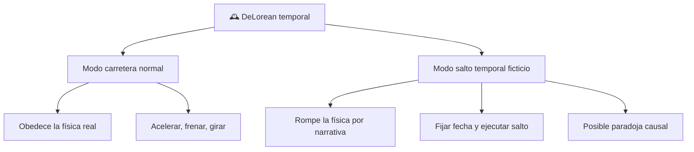

# 📋 Características de la DeLorean temporal

[🏠 Inicio](../../../README.md) · [🕰️ Curso: DeLorean temporal](../README.md) · 📋 Características

> ⚖️ Material educativo original; los derechos de las obras pertenecen a sus titulares.

Que es esta nave, que modos tiene y que rasgos la definen. Este módulo da el
contexto antes de abrir su tecnología imaginaria en el Módulo 4. Todo lo que
sigue es descripción original con fines educativos.

---

## 🧭 Definición

La DeLorean temporal es, en la ficción, un automóvil de calle modificado para
que, al cumplir cierta condición narrativa, realice un "salto" a otra fecha.
Para nuestro curso es un objeto doble: por un lado un vehículo normal que obedece
la física; por otro, una máquina imaginaria que rompe reglas físicas para contar
una historia.

---

## 🧬 Rasgos clave

| Rasgo | Descripción educativa |
| --- | --- |
| Doble naturaleza | Coche real en un modo, máquina de ficción en el otro. |
| Velocidad umbral narrativa | La historia fija una velocidad como disparador del salto. |
| Gran demanda de energía | El salto se asocia a una fuente de energía potente. |
| Destino temporal ajustable | El usuario elige una fecha objetivo en la ficción. |
| Riesgo de paradoja | Cambiar el pasado genera conflictos de causalidad. |
| Aspecto cotidiano | Su forma familiar acerca el tema al público. |

---

## 🗂️ Modos de la nave

---

## 🔍 Comparación de los dos modos

| Aspecto | Modo carretera normal | Modo salto temporal ficticio |
| --- | --- | --- |
| Base física | Real y comprobable | Inventada para la historia |
| Que hace | Se desplaza en el espacio | "Se desplaza" en el tiempo |
| Energía | La de un coche común | Escala enorme y no justificada |
| Riesgos | Choques, frenado | Paradojas de causalidad |
| En simulación | Modelo físico estandar | Reglas de guion configurables |

---

## 🎯 Para qué lo usamos

- Como puente entre una historia conocida y conceptos de física.
- Para practicar la distinción entre lo real y lo narrativo.
- Como base de un simulador con un modo ciencia y un modo ficción.
- Para introducir energía, relatividad y causalidad de forma amena.

---

[⬅️ Anterior: Historia](../historia/historia-delorean.md) · [➡️ Siguiente: Modelos y variantes](../modelos/modelos-delorean.md)
