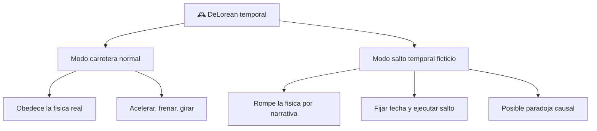

# 📋 Caracteristicas de la DeLorean temporal

[🏠 Inicio](../../../README.md) · [🕰️ Curso: DeLorean temporal](../README.md) · 📋 Caracteristicas

> ⚖️ Material educativo original; los derechos de las obras pertenecen a sus titulares.

Que es esta nave, que modos tiene y que rasgos la definen. Este modulo da el
contexto antes de abrir su tecnologia imaginaria en el Modulo 3. Todo lo que
sigue es descripcion original con fines educativos.

---

## 🧭 Definicion

La DeLorean temporal es, en la ficcion, un automovil de calle modificado para
que, al cumplir cierta condicion narrativa, realice un "salto" a otra fecha.
Para nuestro curso es un objeto doble: por un lado un vehiculo normal que obedece
la fisica; por otro, una maquina imaginaria que rompe reglas fisicas para contar
una historia.

---

## 🧬 Rasgos clave

| Rasgo | Descripcion educativa |
| --- | --- |
| Doble naturaleza | Coche real en un modo, maquina de ficcion en el otro. |
| Velocidad umbral narrativa | La historia fija una velocidad como disparador del salto. |
| Gran demanda de energia | El salto se asocia a una fuente de energia potente. |
| Destino temporal ajustable | El usuario elige una fecha objetivo en la ficcion. |
| Riesgo de paradoja | Cambiar el pasado genera conflictos de causalidad. |
| Aspecto cotidiano | Su forma familiar acerca el tema al publico. |

---

## 🗂️ Modos de la nave

---

## 🔍 Comparacion de los dos modos

| Aspecto | Modo carretera normal | Modo salto temporal ficticio |
| --- | --- | --- |
| Base fisica | Real y comprobable | Inventada para la historia |
| Que hace | Se desplaza en el espacio | "Se desplaza" en el tiempo |
| Energia | La de un coche comun | Escala enorme y no justificada |
| Riesgos | Choques, frenado | Paradojas de causalidad |
| En simulacion | Modelo fisico estandar | Reglas de guion configurables |

---

## 🎯 Para que lo usamos

- Como puente entre una historia conocida y conceptos de fisica.
- Para practicar la distincion entre lo real y lo narrativo.
- Como base de un simulador con un modo ciencia y un modo ficcion.
- Para introducir energia, relatividad y causalidad de forma amena.

---

[⬅️ Anterior: Historia](../historia/historia-delorean.md) · [➡️ Siguiente: Sistemas mecanicos](sistemas-mecanicos-delorean.md)
