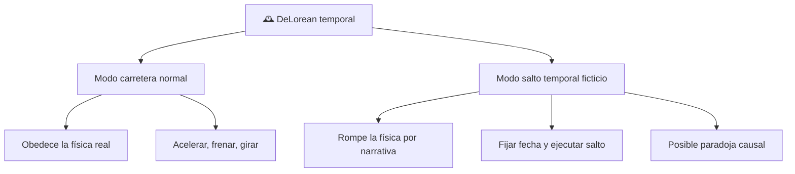

<!-- clase-meta
tipo_documento: clase
clase: 2
codigo: DELOREAN-02
curso: delorean
titulo: "Características de la DeLorean temporal"
modalidad: "teórica aplicada"
duracion_minutos: 45
nivel: introductorio
prerrequisito: DELOREAN-01
competencia: "identificacion_funcional"
resultados_aprendizaje:
  - "Explicar definición, rasgos funcionales, tipos y usos con vocabulario propio de DeLorean temporal."
  - "Aplicar esos conceptos a una decisión segura o a un escenario de simulación de DeLorean temporal."
evidencia: "Matriz comparativa y decisión justificada."
criterio_aprobacion: "La elección considera función, límites, mando y efecto en la simulación; no se apoya solo en preferencias."
fuentes: manuales/fuentes.md
ultima_revision: 2026-09-10
-->

# 📋 Características de la DeLorean temporal

[🏠 Inicio](../../../README.md) · [🕰️ Curso: DeLorean temporal](../README.md) · 📋 Características

> ⚖️ Material educativo original; los derechos de las obras pertenecen a sus titulares.

Que es esta nave, que modos tiene y que rasgos la definen. Esta clase da el
contexto antes de abrir su tecnología imaginaria en el Clase 4. Todo lo que
sigue es descripción original con fines educativos.

---

## 🧭 Definición

La DeLorean temporal es, en la ficción, un automóvil de calle modificado para
que, al cumplir cierta condición narrativa, realice un "salto" a otra fecha.
Para nuestro curso es un objeto doble: por un lado un vehículo normal que obedece
la física; por otro, una máquina imaginaria que rompe reglas físicas para contar
una historia.

---

## 🧬 Rasgos clave

| Rasgo | Descripción educativa |
| --- | --- |
| Doble naturaleza | Coche real en un modo, máquina de ficción en el otro. |
| Velocidad umbral narrativa | La historia fija una velocidad como disparador del salto. |
| Gran demanda de energía | El salto se asocia a una fuente de energía potente. |
| Destino temporal ajustable | El usuario elige una fecha objetivo en la ficción. |
| Riesgo de paradoja | Cambiar el pasado genera conflictos de causalidad. |
| Aspecto cotidiano | Su forma familiar acerca el tema al público. |

---

## 🗂️ Modos de la nave

```mermaid
flowchart TD
    Nave[🕰️ DeLorean temporal] --> Carretera[Modo carretera normal]
    Nave --> Salto[Modo salto temporal ficticio]
    Carretera --> Reglas1[Obedece la física real]
    Carretera --> Uso1[Acelerar, frenar, girar]
    Salto --> Reglas2[Rompe la física por narrativa]
    Salto --> Uso2[Fijar fecha y ejecutar salto]
    Salto --> Riesgo[Posible paradoja causal]
```

---

## 🔍 Comparación de los dos modos

| Aspecto | Modo carretera normal | Modo salto temporal ficticio |
| --- | --- | --- |
| Base física | Real y comprobable | Inventada para la historia |
| Que hace | Se desplaza en el espacio | "Se desplaza" en el tiempo |
| Energía | La de un coche común | Escala enorme y no justificada |
| Riesgos | Choques, frenado | Paradojas de causalidad |
| En simulación | Modelo físico estandar | Reglas de guion configurables |

---

## 🎯 Para qué lo usamos

- Como puente entre una historia conocida y conceptos de física.
- Para practicar la distinción entre lo real y lo narrativo.
- Como base de un simulador con un modo ciencia y un modo ficción.
- Para introducir energía, relatividad y causalidad de forma amena.

## 🧭 Guía de estudio aplicada

### Pregunta guía

¿Cómo ayuda **Definición, Rasgos clave, Modos de la nave y Comparación de los dos modos** a **elegir una configuración adecuada para intento de alcanzar la condición temporal en una vía con espacio limitado**?

### Explicación razonada

Una característica solo es útil cuando permite anticipar comportamiento. En DeLorean temporal, la relación entre motor y alimentación ficticia, transmisión, ruedas y sistema temporal determina capacidad, respuesta y límites. Por eso «DeLorean de serie frente a máquina temporal ficticia» no se compara por apariencia: se compara por misión, entorno, carga de trabajo y exposición al riesgo «confundir canon con física real y omitir los riesgos ordinarios del automóvil».

Esta clase se conecta con el resto del curso mediante **separación entre mecánica automotriz plausible y regla narrativa de velocidad y energía**. El hilo de
seguridad consiste en reconocer a tiempo **confundir canon con física real y omitir los riesgos ordinarios del automóvil** y poder justificar la decisión
**declarar qué regla pertenece al relato y modelar aparte movimiento, energía y seguridad reales**; en clases posteriores cambiará el ángulo de análisis, no esa relación causal.
La lectura funcional común sigue **motor y alimentación ficticia → transmisión → ruedas → sistema temporal**, de modo que cada concepto pueda
ubicarse dentro del funcionamiento completo y no quede como un dato aislado.

**Apoyo documental:** [Back to the Future](https://www.universalpicturesathome.com/movies/back-to-the-future) aporta obra audiovisual primaria;
[Vehicle Safety](https://www.nhtsa.gov/vehicle-safety) se usa para seguridad de vehículos terrestres. Estas fuentes
se contrastan con el alcance de la clase y no sustituyen un manual de equipo concreto.

### Caso resuelto: de la observación a la decisión

1. **Definir la necesidad:** convierte «intento de alcanzar la condición temporal en una vía con espacio limitado» en requisitos de capacidad, entorno y respuesta.
2. **Comparar:** contrasta **DeLorean de serie frente a máquina temporal ficticia** usando esos requisitos y la cadena **motor y alimentación ficticia → transmisión → ruedas → sistema temporal**.
3. **Descartar:** elimina la alternativa que deja menos margen frente a **confundir canon con física real y omitir los riesgos ordinarios del automóvil**.
4. **Elegir:** declara la variante escogida, la evidencia usada y una limitación que todavía debe respetarse.

### Comprueba tu comprensión

1. ¿Qué característica de **sistema temporal** condiciona primero el caso «intento de alcanzar la condición temporal en una vía con espacio limitado»?
2. ¿Qué requisito descartaría una de las alternativas **DeLorean de serie frente a máquina temporal ficticia**?
3. ¿Qué límite debe declararse junto con la variante elegida?

Orientación para revisar tus respuestas

- La primera respuesta debe relacionar el eslabón elegido con un efecto posterior, no solo nombrarlo.
- La segunda debe proponer una señal medible u observable y explicar qué tendencia sería preocupante.
- La tercera debe cambiar al menos una variable de capacidad, mando, entorno o margen de seguridad.

## 🎓 Cierre de clase

- **Actividad:** Compara variantes de DeLorean temporal mediante los ejes «definición, rasgos funcionales, tipos y usos» y elige una para un caso de uso razonado.
- **Evidencia:** Matriz comparativa y decisión justificada.
- **Criterio de aprobación:** La elección considera función, límites, mando y efecto en la simulación; no se apoya solo en preferencias.
- **Transferencia:** explica qué cambiaría al pasar a otra variante de esta máquina.

### Fuentes de esta clase

- [UNIVERSAL-BTTF](https://www.universalpicturesathome.com/movies/back-to-the-future): Back to the Future, Universal Pictures At Home. Uso: obra audiovisual primaria.
- [US-NHTSA](https://www.nhtsa.gov/vehicle-safety): Vehicle Safety, NHTSA. Uso: seguridad de vehículos terrestres.
- [NASA-FLIGHT](https://www1.grc.nasa.gov/beginners-guide-to-aeronautics/): Beginner's Guide to Aeronautics, NASA. Uso: contraste con física y vuelo reales.

> Las fuentes sostienen el marco conceptual y normativo; esta clase no reemplaza el manual
> del fabricante, la formación certificada ni la habilitación exigida para operar equipos reales.

---

[⬅️ Anterior: Historia](../historia/historia-delorean.md) · [➡️ Siguiente: Modelos y variantes](../modelos/modelos-delorean.md)
