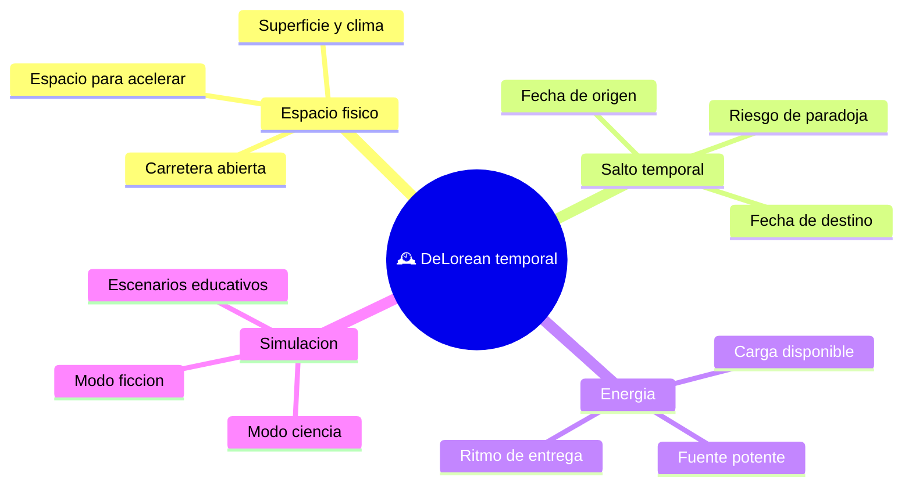

# 🌍 Entornos de la DeLorean temporal

[🏠 Inicio](../../../README.md) · [🕰️ Curso: DeLorean temporal](../README.md) · 🌍 Entornos

> ⚖️ Material educativo original; los derechos de las obras pertenecen a sus titulares.

Dónde opera esta nave y que factores cambian su comportamiento. Como es un
vehículo doble, sus entornos también son dobles: los del mundo físico cuando
rueda y los "entornos temporales" imaginarios cuando salta. Todo es descripción
original con fines educativos.

---

## 🗺️ Entornos y factores

---

## 🌦️ Factores del entorno físico

- **Espacio disponible**: para alcanzar la velocidad umbral narrativa se
  necesita una vía larga y despejada, lo que ya plantea límites prácticos.
- **Superficie y clima**: como cualquier coche, la adherencia y la visibilidad
  afectan la conducción real previa al salto.
- **Seguridad**: acelerar mucho en el mundo real implica riesgos ordinarios de
  tránsito, que la simulación trata con responsabilidad.

---

## 🕰️ Factores del "entorno temporal" ficticio

| Factor | Descripción | Nota educativa |
| --- | --- | --- |
| Fecha de origen | Momento desde el que parte el salto | Punto de referencia narrativo. |
| Fecha de destino | Momento al que apunta el salto | En la realidad no es alcanzable hacia el pasado. |
| Distancia temporal | Diferencia entre origen y destino | La ficción la trata como ajustable a voluntad. |
| Riesgo de paradoja | Posibilidad de alterar causas | Central en el Módulo 7. |

---

## 🧭 Cómo cambia la operación según el entorno

| Entorno | Que domina | Ajuste principal |
| --- | --- | --- |
| Carretera real | Física de movimiento | Velocidad, frenado y seguridad. |
| Preparación del salto | Energía y umbral | Carga y cercanía a la velocidad. |
| Destino temporal | Causalidad | Análisis de posibles paradojas. |
| Modo ciencia | Reglas reales | El salto queda deshabilitado. |
| Modo ficción | Reglas de guion | El salto se permite y se estudia. |

---

## 🎮 Traducción a simulación

Cada entorno es un escenario configurable con su superficie, clima, energía
disponible y modo activo. El diseño completo se detalla en el
[Módulo 8: Diseño de simulación](../simulacion/diseno-simulador-delorean.md).

---

[⬅️ Anterior: Principios y operación](principios-delorean.md) · [➡️ Siguiente: Reglas del universo](../reglamentos/reglas-universo-delorean.md)
