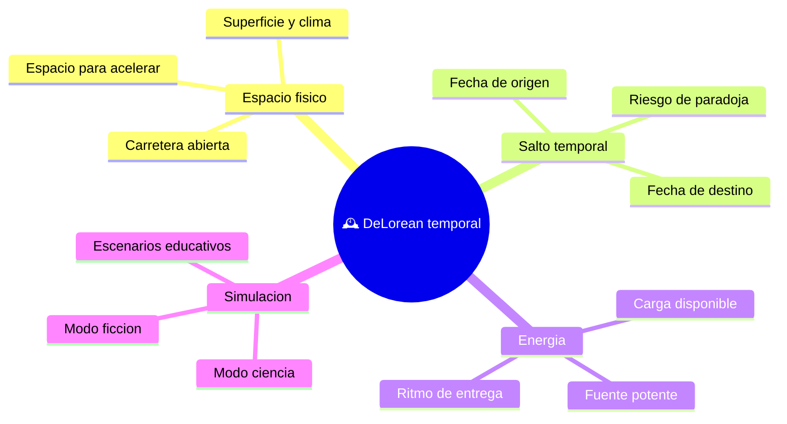

<!-- clase-meta
tipo_documento: clase
clase: 7
codigo: DELOREAN-07
curso: delorean
titulo: "Entornos de la DeLorean temporal"
modalidad: "análisis de escenarios"
duracion_minutos: 60
nivel: introductorio
prerrequisito: DELOREAN-06
competencia: "adaptacion_al_entorno"
resultados_aprendizaje:
  - "Explicar entornos, factores ambientales, riesgos y respuesta de simulación con vocabulario propio de DeLorean temporal."
  - "Aplicar esos conceptos a una decisión segura o a un escenario de simulación de DeLorean temporal."
evidencia: "Matriz entorno–cambio–riesgo–respuesta."
criterio_aprobacion: "Cada respuesta se adapta al entorno y distingue riesgos que no son intercambiables entre escenarios."
fuentes: manuales/fuentes.md
ultima_revision: 2026-09-10
-->

# 🌍 Entornos de la DeLorean temporal

[🏠 Inicio](../../../README.md) · [🕰️ Curso: DeLorean temporal](../README.md) · 🌍 Entornos

> ⚖️ Material educativo original; los derechos de las obras pertenecen a sus titulares.

Dónde opera esta nave y que factores cambian su comportamiento. Como es un
vehículo doble, sus entornos también son dobles: los del mundo físico cuando
rueda y los "entornos temporales" imaginarios cuando salta. Todo es descripción
original con fines educativos.

---

## 🗺️ Entornos y factores

```mermaid
mindmap
  root((🕰️ DeLorean temporal))
    Espacio fisico
      Carretera abierta
      Espacio para acelerar
      Superficie y clima
    Salto temporal
      Fecha de origen
      Fecha de destino
      Riesgo de paradoja
    Energia
      Fuente potente
      Carga disponible
      Ritmo de entrega
    Simulacion
      Modo ciencia
      Modo ficcion
      Escenarios educativos
```

---

## 🌦️ Factores del entorno físico

- **Espacio disponible**: para alcanzar la velocidad umbral narrativa se
  necesita una vía larga y despejada, lo que ya plantea límites prácticos.
- **Superficie y clima**: como cualquier coche, la adherencia y la visibilidad
  afectan la conducción real previa al salto.
- **Seguridad**: acelerar mucho en el mundo real implica riesgos ordinarios de
  tránsito, que la simulación trata con responsabilidad.

---

## 🕰️ Factores del "entorno temporal" ficticio

| Factor | Descripción | Nota educativa |
| --- | --- | --- |
| Fecha de origen | Momento desde el que parte el salto | Punto de referencia narrativo. |
| Fecha de destino | Momento al que apunta el salto | En la realidad no es alcanzable hacia el pasado. |
| Distancia temporal | Diferencia entre origen y destino | La ficción la trata como ajustable a voluntad. |
| Riesgo de paradoja | Posibilidad de alterar causas | Central en el Clase 8. |

---

## 🧭 Cómo cambia la operación según el entorno

| Entorno | Que domina | Ajuste principal |
| --- | --- | --- |
| Carretera real | Física de movimiento | Velocidad, frenado y seguridad. |
| Preparación del salto | Energía y umbral | Carga y cercanía a la velocidad. |
| Destino temporal | Causalidad | Análisis de posibles paradojas. |
| Modo ciencia | Reglas reales | El salto queda deshabilitado. |
| Modo ficción | Reglas de guion | El salto se permite y se estudia. |

---

## 🎮 Traducción a simulación

Cada entorno es un escenario configurable con su superficie, clima, energía
disponible y modo activo. El diseño completo se detalla en el
[Clase 9: Diseño de simulación](../simulacion/diseno-simulador-delorean.md).

## 🧭 Guía de estudio aplicada

### Pregunta guía

¿Cómo ayuda **Entornos y factores, Factores del entorno físico, Factores del "entorno temporal" ficticio y Cómo cambia la operación según el entorno** a **adaptar intento de alcanzar la condición temporal en una vía con espacio limitado a tres condiciones ambientales distintas**?

### Explicación razonada

El entorno no es decoración: modifica las fuerzas, la percepción y el tiempo disponible. En el caso «intento de alcanzar la condición temporal en una vía con espacio limitado», cambia el comportamiento de sistema temporal y aumenta la probabilidad de confundir canon con física real y omitir los riesgos ordinarios del automóvil. La respuesta correcta empieza por reconocer qué variable cambió y después adaptar límites, ruta o misión.

Esta clase se conecta con el resto del curso mediante **separación entre mecánica automotriz plausible y regla narrativa de velocidad y energía**. El hilo de
seguridad consiste en reconocer a tiempo **confundir canon con física real y omitir los riesgos ordinarios del automóvil** y poder justificar la decisión
**declarar qué regla pertenece al relato y modelar aparte movimiento, energía y seguridad reales**; en clases posteriores cambiará el ángulo de análisis, no esa relación causal.
La lectura funcional común sigue **motor y alimentación ficticia → transmisión → ruedas → sistema temporal**, de modo que cada concepto pueda
ubicarse dentro del funcionamiento completo y no quede como un dato aislado.

**Apoyo documental:** [Back to the Future](https://www.universalpicturesathome.com/movies/back-to-the-future) aporta obra audiovisual primaria;
[Vehicle Safety](https://www.nhtsa.gov/vehicle-safety) se usa para seguridad de vehículos terrestres. Estas fuentes
se contrastan con el alcance de la clase y no sustituyen un manual de equipo concreto.

### Caso resuelto: de la observación a la decisión

1. **Escenario base:** conserva la misión «intento de alcanzar la condición temporal en una vía con espacio limitado» para poder comparar.
2. **Cambiar una condición:** modifica sucesivamente superficie o medio, visibilidad y perturbación externa.
3. **Recalcular margen:** explica cómo cada cambio afecta **sistema temporal** y acerca o aleja **confundir canon con física real y omitir los riesgos ordinarios del automóvil**.
4. **Adaptar:** cambia límite, ruta, configuración o incluso cancela; no mantengas la misma respuesta por hábito.

### Comprueba tu comprensión

1. ¿Cómo cambiaría **sistema temporal** si empeora la perturbación externa?
2. ¿Qué condición ambiental acerca más el escenario a **confundir canon con física real y omitir los riesgos ordinarios del automóvil**?
3. ¿Cuándo adaptarías la maniobra y cuándo la cancelarías?

Orientación para revisar tus respuestas

- La primera respuesta debe relacionar el eslabón elegido con un efecto posterior, no solo nombrarlo.
- La segunda debe proponer una señal medible u observable y explicar qué tendencia sería preocupante.
- La tercera debe cambiar al menos una variable de capacidad, mando, entorno o margen de seguridad.

## 🎓 Cierre de clase

- **Actividad:** Contrasta tres entornos de DeLorean temporal a partir de entornos, factores ambientales, riesgos y respuesta de simulación y determina cómo cambian variables, percepción, riesgos y respuesta.
- **Evidencia:** Matriz entorno–cambio–riesgo–respuesta.
- **Criterio de aprobación:** Cada respuesta se adapta al entorno y distingue riesgos que no son intercambiables entre escenarios.
- **Transferencia:** explica qué cambiaría al pasar a otra variante de esta máquina.

### Fuentes de esta clase

- [UNIVERSAL-BTTF](https://www.universalpicturesathome.com/movies/back-to-the-future): Back to the Future, Universal Pictures At Home. Uso: obra audiovisual primaria.
- [US-NHTSA](https://www.nhtsa.gov/vehicle-safety): Vehicle Safety, NHTSA. Uso: seguridad de vehículos terrestres.
- [NASA-FLIGHT](https://www1.grc.nasa.gov/beginners-guide-to-aeronautics/): Beginner's Guide to Aeronautics, NASA. Uso: contraste con física y vuelo reales.

> Las fuentes sostienen el marco conceptual y normativo; esta clase no reemplaza el manual
> del fabricante, la formación certificada ni la habilitación exigida para operar equipos reales.

---

[⬅️ Anterior: Principios y operación](principios-delorean.md) · [➡️ Siguiente: Reglas del universo](../reglamentos/reglas-universo-delorean.md)
